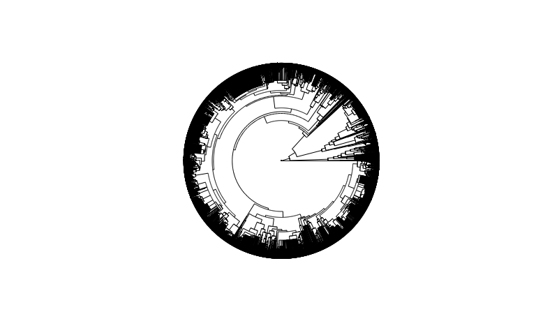
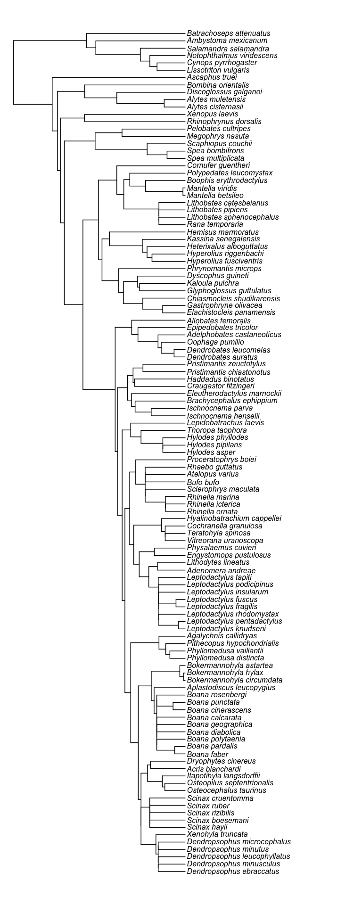

Here, we tidy and merge datasets for lens transmission from this study, lens transmission from Yovanovich et al. (2019, 2020), and ecological data. We then prune a published phylogeny from Jetz and Pyron (2019) to the species in our compiled dataset.

# Lens transmission data

## This study

Lens data were collected from frozen and then thawed lenses in this study. The data span two orders (Anura and Caudata), 29 families, 62 genera, and 86 species. Most data are from post-metamorphic frogs, but we also have data on tadpoles of two species.


```r
#import species data for lens transmission
lens_raw <- data.frame(read.csv("../Data/raw data/species_data.csv", header=TRUE, na.strings=c("", "NA"))) #load raw data

#tidy data
lens_data <- lens_raw %>%
  #put genus and species in separate columns
  separate(species, c("genus", "species"), sep = " ", extra = "drop") %>%
  #add genus_species
  mutate(genus_species = as.factor(paste(genus, species, sep = "_"))) %>%
  mutate(dataset = "this_study") %>%
  mutate(source = "this_study") %>%
  mutate(scanned = "frozen lens") %>%
  select(order, family, genus_species, stage, dataset, source, diam_mm, approx_size, t450nm, t50, pUVA)
```

## Compiled from literature

Lens transmission data measured from fresh anuran lenses were gathered from previously published literature.  Note that for _Bombina orientalis_ the T50% was <300nm. To be able to include it here, I have set it at 300 so that it is numerical and can be included in models and visuals. These data span 14 families, 28 genera,  and 37 species (all post-metamorphic frogs). 


```r
#import species data for lens transmission
lens_lit_raw <- data.frame(read.csv("../Data/raw data/published_data.csv", header=TRUE, na.strings=c("", "NA"))) #load raw data

#tidy data
lens_lit <- lens_lit_raw %>%
  mutate(genus_species = as.factor(species)) %>%
  mutate(t50 = as.numeric(replace(t50, t50=="<300", 300))) %>%
  mutate(t450nm = t450nm*100) %>%
  mutate(source = "literature") %>%
  mutate(stage = "unknown") %>%
  mutate(diam_mm = "unknown") %>%
  select(order, family, genus_species, stage, dataset, source, diam_mm, t450nm, t50, pUVA)
```

## Merged data

Data from our study and previous studies were merged for comparative analyses. Combined, they cover two orders, 32 families, 76 genera, and 116 species. There was overlap in data (our study and in published literature) for 8 species.  


```r
#merge new and published datasets 
lenses <-full_join(lens_data, lens_lit) 

#compile number of frogs sampled by species
samps <- lenses %>%
  arrange(genus_species) %>%
  arrange(family) %>%
  arrange(order) %>%
  select(order, family, genus_species, source, t50, pUVA)

#create table column names
names(samps) <- c("Order","Family", "Species", "Data source", "T50%", "%UVA") 

#generate scrolling table in RMarkdown
kable(samps[ , c("Order","Family", "Species", "Data source", "T50%", "%UVA")], 
      caption = "Species sampled and transmission summary data") %>%
  kable_styling(full_width = F) %>% 
  collapse_rows(columns = c(1,2), valign = "top") %>%
  scroll_box(height = "600px") 
```

<div style="border: 1px solid #ddd; padding: 0px; overflow-y: scroll; height:600px; "><table class="table" style="width: auto !important; margin-left: auto; margin-right: auto;">
<caption>Species sampled and transmission summary data</caption>
 <thead>
  <tr>
   <th style="text-align:left;position: sticky; top:0; background-color: #FFFFFF;"> Order </th>
   <th style="text-align:left;position: sticky; top:0; background-color: #FFFFFF;"> Family </th>
   <th style="text-align:left;position: sticky; top:0; background-color: #FFFFFF;"> Species </th>
   <th style="text-align:left;position: sticky; top:0; background-color: #FFFFFF;"> Data source </th>
   <th style="text-align:right;position: sticky; top:0; background-color: #FFFFFF;"> T50% </th>
   <th style="text-align:right;position: sticky; top:0; background-color: #FFFFFF;"> %UVA </th>
  </tr>
 </thead>
<tbody>
  <tr>
   <td style="text-align:left;"> Anura </td>
   <td style="text-align:left;"> Alytidae </td>
   <td style="text-align:left;"> Alytes_cisternasii </td>
   <td style="text-align:left;"> this_study </td>
   <td style="text-align:right;"> 380 </td>
   <td style="text-align:right;"> 37.10 </td>
  </tr>
  <tr>
   <td style="text-align:left;"> Anura </td>
   <td style="text-align:left;"> Alytidae </td>
   <td style="text-align:left;"> Alytes_muletensis </td>
   <td style="text-align:left;"> this_study </td>
   <td style="text-align:right;"> 336 </td>
   <td style="text-align:right;"> 59.30 </td>
  </tr>
  <tr>
   <td style="text-align:left;"> Anura </td>
   <td style="text-align:left;"> Alytidae </td>
   <td style="text-align:left;"> Alytes_muletensis </td>
   <td style="text-align:left;"> this_study </td>
   <td style="text-align:right;"> 351 </td>
   <td style="text-align:right;"> 51.50 </td>
  </tr>
  <tr>
   <td style="text-align:left;"> Anura </td>
   <td style="text-align:left;"> Alytidae </td>
   <td style="text-align:left;"> Discoglossus_galganoi </td>
   <td style="text-align:left;"> this_study </td>
   <td style="text-align:right;"> 346 </td>
   <td style="text-align:right;"> 59.60 </td>
  </tr>
  <tr>
   <td style="text-align:left;"> Anura </td>
   <td style="text-align:left;"> Aromobatidae </td>
   <td style="text-align:left;"> Allobates_femoralis </td>
   <td style="text-align:left;"> literature </td>
   <td style="text-align:right;"> 423 </td>
   <td style="text-align:right;"> NA </td>
  </tr>
  <tr>
   <td style="text-align:left;"> Anura </td>
   <td style="text-align:left;"> Ascaphidae </td>
   <td style="text-align:left;"> Ascaphus_truei </td>
   <td style="text-align:left;"> this_study </td>
   <td style="text-align:right;"> 349 </td>
   <td style="text-align:right;"> 57.50 </td>
  </tr>
  <tr>
   <td style="text-align:left;"> Anura </td>
   <td style="text-align:left;"> Bombinatoridae </td>
   <td style="text-align:left;"> Bombina_orientalis </td>
   <td style="text-align:left;"> literature </td>
   <td style="text-align:right;"> 300 </td>
   <td style="text-align:right;"> 95.55 </td>
  </tr>
  <tr>
   <td style="text-align:left;"> Anura </td>
   <td style="text-align:left;"> Brachycephalidae </td>
   <td style="text-align:left;"> Brachycephalus_ephippium </td>
   <td style="text-align:left;"> this_study </td>
   <td style="text-align:right;"> 356 </td>
   <td style="text-align:right;"> 48.60 </td>
  </tr>
  <tr>
   <td style="text-align:left;"> Anura </td>
   <td style="text-align:left;"> Brachycephalidae </td>
   <td style="text-align:left;"> Brachycephalus_ephippium </td>
   <td style="text-align:left;"> literature </td>
   <td style="text-align:right;"> 339 </td>
   <td style="text-align:right;"> NA </td>
  </tr>
  <tr>
   <td style="text-align:left;"> Anura </td>
   <td style="text-align:left;"> Brachycephalidae </td>
   <td style="text-align:left;"> Ischnocnema_henselii </td>
   <td style="text-align:left;"> this_study </td>
   <td style="text-align:right;"> 314 </td>
   <td style="text-align:right;"> 91.50 </td>
  </tr>
  <tr>
   <td style="text-align:left;"> Anura </td>
   <td style="text-align:left;"> Brachycephalidae </td>
   <td style="text-align:left;"> Ischnocnema_parva </td>
   <td style="text-align:left;"> this_study </td>
   <td style="text-align:right;"> 322 </td>
   <td style="text-align:right;"> 67.30 </td>
  </tr>
  <tr>
   <td style="text-align:left;"> Anura </td>
   <td style="text-align:left;"> Brachycephalidae </td>
   <td style="text-align:left;"> Ischnocnema_parva </td>
   <td style="text-align:left;"> literature </td>
   <td style="text-align:right;"> 324 </td>
   <td style="text-align:right;"> 61.96 </td>
  </tr>
  <tr>
   <td style="text-align:left;"> Anura </td>
   <td style="text-align:left;"> Bufonidae </td>
   <td style="text-align:left;"> Bufo_bufo </td>
   <td style="text-align:left;"> this_study </td>
   <td style="text-align:right;"> 341 </td>
   <td style="text-align:right;"> 66.80 </td>
  </tr>
  <tr>
   <td style="text-align:left;"> Anura </td>
   <td style="text-align:left;"> Bufonidae </td>
   <td style="text-align:left;"> Bufo_bufo </td>
   <td style="text-align:left;"> literature </td>
   <td style="text-align:right;"> 360 </td>
   <td style="text-align:right;"> 44.15 </td>
  </tr>
  <tr>
   <td style="text-align:left;"> Anura </td>
   <td style="text-align:left;"> Bufonidae </td>
   <td style="text-align:left;"> Rhaebo_guttatus </td>
   <td style="text-align:left;"> this_study </td>
   <td style="text-align:right;"> 365 </td>
   <td style="text-align:right;"> 43.40 </td>
  </tr>
  <tr>
   <td style="text-align:left;"> Anura </td>
   <td style="text-align:left;"> Bufonidae </td>
   <td style="text-align:left;"> Rhinella_icterica </td>
   <td style="text-align:left;"> this_study </td>
   <td style="text-align:right;"> 338 </td>
   <td style="text-align:right;"> 63.50 </td>
  </tr>
  <tr>
   <td style="text-align:left;"> Anura </td>
   <td style="text-align:left;"> Bufonidae </td>
   <td style="text-align:left;"> Rhinella_icterica </td>
   <td style="text-align:left;"> literature </td>
   <td style="text-align:right;"> 361 </td>
   <td style="text-align:right;"> 46.24 </td>
  </tr>
  <tr>
   <td style="text-align:left;"> Anura </td>
   <td style="text-align:left;"> Bufonidae </td>
   <td style="text-align:left;"> Rhinella_marina </td>
   <td style="text-align:left;"> this_study </td>
   <td style="text-align:right;"> 362 </td>
   <td style="text-align:right;"> 43.90 </td>
  </tr>
  <tr>
   <td style="text-align:left;"> Anura </td>
   <td style="text-align:left;"> Bufonidae </td>
   <td style="text-align:left;"> Sclerophrys_maculata </td>
   <td style="text-align:left;"> this_study </td>
   <td style="text-align:right;"> 359 </td>
   <td style="text-align:right;"> 44.10 </td>
  </tr>
  <tr>
   <td style="text-align:left;"> Anura </td>
   <td style="text-align:left;"> Bufonidae </td>
   <td style="text-align:left;"> Atelopus_varius </td>
   <td style="text-align:left;"> literature </td>
   <td style="text-align:right;"> 331 </td>
   <td style="text-align:right;"> 75.30 </td>
  </tr>
  <tr>
   <td style="text-align:left;"> Anura </td>
   <td style="text-align:left;"> Bufonidae </td>
   <td style="text-align:left;"> Rhinella_ornata </td>
   <td style="text-align:left;"> literature </td>
   <td style="text-align:right;"> 344 </td>
   <td style="text-align:right;"> 54.88 </td>
  </tr>
  <tr>
   <td style="text-align:left;"> Anura </td>
   <td style="text-align:left;"> Centrolenidae </td>
   <td style="text-align:left;"> Hyalinobatrachium_cappellei </td>
   <td style="text-align:left;"> this_study </td>
   <td style="text-align:right;"> 359 </td>
   <td style="text-align:right;"> 47.90 </td>
  </tr>
  <tr>
   <td style="text-align:left;"> Anura </td>
   <td style="text-align:left;"> Centrolenidae </td>
   <td style="text-align:left;"> Vitreorana_uranoscopa </td>
   <td style="text-align:left;"> this_study </td>
   <td style="text-align:right;"> 361 </td>
   <td style="text-align:right;"> 46.60 </td>
  </tr>
  <tr>
   <td style="text-align:left;"> Anura </td>
   <td style="text-align:left;"> Centrolenidae </td>
   <td style="text-align:left;"> Cochranella_granulosa </td>
   <td style="text-align:left;"> literature </td>
   <td style="text-align:right;"> 380 </td>
   <td style="text-align:right;"> 29.43 </td>
  </tr>
  <tr>
   <td style="text-align:left;"> Anura </td>
   <td style="text-align:left;"> Centrolenidae </td>
   <td style="text-align:left;"> Teratohyla_spinosa </td>
   <td style="text-align:left;"> literature </td>
   <td style="text-align:right;"> 379 </td>
   <td style="text-align:right;"> 31.20 </td>
  </tr>
  <tr>
   <td style="text-align:left;"> Anura </td>
   <td style="text-align:left;"> Ceratobatrachidae </td>
   <td style="text-align:left;"> Cornufer_guentheri </td>
   <td style="text-align:left;"> this_study </td>
   <td style="text-align:right;"> 358 </td>
   <td style="text-align:right;"> 52.80 </td>
  </tr>
  <tr>
   <td style="text-align:left;"> Anura </td>
   <td style="text-align:left;"> Ceratophryidae </td>
   <td style="text-align:left;"> Lepidobatrachus_laevis </td>
   <td style="text-align:left;"> this_study </td>
   <td style="text-align:right;"> 359 </td>
   <td style="text-align:right;"> 47.60 </td>
  </tr>
  <tr>
   <td style="text-align:left;"> Anura </td>
   <td style="text-align:left;"> Craugastoridae </td>
   <td style="text-align:left;"> Haddadus_binotatus </td>
   <td style="text-align:left;"> this_study </td>
   <td style="text-align:right;"> 327 </td>
   <td style="text-align:right;"> 73.70 </td>
  </tr>
  <tr>
   <td style="text-align:left;"> Anura </td>
   <td style="text-align:left;"> Craugastoridae </td>
   <td style="text-align:left;"> Pristimantis_chiastonotus </td>
   <td style="text-align:left;"> this_study </td>
   <td style="text-align:right;"> 364 </td>
   <td style="text-align:right;"> 46.30 </td>
  </tr>
  <tr>
   <td style="text-align:left;"> Anura </td>
   <td style="text-align:left;"> Craugastoridae </td>
   <td style="text-align:left;"> Pristimantis_zeuctotylus </td>
   <td style="text-align:left;"> this_study </td>
   <td style="text-align:right;"> 388 </td>
   <td style="text-align:right;"> 25.90 </td>
  </tr>
  <tr>
   <td style="text-align:left;"> Anura </td>
   <td style="text-align:left;"> Craugastoridae </td>
   <td style="text-align:left;"> Craugastor_fitzingeri </td>
   <td style="text-align:left;"> literature </td>
   <td style="text-align:right;"> 360 </td>
   <td style="text-align:right;"> 55.30 </td>
  </tr>
  <tr>
   <td style="text-align:left;"> Anura </td>
   <td style="text-align:left;"> Cycloramphidae </td>
   <td style="text-align:left;"> Thoropa_taophora </td>
   <td style="text-align:left;"> literature </td>
   <td style="text-align:right;"> 343 </td>
   <td style="text-align:right;"> 60.79 </td>
  </tr>
  <tr>
   <td style="text-align:left;"> Anura </td>
   <td style="text-align:left;"> Dendrobatidae </td>
   <td style="text-align:left;"> Dendrobates_leucomelas </td>
   <td style="text-align:left;"> this_study </td>
   <td style="text-align:right;"> 326 </td>
   <td style="text-align:right;"> 54.80 </td>
  </tr>
  <tr>
   <td style="text-align:left;"> Anura </td>
   <td style="text-align:left;"> Dendrobatidae </td>
   <td style="text-align:left;"> Epipedobates_tricolor </td>
   <td style="text-align:left;"> this_study </td>
   <td style="text-align:right;"> 413 </td>
   <td style="text-align:right;"> 23.10 </td>
  </tr>
  <tr>
   <td style="text-align:left;"> Anura </td>
   <td style="text-align:left;"> Dendrobatidae </td>
   <td style="text-align:left;"> Adelphobates_castaneoticus </td>
   <td style="text-align:left;"> literature </td>
   <td style="text-align:right;"> 416 </td>
   <td style="text-align:right;"> NA </td>
  </tr>
  <tr>
   <td style="text-align:left;"> Anura </td>
   <td style="text-align:left;"> Dendrobatidae </td>
   <td style="text-align:left;"> Dendrobates_auratus </td>
   <td style="text-align:left;"> literature </td>
   <td style="text-align:right;"> 421 </td>
   <td style="text-align:right;"> 11.94 </td>
  </tr>
  <tr>
   <td style="text-align:left;"> Anura </td>
   <td style="text-align:left;"> Dendrobatidae </td>
   <td style="text-align:left;"> Oophaga_pumilio </td>
   <td style="text-align:left;"> literature </td>
   <td style="text-align:right;"> 425 </td>
   <td style="text-align:right;"> 6.88 </td>
  </tr>
  <tr>
   <td style="text-align:left;"> Anura </td>
   <td style="text-align:left;"> Eleutherodactylidae </td>
   <td style="text-align:left;"> Eleutherodactylus_marnockii </td>
   <td style="text-align:left;"> this_study </td>
   <td style="text-align:right;"> 355 </td>
   <td style="text-align:right;"> 49.30 </td>
  </tr>
  <tr>
   <td style="text-align:left;"> Anura </td>
   <td style="text-align:left;"> Hemisotidae </td>
   <td style="text-align:left;"> Hemisus_marmoratus </td>
   <td style="text-align:left;"> this_study </td>
   <td style="text-align:right;"> 345 </td>
   <td style="text-align:right;"> 57.30 </td>
  </tr>
  <tr>
   <td style="text-align:left;"> Anura </td>
   <td style="text-align:left;"> Hylidae </td>
   <td style="text-align:left;"> Acris_blanchardi </td>
   <td style="text-align:left;"> this_study </td>
   <td style="text-align:right;"> 394 </td>
   <td style="text-align:right;"> 13.30 </td>
  </tr>
  <tr>
   <td style="text-align:left;"> Anura </td>
   <td style="text-align:left;"> Hylidae </td>
   <td style="text-align:left;"> Aplastodiscus_leucopygius </td>
   <td style="text-align:left;"> this_study </td>
   <td style="text-align:right;"> 385 </td>
   <td style="text-align:right;"> 30.50 </td>
  </tr>
  <tr>
   <td style="text-align:left;"> Anura </td>
   <td style="text-align:left;"> Hylidae </td>
   <td style="text-align:left;"> Boana_calcarata </td>
   <td style="text-align:left;"> this_study </td>
   <td style="text-align:right;"> 398 </td>
   <td style="text-align:right;"> 18.50 </td>
  </tr>
  <tr>
   <td style="text-align:left;"> Anura </td>
   <td style="text-align:left;"> Hylidae </td>
   <td style="text-align:left;"> Boana_cinerascens </td>
   <td style="text-align:left;"> this_study </td>
   <td style="text-align:right;"> 389 </td>
   <td style="text-align:right;"> 21.80 </td>
  </tr>
  <tr>
   <td style="text-align:left;"> Anura </td>
   <td style="text-align:left;"> Hylidae </td>
   <td style="text-align:left;"> Boana_diabolica </td>
   <td style="text-align:left;"> this_study </td>
   <td style="text-align:right;"> 396 </td>
   <td style="text-align:right;"> 20.90 </td>
  </tr>
  <tr>
   <td style="text-align:left;"> Anura </td>
   <td style="text-align:left;"> Hylidae </td>
   <td style="text-align:left;"> Boana_faber </td>
   <td style="text-align:left;"> this_study </td>
   <td style="text-align:right;"> 399 </td>
   <td style="text-align:right;"> 6.10 </td>
  </tr>
  <tr>
   <td style="text-align:left;"> Anura </td>
   <td style="text-align:left;"> Hylidae </td>
   <td style="text-align:left;"> Boana_pardalis </td>
   <td style="text-align:left;"> this_study </td>
   <td style="text-align:right;"> 387 </td>
   <td style="text-align:right;"> 25.20 </td>
  </tr>
  <tr>
   <td style="text-align:left;"> Anura </td>
   <td style="text-align:left;"> Hylidae </td>
   <td style="text-align:left;"> Boana_polytaenia </td>
   <td style="text-align:left;"> this_study </td>
   <td style="text-align:right;"> 365 </td>
   <td style="text-align:right;"> 51.50 </td>
  </tr>
  <tr>
   <td style="text-align:left;"> Anura </td>
   <td style="text-align:left;"> Hylidae </td>
   <td style="text-align:left;"> Boana_punctata </td>
   <td style="text-align:left;"> this_study </td>
   <td style="text-align:right;"> 379 </td>
   <td style="text-align:right;"> 37.80 </td>
  </tr>
  <tr>
   <td style="text-align:left;"> Anura </td>
   <td style="text-align:left;"> Hylidae </td>
   <td style="text-align:left;"> Bokermannohyla_circumdata </td>
   <td style="text-align:left;"> this_study </td>
   <td style="text-align:right;"> 389 </td>
   <td style="text-align:right;"> 20.90 </td>
  </tr>
  <tr>
   <td style="text-align:left;"> Anura </td>
   <td style="text-align:left;"> Hylidae </td>
   <td style="text-align:left;"> Dendropsophus_leucophyllatus </td>
   <td style="text-align:left;"> this_study </td>
   <td style="text-align:right;"> 384 </td>
   <td style="text-align:right;"> 33.70 </td>
  </tr>
  <tr>
   <td style="text-align:left;"> Anura </td>
   <td style="text-align:left;"> Hylidae </td>
   <td style="text-align:left;"> Dendropsophus_minusculus </td>
   <td style="text-align:left;"> this_study </td>
   <td style="text-align:right;"> 402 </td>
   <td style="text-align:right;"> 17.70 </td>
  </tr>
  <tr>
   <td style="text-align:left;"> Anura </td>
   <td style="text-align:left;"> Hylidae </td>
   <td style="text-align:left;"> Dendropsophus_minutus </td>
   <td style="text-align:left;"> this_study </td>
   <td style="text-align:right;"> 359 </td>
   <td style="text-align:right;"> 48.20 </td>
  </tr>
  <tr>
   <td style="text-align:left;"> Anura </td>
   <td style="text-align:left;"> Hylidae </td>
   <td style="text-align:left;"> Dryophytes_cinereus </td>
   <td style="text-align:left;"> this_study </td>
   <td style="text-align:right;"> 370 </td>
   <td style="text-align:right;"> 42.50 </td>
  </tr>
  <tr>
   <td style="text-align:left;"> Anura </td>
   <td style="text-align:left;"> Hylidae </td>
   <td style="text-align:left;"> Itapotihyla_langsdorffii </td>
   <td style="text-align:left;"> this_study </td>
   <td style="text-align:right;"> 368 </td>
   <td style="text-align:right;"> 49.90 </td>
  </tr>
  <tr>
   <td style="text-align:left;"> Anura </td>
   <td style="text-align:left;"> Hylidae </td>
   <td style="text-align:left;"> Osteocephalus_taurinus </td>
   <td style="text-align:left;"> this_study </td>
   <td style="text-align:right;"> 395 </td>
   <td style="text-align:right;"> 14.40 </td>
  </tr>
  <tr>
   <td style="text-align:left;"> Anura </td>
   <td style="text-align:left;"> Hylidae </td>
   <td style="text-align:left;"> Osteopilus_septentrionalis </td>
   <td style="text-align:left;"> this_study </td>
   <td style="text-align:right;"> 397 </td>
   <td style="text-align:right;"> 10.30 </td>
  </tr>
  <tr>
   <td style="text-align:left;"> Anura </td>
   <td style="text-align:left;"> Hylidae </td>
   <td style="text-align:left;"> Scinax_boesemani </td>
   <td style="text-align:left;"> this_study </td>
   <td style="text-align:right;"> 376 </td>
   <td style="text-align:right;"> 41.50 </td>
  </tr>
  <tr>
   <td style="text-align:left;"> Anura </td>
   <td style="text-align:left;"> Hylidae </td>
   <td style="text-align:left;"> Scinax_cruentomma </td>
   <td style="text-align:left;"> this_study </td>
   <td style="text-align:right;"> 397 </td>
   <td style="text-align:right;"> 20.60 </td>
  </tr>
  <tr>
   <td style="text-align:left;"> Anura </td>
   <td style="text-align:left;"> Hylidae </td>
   <td style="text-align:left;"> Scinax_hayii </td>
   <td style="text-align:left;"> this_study </td>
   <td style="text-align:right;"> 387 </td>
   <td style="text-align:right;"> 26.60 </td>
  </tr>
  <tr>
   <td style="text-align:left;"> Anura </td>
   <td style="text-align:left;"> Hylidae </td>
   <td style="text-align:left;"> Scinax_rizibilis </td>
   <td style="text-align:left;"> this_study </td>
   <td style="text-align:right;"> 388 </td>
   <td style="text-align:right;"> 22.80 </td>
  </tr>
  <tr>
   <td style="text-align:left;"> Anura </td>
   <td style="text-align:left;"> Hylidae </td>
   <td style="text-align:left;"> Boana_geographica </td>
   <td style="text-align:left;"> literature </td>
   <td style="text-align:right;"> 393 </td>
   <td style="text-align:right;"> NA </td>
  </tr>
  <tr>
   <td style="text-align:left;"> Anura </td>
   <td style="text-align:left;"> Hylidae </td>
   <td style="text-align:left;"> Boana_rosenbergi </td>
   <td style="text-align:left;"> literature </td>
   <td style="text-align:right;"> 399 </td>
   <td style="text-align:right;"> 7.54 </td>
  </tr>
  <tr>
   <td style="text-align:left;"> Anura </td>
   <td style="text-align:left;"> Hylidae </td>
   <td style="text-align:left;"> Bokermannohyla_astartea </td>
   <td style="text-align:left;"> literature </td>
   <td style="text-align:right;"> 392 </td>
   <td style="text-align:right;"> NA </td>
  </tr>
  <tr>
   <td style="text-align:left;"> Anura </td>
   <td style="text-align:left;"> Hylidae </td>
   <td style="text-align:left;"> Bokermannohyla_hylax </td>
   <td style="text-align:left;"> literature </td>
   <td style="text-align:right;"> 395 </td>
   <td style="text-align:right;"> NA </td>
  </tr>
  <tr>
   <td style="text-align:left;"> Anura </td>
   <td style="text-align:left;"> Hylidae </td>
   <td style="text-align:left;"> Dendropsophus_ebraccatus </td>
   <td style="text-align:left;"> literature </td>
   <td style="text-align:right;"> 394 </td>
   <td style="text-align:right;"> 15.70 </td>
  </tr>
  <tr>
   <td style="text-align:left;"> Anura </td>
   <td style="text-align:left;"> Hylidae </td>
   <td style="text-align:left;"> Dendropsophus_microcephalus </td>
   <td style="text-align:left;"> literature </td>
   <td style="text-align:right;"> 391 </td>
   <td style="text-align:right;"> 17.34 </td>
  </tr>
  <tr>
   <td style="text-align:left;"> Anura </td>
   <td style="text-align:left;"> Hylidae </td>
   <td style="text-align:left;"> Scinax_ruber </td>
   <td style="text-align:left;"> literature </td>
   <td style="text-align:right;"> 397 </td>
   <td style="text-align:right;"> 10.38 </td>
  </tr>
  <tr>
   <td style="text-align:left;"> Anura </td>
   <td style="text-align:left;"> Hylidae </td>
   <td style="text-align:left;"> Xenohyla_truncata </td>
   <td style="text-align:left;"> literature </td>
   <td style="text-align:right;"> 388 </td>
   <td style="text-align:right;"> NA </td>
  </tr>
  <tr>
   <td style="text-align:left;"> Anura </td>
   <td style="text-align:left;"> Hylodidae </td>
   <td style="text-align:left;"> Hylodes_phyllodes </td>
   <td style="text-align:left;"> this_study </td>
   <td style="text-align:right;"> 409 </td>
   <td style="text-align:right;"> 40.80 </td>
  </tr>
  <tr>
   <td style="text-align:left;"> Anura </td>
   <td style="text-align:left;"> Hylodidae </td>
   <td style="text-align:left;"> Hylodes_phyllodes </td>
   <td style="text-align:left;"> this_study </td>
   <td style="text-align:right;"> 423 </td>
   <td style="text-align:right;"> 2.00 </td>
  </tr>
  <tr>
   <td style="text-align:left;"> Anura </td>
   <td style="text-align:left;"> Hylodidae </td>
   <td style="text-align:left;"> Hylodes_phyllodes </td>
   <td style="text-align:left;"> literature </td>
   <td style="text-align:right;"> 418 </td>
   <td style="text-align:right;"> 9.31 </td>
  </tr>
  <tr>
   <td style="text-align:left;"> Anura </td>
   <td style="text-align:left;"> Hylodidae </td>
   <td style="text-align:left;"> Hylodes_asper </td>
   <td style="text-align:left;"> literature </td>
   <td style="text-align:right;"> 411 </td>
   <td style="text-align:right;"> NA </td>
  </tr>
  <tr>
   <td style="text-align:left;"> Anura </td>
   <td style="text-align:left;"> Hylodidae </td>
   <td style="text-align:left;"> Hylodes_pipilans </td>
   <td style="text-align:left;"> literature </td>
   <td style="text-align:right;"> 415 </td>
   <td style="text-align:right;"> NA </td>
  </tr>
  <tr>
   <td style="text-align:left;"> Anura </td>
   <td style="text-align:left;"> Hyperoliidae </td>
   <td style="text-align:left;"> Heterixalus_alboguttatus </td>
   <td style="text-align:left;"> this_study </td>
   <td style="text-align:right;"> 397 </td>
   <td style="text-align:right;"> 23.50 </td>
  </tr>
  <tr>
   <td style="text-align:left;"> Anura </td>
   <td style="text-align:left;"> Hyperoliidae </td>
   <td style="text-align:left;"> Hyperolius_fusciventris </td>
   <td style="text-align:left;"> this_study </td>
   <td style="text-align:right;"> 394 </td>
   <td style="text-align:right;"> 29.20 </td>
  </tr>
  <tr>
   <td style="text-align:left;"> Anura </td>
   <td style="text-align:left;"> Hyperoliidae </td>
   <td style="text-align:left;"> Hyperolius_riggenbachi </td>
   <td style="text-align:left;"> this_study </td>
   <td style="text-align:right;"> 407 </td>
   <td style="text-align:right;"> 5.70 </td>
  </tr>
  <tr>
   <td style="text-align:left;"> Anura </td>
   <td style="text-align:left;"> Hyperoliidae </td>
   <td style="text-align:left;"> Kassina_senegalensis </td>
   <td style="text-align:left;"> this_study </td>
   <td style="text-align:right;"> 348 </td>
   <td style="text-align:right;"> 60.10 </td>
  </tr>
  <tr>
   <td style="text-align:left;"> Anura </td>
   <td style="text-align:left;"> Leptodactylidae </td>
   <td style="text-align:left;"> Adenomera_andreae </td>
   <td style="text-align:left;"> this_study </td>
   <td style="text-align:right;"> 337 </td>
   <td style="text-align:right;"> 63.40 </td>
  </tr>
  <tr>
   <td style="text-align:left;"> Anura </td>
   <td style="text-align:left;"> Leptodactylidae </td>
   <td style="text-align:left;"> Leptodactylus_fuscus </td>
   <td style="text-align:left;"> this_study </td>
   <td style="text-align:right;"> 370 </td>
   <td style="text-align:right;"> 37.20 </td>
  </tr>
  <tr>
   <td style="text-align:left;"> Anura </td>
   <td style="text-align:left;"> Leptodactylidae </td>
   <td style="text-align:left;"> Leptodactylus_knudseni </td>
   <td style="text-align:left;"> this_study </td>
   <td style="text-align:right;"> 380 </td>
   <td style="text-align:right;"> 25.70 </td>
  </tr>
  <tr>
   <td style="text-align:left;"> Anura </td>
   <td style="text-align:left;"> Leptodactylidae </td>
   <td style="text-align:left;"> Leptodactylus_pentadactylus </td>
   <td style="text-align:left;"> this_study </td>
   <td style="text-align:right;"> 364 </td>
   <td style="text-align:right;"> 45.60 </td>
  </tr>
  <tr>
   <td style="text-align:left;"> Anura </td>
   <td style="text-align:left;"> Leptodactylidae </td>
   <td style="text-align:left;"> Leptodactylus_podicipinus </td>
   <td style="text-align:left;"> this_study </td>
   <td style="text-align:right;"> 365 </td>
   <td style="text-align:right;"> 42.20 </td>
  </tr>
  <tr>
   <td style="text-align:left;"> Anura </td>
   <td style="text-align:left;"> Leptodactylidae </td>
   <td style="text-align:left;"> Leptodactylus_rhodomystax </td>
   <td style="text-align:left;"> this_study </td>
   <td style="text-align:right;"> 397 </td>
   <td style="text-align:right;"> 24.10 </td>
  </tr>
  <tr>
   <td style="text-align:left;"> Anura </td>
   <td style="text-align:left;"> Leptodactylidae </td>
   <td style="text-align:left;"> Lithodytes_lineatus </td>
   <td style="text-align:left;"> this_study </td>
   <td style="text-align:right;"> 366 </td>
   <td style="text-align:right;"> 44.00 </td>
  </tr>
  <tr>
   <td style="text-align:left;"> Anura </td>
   <td style="text-align:left;"> Leptodactylidae </td>
   <td style="text-align:left;"> Physalaemus_cuvieri </td>
   <td style="text-align:left;"> this_study </td>
   <td style="text-align:right;"> 360 </td>
   <td style="text-align:right;"> 50.00 </td>
  </tr>
  <tr>
   <td style="text-align:left;"> Anura </td>
   <td style="text-align:left;"> Leptodactylidae </td>
   <td style="text-align:left;"> Physalaemus_cuvieri </td>
   <td style="text-align:left;"> literature </td>
   <td style="text-align:right;"> 390 </td>
   <td style="text-align:right;"> 17.07 </td>
  </tr>
  <tr>
   <td style="text-align:left;"> Anura </td>
   <td style="text-align:left;"> Leptodactylidae </td>
   <td style="text-align:left;"> Engystomops_pustulosus </td>
   <td style="text-align:left;"> literature </td>
   <td style="text-align:right;"> 324 </td>
   <td style="text-align:right;"> 81.43 </td>
  </tr>
  <tr>
   <td style="text-align:left;"> Anura </td>
   <td style="text-align:left;"> Leptodactylidae </td>
   <td style="text-align:left;"> Leptodactylus_fragilis </td>
   <td style="text-align:left;"> literature </td>
   <td style="text-align:right;"> 372 </td>
   <td style="text-align:right;"> 36.06 </td>
  </tr>
  <tr>
   <td style="text-align:left;"> Anura </td>
   <td style="text-align:left;"> Leptodactylidae </td>
   <td style="text-align:left;"> Leptodactylus_insularum </td>
   <td style="text-align:left;"> literature </td>
   <td style="text-align:right;"> 380 </td>
   <td style="text-align:right;"> 25.78 </td>
  </tr>
  <tr>
   <td style="text-align:left;"> Anura </td>
   <td style="text-align:left;"> Leptodactylidae </td>
   <td style="text-align:left;"> Leptodactylus_tapiti </td>
   <td style="text-align:left;"> literature </td>
   <td style="text-align:right;"> 376 </td>
   <td style="text-align:right;"> NA </td>
  </tr>
  <tr>
   <td style="text-align:left;"> Anura </td>
   <td style="text-align:left;"> Mantellidae </td>
   <td style="text-align:left;"> Boophis_erythrodactylus </td>
   <td style="text-align:left;"> this_study </td>
   <td style="text-align:right;"> 396 </td>
   <td style="text-align:right;"> 12.90 </td>
  </tr>
  <tr>
   <td style="text-align:left;"> Anura </td>
   <td style="text-align:left;"> Mantellidae </td>
   <td style="text-align:left;"> Mantella_betsileo </td>
   <td style="text-align:left;"> this_study </td>
   <td style="text-align:right;"> 389 </td>
   <td style="text-align:right;"> 21.20 </td>
  </tr>
  <tr>
   <td style="text-align:left;"> Anura </td>
   <td style="text-align:left;"> Mantellidae </td>
   <td style="text-align:left;"> Mantella_viridis </td>
   <td style="text-align:left;"> this_study </td>
   <td style="text-align:right;"> 368 </td>
   <td style="text-align:right;"> 37.90 </td>
  </tr>
  <tr>
   <td style="text-align:left;"> Anura </td>
   <td style="text-align:left;"> Megophridae </td>
   <td style="text-align:left;"> Megophrys_nasuta </td>
   <td style="text-align:left;"> this_study </td>
   <td style="text-align:right;"> 374 </td>
   <td style="text-align:right;"> 30.50 </td>
  </tr>
  <tr>
   <td style="text-align:left;"> Anura </td>
   <td style="text-align:left;"> Microhylidae </td>
   <td style="text-align:left;"> Chiasmocleis_shudikarensis </td>
   <td style="text-align:left;"> this_study </td>
   <td style="text-align:right;"> 341 </td>
   <td style="text-align:right;"> 58.20 </td>
  </tr>
  <tr>
   <td style="text-align:left;"> Anura </td>
   <td style="text-align:left;"> Microhylidae </td>
   <td style="text-align:left;"> Dyscophus_guineti </td>
   <td style="text-align:left;"> this_study </td>
   <td style="text-align:right;"> 331 </td>
   <td style="text-align:right;"> 69.90 </td>
  </tr>
  <tr>
   <td style="text-align:left;"> Anura </td>
   <td style="text-align:left;"> Microhylidae </td>
   <td style="text-align:left;"> Gastrophryne_olivacea </td>
   <td style="text-align:left;"> this_study </td>
   <td style="text-align:right;"> 349 </td>
   <td style="text-align:right;"> 49.40 </td>
  </tr>
  <tr>
   <td style="text-align:left;"> Anura </td>
   <td style="text-align:left;"> Microhylidae </td>
   <td style="text-align:left;"> Glyphoglossus_guttulatus </td>
   <td style="text-align:left;"> this_study </td>
   <td style="text-align:right;"> 337 </td>
   <td style="text-align:right;"> 64.30 </td>
  </tr>
  <tr>
   <td style="text-align:left;"> Anura </td>
   <td style="text-align:left;"> Microhylidae </td>
   <td style="text-align:left;"> Kaloula_pulchra </td>
   <td style="text-align:left;"> this_study </td>
   <td style="text-align:right;"> 339 </td>
   <td style="text-align:right;"> 58.50 </td>
  </tr>
  <tr>
   <td style="text-align:left;"> Anura </td>
   <td style="text-align:left;"> Microhylidae </td>
   <td style="text-align:left;"> Phrynomantis_microps </td>
   <td style="text-align:left;"> this_study </td>
   <td style="text-align:right;"> 343 </td>
   <td style="text-align:right;"> 56.70 </td>
  </tr>
  <tr>
   <td style="text-align:left;"> Anura </td>
   <td style="text-align:left;"> Microhylidae </td>
   <td style="text-align:left;"> Elachistocleis_panamensis </td>
   <td style="text-align:left;"> literature </td>
   <td style="text-align:right;"> 319 </td>
   <td style="text-align:right;"> 84.54 </td>
  </tr>
  <tr>
   <td style="text-align:left;"> Anura </td>
   <td style="text-align:left;"> Odontophrynidae </td>
   <td style="text-align:left;"> Proceratophrys_boiei </td>
   <td style="text-align:left;"> this_study </td>
   <td style="text-align:right;"> 332 </td>
   <td style="text-align:right;"> 69.20 </td>
  </tr>
  <tr>
   <td style="text-align:left;"> Anura </td>
   <td style="text-align:left;"> Pelobatidae </td>
   <td style="text-align:left;"> Pelobates_cultripes </td>
   <td style="text-align:left;"> this_study </td>
   <td style="text-align:right;"> 328 </td>
   <td style="text-align:right;"> 73.60 </td>
  </tr>
  <tr>
   <td style="text-align:left;"> Anura </td>
   <td style="text-align:left;"> Phyllomedusidae </td>
   <td style="text-align:left;"> Phyllomedusa_distincta </td>
   <td style="text-align:left;"> this_study </td>
   <td style="text-align:right;"> 362 </td>
   <td style="text-align:right;"> 55.20 </td>
  </tr>
  <tr>
   <td style="text-align:left;"> Anura </td>
   <td style="text-align:left;"> Phyllomedusidae </td>
   <td style="text-align:left;"> Phyllomedusa_vaillantii </td>
   <td style="text-align:left;"> this_study </td>
   <td style="text-align:right;"> 348 </td>
   <td style="text-align:right;"> 54.60 </td>
  </tr>
  <tr>
   <td style="text-align:left;"> Anura </td>
   <td style="text-align:left;"> Phyllomedusidae </td>
   <td style="text-align:left;"> Agalychnis_callidryas </td>
   <td style="text-align:left;"> literature </td>
   <td style="text-align:right;"> 385 </td>
   <td style="text-align:right;"> 27.78 </td>
  </tr>
  <tr>
   <td style="text-align:left;"> Anura </td>
   <td style="text-align:left;"> Phyllomedusidae </td>
   <td style="text-align:left;"> Pithecopus_hypochondrialis </td>
   <td style="text-align:left;"> literature </td>
   <td style="text-align:right;"> 382 </td>
   <td style="text-align:right;"> NA </td>
  </tr>
  <tr>
   <td style="text-align:left;"> Anura </td>
   <td style="text-align:left;"> Pipidae </td>
   <td style="text-align:left;"> Xenopus_laevis </td>
   <td style="text-align:left;"> this_study </td>
   <td style="text-align:right;"> 352 </td>
   <td style="text-align:right;"> 52.90 </td>
  </tr>
  <tr>
   <td style="text-align:left;"> Anura </td>
   <td style="text-align:left;"> Ranidae </td>
   <td style="text-align:left;"> Lithobates_pipiens </td>
   <td style="text-align:left;"> this_study </td>
   <td style="text-align:right;"> 392 </td>
   <td style="text-align:right;"> 15.40 </td>
  </tr>
  <tr>
   <td style="text-align:left;"> Anura </td>
   <td style="text-align:left;"> Ranidae </td>
   <td style="text-align:left;"> Lithobates_pipiens </td>
   <td style="text-align:left;"> literature </td>
   <td style="text-align:right;"> 380 </td>
   <td style="text-align:right;"> NA </td>
  </tr>
  <tr>
   <td style="text-align:left;"> Anura </td>
   <td style="text-align:left;"> Ranidae </td>
   <td style="text-align:left;"> Lithobates_sphenocephalus </td>
   <td style="text-align:left;"> this_study </td>
   <td style="text-align:right;"> 381 </td>
   <td style="text-align:right;"> 33.10 </td>
  </tr>
  <tr>
   <td style="text-align:left;"> Anura </td>
   <td style="text-align:left;"> Ranidae </td>
   <td style="text-align:left;"> Rana_temporaria </td>
   <td style="text-align:left;"> this_study </td>
   <td style="text-align:right;"> 392 </td>
   <td style="text-align:right;"> 15.20 </td>
  </tr>
  <tr>
   <td style="text-align:left;"> Anura </td>
   <td style="text-align:left;"> Ranidae </td>
   <td style="text-align:left;"> Rana_temporaria </td>
   <td style="text-align:left;"> literature </td>
   <td style="text-align:right;"> 404 </td>
   <td style="text-align:right;"> 5.94 </td>
  </tr>
  <tr>
   <td style="text-align:left;"> Anura </td>
   <td style="text-align:left;"> Ranidae </td>
   <td style="text-align:left;"> Lithobates_catesbeianus </td>
   <td style="text-align:left;"> literature </td>
   <td style="text-align:right;"> 400 </td>
   <td style="text-align:right;"> 9.54 </td>
  </tr>
  <tr>
   <td style="text-align:left;"> Anura </td>
   <td style="text-align:left;"> Rhacophoridae </td>
   <td style="text-align:left;"> Polypedates_leucomystax </td>
   <td style="text-align:left;"> this_study </td>
   <td style="text-align:right;"> 391 </td>
   <td style="text-align:right;"> 16.60 </td>
  </tr>
  <tr>
   <td style="text-align:left;"> Anura </td>
   <td style="text-align:left;"> Rhinophrynidae </td>
   <td style="text-align:left;"> Rhinophrynus_dorsalis </td>
   <td style="text-align:left;"> this_study </td>
   <td style="text-align:right;"> 349 </td>
   <td style="text-align:right;"> 53.50 </td>
  </tr>
  <tr>
   <td style="text-align:left;"> Anura </td>
   <td style="text-align:left;"> Scaphiopodidae </td>
   <td style="text-align:left;"> Scaphiopus_couchii </td>
   <td style="text-align:left;"> this_study </td>
   <td style="text-align:right;"> 342 </td>
   <td style="text-align:right;"> 59.40 </td>
  </tr>
  <tr>
   <td style="text-align:left;"> Anura </td>
   <td style="text-align:left;"> Scaphiopodidae </td>
   <td style="text-align:left;"> Spea_bombifrons </td>
   <td style="text-align:left;"> this_study </td>
   <td style="text-align:right;"> 349 </td>
   <td style="text-align:right;"> 49.30 </td>
  </tr>
  <tr>
   <td style="text-align:left;"> Anura </td>
   <td style="text-align:left;"> Scaphiopodidae </td>
   <td style="text-align:left;"> Spea_multiplicata </td>
   <td style="text-align:left;"> this_study </td>
   <td style="text-align:right;"> 354 </td>
   <td style="text-align:right;"> 50.60 </td>
  </tr>
  <tr>
   <td style="text-align:left;"> Caudata </td>
   <td style="text-align:left;"> Ambystomatidae </td>
   <td style="text-align:left;"> Ambystoma_mexicanum </td>
   <td style="text-align:left;"> this_study </td>
   <td style="text-align:right;"> 318 </td>
   <td style="text-align:right;"> 73.40 </td>
  </tr>
  <tr>
   <td style="text-align:left;"> Caudata </td>
   <td style="text-align:left;"> Plethodontidae </td>
   <td style="text-align:left;"> Batrachoseps_attenuatus </td>
   <td style="text-align:left;"> this_study </td>
   <td style="text-align:right;"> 360 </td>
   <td style="text-align:right;"> 34.40 </td>
  </tr>
  <tr>
   <td style="text-align:left;"> Caudata </td>
   <td style="text-align:left;"> Salamandridae </td>
   <td style="text-align:left;"> Cynops_pyrrhogaster </td>
   <td style="text-align:left;"> this_study </td>
   <td style="text-align:right;"> 318 </td>
   <td style="text-align:right;"> 74.00 </td>
  </tr>
  <tr>
   <td style="text-align:left;"> Caudata </td>
   <td style="text-align:left;"> Salamandridae </td>
   <td style="text-align:left;"> Lissotriton_vulgaris </td>
   <td style="text-align:left;"> this_study </td>
   <td style="text-align:right;"> 342 </td>
   <td style="text-align:right;"> 59.90 </td>
  </tr>
  <tr>
   <td style="text-align:left;"> Caudata </td>
   <td style="text-align:left;"> Salamandridae </td>
   <td style="text-align:left;"> Notophthalmus_viridescens </td>
   <td style="text-align:left;"> this_study </td>
   <td style="text-align:right;"> 347 </td>
   <td style="text-align:right;"> 57.10 </td>
  </tr>
  <tr>
   <td style="text-align:left;"> Caudata </td>
   <td style="text-align:left;"> Salamandridae </td>
   <td style="text-align:left;"> Salamandra_salamandra </td>
   <td style="text-align:left;"> this_study </td>
   <td style="text-align:right;"> 317 </td>
   <td style="text-align:right;"> 73.90 </td>
  </tr>
</tbody>
</table></div>

# Ecological trait data

Ecological data for each species is imported and matched to the species in the lens transmission dataset. In the original trait database used for other projects, adult habitat was categorized as: fossorial, subfossorial, aquatic, semiaquatic, ground-dwelling, scansorial; here, we collapse it into binary states (scansorial or other) to test whether scansoriality is correlated with lens transmission. Likewise, in our original database, activity pattern was categorized as: diurnal, nocturnal, both; here, we make it binary (primarily diurnal or not) to test whether diurnal activity is associated with lens transmission. Finally, we include data for the presence or absence of sexual dichromatism in each species. 


```r
#import trait data
traits_raw <- data.frame(read.csv("../Data/raw data/lens_traits.csv", header=TRUE, na.strings=c("", "NA")))

#convert to binary traits and extract relevent columns
traits <- traits_raw %>%
  mutate(hab = recode_factor(Adult_habitat, "Scansorial" = "scansorial", "Fossorial" = "other", "Subfossorial" = "other", "Ground-dwelling" = "other", "Aquatic" = "other", "Semiaquatic" = "other")) %>%
  mutate(Activity_period = na_if(Activity_period, "Unknown")) %>%
  mutate(act = recode_factor(Activity_period, "Both" = "nondiurnal", "Diurnal" = "diurnal", "Nocturnal" = "nondiurnal")) %>%
  mutate (dich = recode_factor(Sex_dichromatism, "Absent" = "nondichromatic", "Present" = "dichromatic")) %>%
  select(genus_species, hab, act)

#merge lens and trait data by species name
lens_traits <- left_join(lenses, traits, by="genus_species")
```

# Convert to Frost (2021) phylogeny

Here, we use the AmphiNom package to add a column showing names according to Amphibian Species of the World (Frosg, 2021). This will allow us to match up species with those in the phylogeny even if different synonyms have been used. 


```r
#update AmphiNom package with most current ASW taxonomy
##note: this is time consuming but should be redone periodically for most updated results.
### last update: July 2021
#getTaxonomy() 

### Dataset names ------

#Screen names in dataset to see how well they match up to ASW and what can be 'updated' seamlessly
datanames.asw <- aswSync(lens_traits$genus_species)
synonymReport(datanames.asw)
```

```{style="max-height: 350px;"}
##                            number_of_units
## queries                                125
## names_up_to_date                       122
## names_successfully_updated               0
## names_not_found                          0
## ambiguities                              3
## duplicates_produced                     19
```

```r
#pull out all direct matches or updated ASW taxonomy
data.update <- datanames.asw %>%
  filter(status == "up_to_date" | status =="updated") %>%
  mutate(genus_species = query) %>%
  select(genus_species, ASW_names)

#add column to lens data with updated ASW names
lens_names <- distinct(left_join(lens_traits, data.update, by = "genus_species"))

#check how many species aren't being matched to ASW names
missingASW <- lens_names %>%
  filter(is.na(ASW_names)) %>%
  select(genus_species, ASW_names)

#add ASW manual entries after checking species
missingASW$ASW_names[missingASW$genus_species=="Cornufer_guentheri"]<-"Cornufer_guentheri" #ambuiguous (mult. matches)
missingASW$ASW_names[missingASW$genus_species=="Lissotriton_vulgaris"]<-"Lissotriton_vulgaris" #ambuiguous (mult. matches)
missingASW$ASW_names[missingASW$genus_species=="Cynops_pyrrhogaster"]<-"Cynops_pyrrhogaster" #ambiguous (mult. matches)

#merge these updated names with original data update
data.update2 <- full_join(data.update, missingASW)

#remerge with pupil data
lens_names2 <- distinct(left_join(lens_traits, data.update2, by = "genus_species"))
```

Finally, we export this tidied, compiled data set to be used for analyses. 


```r
#export this compiled data file with ASW names
write.csv(lens_names2, file = "../Data/tidy data/lenses_compiled.csv")
```


# Phylogeny

We used the amphibian phylogenetic hypothesis by Jetz and Pyron (2019). It's important to note that this tree includes branches supported by molecular data as well as branches that are grafted on based exclusively on taxonomy, and has many polytomies. Because we need a dichotomous tree for comparative analyses, we randomly resolved polytomies using the multi2di function in ape v.5.4.1. 

## Import tree


```r
#Import phylogeny from Jetz and Pyron 2019
tree_orig <- read.tree(file = "../Data/raw data/amph_shl_new_Consensus_7238.tre") #reads tree

#Test whether tree is rooted
is.rooted(tree_orig)

#Test whether tree is binary
is.binary(tree_orig)

#Test whether tree is ultrametric
is.ultrametric(tree_orig)

#examine tree
plot.phylo(tree_orig, type = "fan", show.tip.label = FALSE)
```

<!-- -->

## Convert tree tip labes to ASW taxonomy

We matched up the species names in the tree to the species names in our dataset by converting both species list to Frost's taxonomy from Amphibian Species of the World (ASW). Anuran taxonomy changes frequently and there are likely some species  that are named differently in the tree vs. in our datasets. To match them up, we use the AmphiNom package by Liedtke (2019) to convert known synonyms to the taxonomy represented in Amphibian Speicies of the World (ASW). This addressed the bulk of the taxa; the remaining we examined and matched manually. 


```r
#Pull out tip labels from tree
tips <- as.vector(tree_orig$tip.label)

#Make a dataframe with tip vector as a column called "phylo_names"
phylo_names <- as.data.frame(tips, optional = TRUE, stringsAsFactors = FALSE)
colnames(phylo_names) <- "species_phylo"

#Screen names in phylogeny tips to see how well they match up to ASW and what can be 'updated' seamlessly
phylotips.asw <- aswSync(phylo_names$species_phylo)

#view summary
synonymReport(phylotips.asw)

#pull out all direct matches for updated ASW taxonomy
tip.update <- phylotips.asw %>%
  filter(status == "up_to_date" | status =="updated") %>%
  mutate(species_phylo = query) %>%
  select(species_phylo, ASW_names) 

#add column to phylotips with updated ASW names
phylo_names2 <- left_join(phylo_names, tip.update, by = "species_phylo")

### Find species missing from tips and dataset ----

#check how many species in ASW revised dataset are not matching new tree ASW labels
length(which(!lens_names2$ASW_names %in% phylo_names2$ASW_names))

#list species that need manually checked in tree
missing <- setdiff(lens_names2$ASW_names, phylo_names2$ASW_names)
missing <- as.data.frame(missing, optional = TRUE, stringsAsFactors = FALSE)
colnames(missing) <- "ASW_names" #rename col with ASW names
missing$species_phylo <- NA #create empty col for phylo matches

#add ASW phylo matches manually 

#Add Lissotriton vulgaris (was ambiguous match)
missing$species_phylo[missing$ASW_names=="Lissotriton_vulgaris"]<-"Lissotriton_vulgaris" 

#Add Cynops pyrrhogaster (was ambiguous match)
missing$species_phylo[missing$ASW_names=="Cynops_pyrrhogaster"]<-"Cynops_pyrrhogaster" 

#Add Lithobates pipiens
missing$species_phylo[missing$ASW_names=="Lithobates_pipiens"]<-"Rana_pipiens" 

#Boana diabolica is missing from phylogeny and will have to be grafted in as a sister taxon to Boana geographica (according to Caminer and Ron 2020)) later
# Adding it here as placeholder now. 
missing$species_phylo[missing$ASW_names=="Boana_diabolica"]<-"Boana_diabolica" #ambiguous (mult. matches)


#add manual matches to phylogeny ASW matches
phylo_names3 <- phylo_names2 %>%
  drop_na(ASW_names)
  
phylo_names4 <- full_join(phylo_names3, missing)

#check how many species in ASW revised dataset are not matching new tree ASW labels
missing2 <- setdiff(lens_names2$ASW_names, phylo_names4$ASW_names)

#check for duplicate taxa
n_occur <- data.frame(table(lens_names2$genus_species))
```

## Match tree tip labels to data and prune

Here, we match sampled species to the tip labels in the tree using the ASW names and then prune the tree to match the species sampled.


```r
### Match data species names with phylogeny tip labels ###

#remove duplicate ASW matches from phylogeny labels
phylo_names5 <- phylo_names4 %>%
  distinct(ASW_names, .keep_all = TRUE) #remove any duplicates

#use a left join in dplyr to match phylo tips to dataset species names
phylo_data <- lens_names2 %>%
  left_join(phylo_names5, by = "ASW_names") %>%
  drop_na(species_phylo) %>% #drop species not in phylogeny
  mutate_if(is.factor, as.character) %>%
  distinct(ASW_names, .keep_all = TRUE) #remove any duplicates

### Pruning a phylogeny to match the species in your dataset ###

#make list of taxa to drop (in tree but not in dataset)
drops <- setdiff(tree_orig$tip.label, phylo_data$species_phylo)

#drop unwanted tips from phylogeny
tree.pruned <- drop.tip(phy = tree_orig, tip = drops) 

#see which tips you've kept in your phylogeny
tree.pruned$tip.label
```

```{style="max-height: 350px;"}
##   [1] "Salamandra_salamandra"        "Lissotriton_vulgaris"        
##   [3] "Cynops_pyrrhogaster"          "Notophthalmus_viridescens"   
##   [5] "Ambystoma_mexicanum"          "Batrachoseps_attenuatus"     
##   [7] "Ascaphus_truei"               "Bombina_orientalis"          
##   [9] "Alytes_cisternasii"           "Alytes_muletensis"           
##  [11] "Discoglossus_galganoi"        "Rhinophrynus_dorsalis"       
##  [13] "Xenopus_laevis"               "Scaphiopus_couchii"          
##  [15] "Spea_multiplicata"            "Spea_bombifrons"             
##  [17] "Megophrys_nasuta"             "Pelobates_cultripes"         
##  [19] "Adelphobates_castaneoticus"   "Dendrobates_auratus"         
##  [21] "Dendrobates_leucomelas"       "Oophaga_pumilio"             
##  [23] "Epipedobates_tricolor"        "Allobates_femoralis"         
##  [25] "Brachycephalus_ephippium"     "Ischnocnema_henselii"        
##  [27] "Ischnocnema_parva"            "Eleutherodactylus_marnockii" 
##  [29] "Craugastor_fitzingeri"        "Haddadus_binotatus"          
##  [31] "Pristimantis_chiastonotus"    "Pristimantis_zeuctotylus"    
##  [33] "Lepidobatrachus_laevis"       "Thoropa_taophora"            
##  [35] "Hylodes_asper"                "Hylodes_pipilans"            
##  [37] "Hylodes_phyllodes"            "Agalychnis_callidryas"       
##  [39] "Phyllomedusa_hypochondrialis" "Phyllomedusa_distincta"      
##  [41] "Phyllomedusa_vaillantii"      "Aplastodiscus_leucopygius"   
##  [43] "Hypsiboas_calcaratus"         "Hypsiboas_geographicus"      
##  [45] "Hypsiboas_polytaenius"        "Hypsiboas_cinerascens"       
##  [47] "Hypsiboas_punctatus"          "Hypsiboas_rosenbergi"        
##  [49] "Hypsiboas_faber"              "Hypsiboas_pardalis"          
##  [51] "Bokermannohyla_astartea"      "Bokermannohyla_circumdata"   
##  [53] "Bokermannohyla_hylax"         "Dendropsophus_ebraccatus"    
##  [55] "Dendropsophus_minutus"        "Dendropsophus_minusculus"    
##  [57] "Dendropsophus_leucophyllatus" "Dendropsophus_microcephalus" 
##  [59] "Xenohyla_truncata"            "Scinax_boesemani"            
##  [61] "Scinax_cruentommus"           "Scinax_hayii"                
##  [63] "Scinax_ruber"                 "Scinax_rizibilis"            
##  [65] "Itapotihyla_langsdorffii"     "Osteocephalus_taurinus"      
##  [67] "Osteopilus_septentrionalis"   "Acris_blanchardi"            
##  [69] "Hyla_cinerea"                 "Proceratophrys_boiei"        
##  [71] "Bufo_bufo"                    "Amietophrynus_chudeaui"      
##  [73] "Rhinella_ornata"              "Rhinella_icterica"           
##  [75] "Rhinella_marina"              "Atelopus_varius"             
##  [77] "Rhaebo_guttatus"              "Engystomops_pustulosus"      
##  [79] "Physalaemus_cuvieri"          "Adenomera_andreae"           
##  [81] "Lithodytes_lineatus"          "Leptodactylus_insularum"     
##  [83] "Leptodactylus_fragilis"       "Leptodactylus_fuscus"        
##  [85] "Leptodactylus_podicipinus"    "Leptodactylus_knudseni"      
##  [87] "Leptodactylus_pentadactylus"  "Leptodactylus_rhodomystax"   
##  [89] "Leptodactylus_tapiti"         "Hyalinobatrachium_cappellei" 
##  [91] "Cochranella_granulosa"        "Teratohyla_spinosa"          
##  [93] "Vitreorana_uranoscopa"        "Hemisus_marmoratus"          
##  [95] "Kassina_senegalensis"         "Heterixalus_alboguttatus"    
##  [97] "Hyperolius_fusciventris"      "Hyperolius_riggenbachi"      
##  [99] "Phrynomantis_microps"         "Elachistocleis_panamensis"   
## [101] "Gastrophryne_olivacea"        "Chiasmocleis_shudikarensis"  
## [103] "Calluella_guttulata"          "Kaloula_macrocephala"        
## [105] "Dyscophus_guineti"            "Ceratobatrachus_guentheri"   
## [107] "Rana_temporaria"              "Rana_sphenocephala"          
## [109] "Rana_catesbeiana"             "Rana_pipiens"                
## [111] "Polypedates_leucomystax"      "Boophis_erythrodactylus"     
## [113] "Mantella_betsileo"            "Mantella_viridis"
```

```r
#note that the 1 missing species is Boana diabolica, which is not in the phylogeny and will be grafted on later

#rename tips to ASW names
tree.pruned$tip.label <- phylo_data[["ASW_names"]][match(tree.pruned$tip.label, phylo_data[["species_phylo"]])]

#force species_phylo to dataframe
phylo_data <- as.data.frame(phylo_data)
rownames(phylo_data) <- phylo_data$ASW_names

#check that phylogeny tips and data match exactly (if they match will return "OK")
name.check(tree.pruned, phylo_data)
```

```{style="max-height: 350px;"}
## $tree_not_data
## character(0)
## 
## $data_not_tree
## [1] "Boana_diabolica"
```

```r
#check and reorder tree

#tests whether tree is rooted (want it to return "TRUE") 
is.rooted(tree.pruned) 
```

```{style="max-height: 350px;"}
## [1] TRUE
```

```r
#Test whether tree is ultrametric
is.ultrametric(tree.pruned)
```

```{style="max-height: 350px;"}
## [1] FALSE
```

```r
#force pruned tree to be ultrametric (it is originally, this is rounding error)
tree.ultra <- force.ultrametric(tree.pruned)
```

```{style="max-height: 350px;"}
## ***************************************************************
## *                          Note:                              *
## *    force.ultrametric does not include a formal method to    *
## *    ultrametricize a tree & should only be used to coerce    *
## *   a phylogeny that fails is.ultramtric due to rounding --   *
## *    not as a substitute for formal rate-smoothing methods.   *
## ***************************************************************
```

```r
#Boana diabolica is missing from phylogeny and will be grafted in as a polytomy based on the genus
tree_add <- add.species.to.genus(tree.ultra, "Boana_diabolica", where = "root")

#test whether tree is dichotomous (no polytomies)
is.binary(tree_add) 
```

```{style="max-height: 350px;"}
## [1] FALSE
```

```r
#make tree dichotomous by randomly resolving polytomies
tree_add2 <- multi2di(tree_add)

#ladderize 
lens.tree <- ladderize(tree_add2) #ladderizes tree
```

The multi2di function has recently been erroneously converting an ultrametric tree to a non-ultrametric tree. Therefore, this piece of code is not working properly (but we keep it in the RMarkdown for transparency). Instead, we next import and plot the final pruned tree that we previously exported from this code when it was functioning properly. 


```r
#import final pruned tree
tree_final <- read.tree(file = "../Data/tidy data/pruned_tree.txt") #reads tree

#double-check final tree
is.rooted(tree_final)
```

```{style="max-height: 350px;"}
## [1] TRUE
```

```r
is.ultrametric(tree_final)
```

```{style="max-height: 350px;"}
## [1] TRUE
```

```r
is.binary(tree_final)
```

```{style="max-height: 350px;"}
## [1] TRUE
```

```r
name.check(tree_final, phylo_data)
```

```{style="max-height: 350px;"}
## [1] "OK"
```

```r
#plot phylogeny
plot.phylo(tree_final, #phylogeny to plot
           type = "phylogram", #how to visualize phylogeny
           show.tip.label = TRUE, #whether to show tip labels/species names
           cex = 1.0, #text size
           no.margin = TRUE, 
           use.edge.length = TRUE,
           edge.width = 1.5, #thickness of phylogeny branches
           label.offset = 3) #how far away from tips to put labels
```


