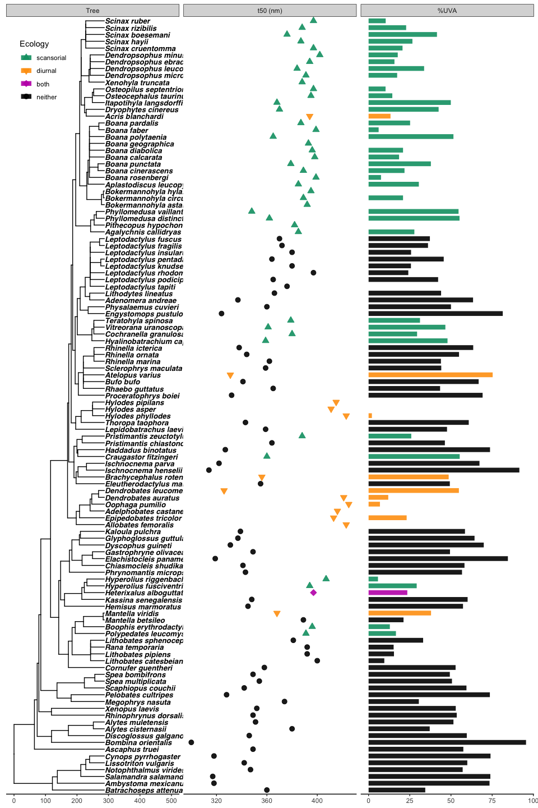

Here, we examine how ecology may shape species differences in short-wavelength lens transmission. 


# Data

First, we import the tidied data compiled from all studies that includes ASW names and ecological details. 


```r
#import species data for lens transmission
lens_data <- data.frame(read.csv("../Data/tidy data/lenses_compiled.csv", header=TRUE, na.strings=c("", "NA"))) 
```

Then we subset data to adults measured in this study and previously published studies. We also create subsets for data from this study vs. data from previous studies. 


```r
#adults
lens_adults <- lens_data %>% 
  filter(stage %in% c("adult", "unknown"))

#adults-this study
lens_adults.new <- lens_adults %>% 
  filter(source == "this_study")

#adults-literature
lens_adults.pub <- lens_adults %>% 
  filter(source == "literature")
```

Finally, we import the pruned tree. 


```r
#Import pruned tree
lens.tree <- read.tree(file = "../Data/tidy data/pruned_tree.txt")
```


# Visualize data

Here, we examine the distribution of lens transmission summary data across the amphibian phylogeny and ecological traits.

## Plot adult sampling onto phylogeny


```r
# prep data -----

#create dataframe of adults with this paper and lit data in two separate columns

#our data
new_cols <- lens_adults.new %>%
  mutate(t450nm_new = t450nm) %>%
  mutate(t50_new = t50) %>%
  mutate(pUVA_new = pUVA) %>%
  select(ASW_names, t450nm_new, t50_new, pUVA_new, hab, act)

#published data
lit_cols <- lens_adults.pub %>%
  mutate(t450nm_lit = t450nm) %>%
  mutate(t50_lit = t50) %>%
  mutate(pUVA_lit = pUVA) %>%
  select(ASW_names, t450nm_lit, t50_lit, pUVA_lit, hab, act)

#merge
adults_sep <- full_join(new_cols, lit_cols, by = c("ASW_names", "hab", "act"))

#prune tree to adult data -----

#make list of taxa to drop (in tree but not in dataset)
drops <- setdiff(lens.tree$tip.label, adults_sep$ASW_names)

#drop unwanted tips from phylogeny
tree.adults <- drop.tip(phy = lens.tree, tip = drops) 

#set rownames of adult dataset
rownames(adults_sep) <- as.character(adults_sep$ASW_names)

#check that phylogeny tips and data match exactly (if they match will return "OK")
name.check(tree.adults, adults_sep)

#resort dataset to the order of tree tip labels
adults_sep <- adults_sep[tree.adults$tip.label, ] 
```


```r
#plot phylogeny with sampling tip labels ----


#color vecctors
col_hab <- c("other" = "grey95",
             "scansorial" = "#009E73")

col_act <- c("diurnal" = "#FFB122",
             "nondiurnal" = "grey95")

#phylogeny
plot.phylo(tree.adults, 
           type = "phylogram", 
           show.tip.label = TRUE, 
           cex = 0.6, #text size
           no.margin = TRUE, 
           use.edge.length = TRUE, 
           edge.width = 2,
           x.lim = 650,
           label.offset = 2) 

#add tip labels for our data (t50)
tiplabels(adults_sep$t50_new,
          cex = 0.6,
          frame = "none",
          bg = "white",
          offset = 195) #size of labels

#add tip labels for published data (t50) 
tiplabels(adults_sep$t50_lit,
          cex = 0.6,
          font = 3,
          frame = "none",
          bg = "white",
          offset = 215) #size of labels

#add tip labels for our data (%UVA)
tiplabels(round(adults_sep$pUVA_new, digits = 0),
          cex = 0.6,
          font = 2,
          frame = "none",
          bg = "white",
          offset = 240) #size of labels

#add tip labels for published data (%UVA)
tiplabels(round(adults_sep$pUVA_lit,digits = 0),
          cex = 0.6,
          font = 4, 
          frame = "none",
          bg = "white",
          offset = 255) #size of labels

#add tip labels for scansorial/not
tiplabels(col = col_hab[as.factor(adults_sep$hab)], #sets color habitat
          pch = 17,
          cex = 0.8,
          offset = 150) 

#add tip labels for diurnal/not
tiplabels(col = col_act[as.factor(adults_sep$act)], #sets color habitat
          pch = 19,
          cex = 0.8,
          offset = 160) 


#add legend for ecology traits
legend(x = 20, y = 25, legend = c("Scansorial", "Diurnal"), 
       col = c("#009E73", "#FFB122"),
       pch = c(17,19),
       cex = 0.6, 
       box.lty = 0, 
       title = "Ecology", 
       title.adj = 0)
```


```r
#export pdf

#pdf
pdf("../Figures/phylogeny_summary.pdf", width = 7, height = 12)

#phylogeny
plot.phylo(tree.adults, 
           type = "phylogram", 
           show.tip.label = TRUE, 
           cex = 0.6, #text size
           no.margin = TRUE, 
           use.edge.length = TRUE, 
           edge.width = 2,
           x.lim = 650,
           label.offset = 2) 

#add tip labels for our data (t50)
tiplabels(adults_sep$t50_new,
          cex = 0.6,
          frame = "none",
          bg = "white",
          offset = 195) #size of labels

#add tip labels for published data (t50) 
tiplabels(adults_sep$t50_lit,
          cex = 0.6,
          font = 3,
          frame = "none",
          bg = "white",
          offset = 215) #size of labels

#add tip labels for our data (%UVA)
tiplabels(round(adults_sep$pUVA_new, digits = 0),
          cex = 0.6,
          font = 2,
          frame = "none",
          bg = "white",
          offset = 240) #size of labels

#add tip labels for published data (%UVA)
tiplabels(round(adults_sep$pUVA_lit,digits = 0),
          cex = 0.6,
          font = 4, 
          frame = "none",
          bg = "white",
          offset = 255) #size of labels

#add tip labels for scansorial/not
tiplabels(col = col_hab[as.factor(adults_sep$hab)], #sets color habitat
          pch = 17,
          cex = 0.8,
          offset = 150) 

#add tip labels for diurnal/not
tiplabels(col = col_act[as.factor(adults_sep$act)], #sets color habitat
          pch = 19,
          cex = 0.8,
          offset = 160) 

#add legend for ecology traits
legend(x = 20, y = 25, legend = c("Scansorial", "Diurnal"), 
       col = c("#009E73", "#FFB122"),
       pch = c(17,19),
       cex = 0.6, 
       box.lty = 0, 
       title = "Ecology", 
       title.adj = 0)

dev.off()
```


## Plots of t50 and %UVA values across ecological states

Here we plot adult lens transmission metrics (t50 and %UVA) across ecological categories to visualize differences. 


```r
# create vectors of colors for habitat
col_hab <- c("scansorial" = "#009E73",
              "other"  = "#636363")

#create vector of colors for activity period
col_act <- c("nondiurnal" = "#636363",
             "diurnal" = "#FFA010")

#create vector of colors for activity period
col_dich <- c("nondichromatic" = "#636363",
              "dichromatic" = "#03a1fc")

#create shape vector for source of data
sh_source <- c("literature" = 1, 
               "this_study" = 19)
```


```r
# Scansoriality ------

# boxplot of T50 across habs
boxplot_habs.t50 <- ggplot(data = lens_adults, 
                       aes(x = hab, y = t50)) + 
  geom_boxplot(notch = FALSE, outlier.shape = NA, alpha = 0.9) + #controls boxes  
 geom_jitter(aes(color = hab, shape = source), size = 1.5, alpha = 0.7, position = position_jitter(0.15)) +
  scale_color_manual(values = col_hab,
                     name = "Habitat",
                     breaks = c("scansorial", "other"),
                     labels = c("scansorial", "non-scans.")) +
  stat_summary(fun.y = mean, colour = "black", geom = "point", shape = 18, size = 3, show_guide = FALSE) + #controls what stats shown
  scale_shape_manual(values = sh_source,
                     name = "Data",
                     breaks = c("this_study", "literature"),
                     labels = c("this study", "literature"),
                     guide = guide_legend(override.aes = list(color = "black"), fill = "black")) +
  theme(text = element_text(size=14), panel.background = element_blank(), axis.line = element_line(colour = "black"), legend.key = element_rect(fill = NA)) + #controls background +
  scale_x_discrete(labels=c("scansorial" = "scansorial",
                            "other" = "non-scans.")) +
  scale_y_continuous(breaks = c(300,325,350,375,400,425), limits=c(300, 425)) +
  xlab("") +
  ylab("t50 (nm)")

# boxplot of %UVA across habs
boxplot_habs.uva <- ggplot(data = lens_adults, 
                       aes(x = hab, y = pUVA)) + 
  geom_boxplot(notch = FALSE, outlier.shape = NA, alpha = 0.9) + #controls boxes  
  
 geom_jitter(aes(color = hab, shape = source), size = 1.5, alpha = 0.7, position = position_jitter(0.15)) +
  stat_summary(fun.y = mean, colour = "black", geom = "point", shape = 18, size = 3, show_guide = FALSE) + #controls what stats shown
  scale_color_manual(values = col_hab,
                     name = "Habitat",
                     breaks = c("scansorial", "other"),
                     labels = c("scansorial", "non-scans.")) +
  scale_shape_manual(values = sh_source,
                     name = "Data",
                     breaks = c("this_study", "literature"),
                     labels = c("this study", "literature"),
                     guide = guide_legend(override.aes = list(color = "black"), fill = "black")) +
  theme(text = element_text(size=14), panel.background = element_blank(), axis.line = element_line(colour = "black"), legend.key = element_rect(fill = NA)) + #controls background
  xlab("Scansoriality") +
  scale_x_discrete(labels=c("scansorial" = "scansorial",
                            "other" = "non-scans.")) +
  ylab("UVA (%)") +
  labs(fill = "Data source")

#print plots
plot_grid(boxplot_habs.t50, boxplot_habs.uva,  #list of plots to arrange in grid
           align = 'vh', #align horizontally and vertically
           ncol = 2,
           rel_widths = c(1, 1)) #number of columns in grids
```

<!-- -->

```r
# Diurnality ------

# boxplot of T50 across acts
boxplot_act.t50 <- lens_adults %>%
  mutate(act = fct_relevel(act, "diurnal", "nondiurnal")) %>%
  ggplot(aes(x = act, y = t50)) + 
   geom_boxplot(notch = FALSE, outlier.shape = NA, alpha = 0.9) + #controls boxes  
  #controls what stats shown
 geom_jitter(aes(color = act, shape = source), size = 1.5, alpha = 0.7, position = position_jitter(0.15)) +
   stat_summary(fun.y = mean, colour = "black", geom = "point", shape = 18, size = 3, show_guide = FALSE) +
  scale_color_manual(values = col_act,
                     name = "Activity",
                     breaks = c("diurnal", "nondiurnal"),
                     labels = c("diurnal", "non-diurnal")) +
  scale_shape_manual(values = sh_source,
                     name = "Data",
                     breaks = c("this_study", "literature"),
                     labels = c("this study", "literature"),
                     guide = guide_legend(override.aes = list(color = "black"), fill = "black")) +
  theme(text = element_text(size=14), panel.background = element_blank(), axis.line = element_line(colour = "black"), legend.key = element_rect(fill = NA)) + #controls background
  scale_x_discrete(labels=c("diurnal" = "diurnal",
                            "nondiurnal" = "non-diurnal")) +
  scale_y_continuous(breaks = c(300,325,350,375,400,425), limits=c(300, 425)) +
  xlab("Diurnality") +
  ylab("t50 (nm)") +
  labs(fill = "Data source")

# boxplot of %UVA across habs
boxplot_act.uva <- lens_adults %>%
  mutate(act = fct_relevel(act, "diurnal", "nondiurnal")) %>%
  ggplot(aes(x = act, y = pUVA)) + 
   geom_boxplot(notch = FALSE, outlier.shape = NA, alpha = 0.9) + #controls boxes  
 geom_jitter(aes(color = act, shape = source), size = 1.5, alpha = 0.7, position = position_jitter(0.15)) +
  stat_summary(fun.y = mean, colour = "black", geom = "point", shape = 18, size = 3, show_guide = FALSE) +
  scale_color_manual(values = col_act,
                     name = "Activity",
                     breaks = c("diurnal", "nondiurnal"),
                     labels = c("diurnal", "non-diurnal")) +
  scale_shape_manual(values = sh_source,
                     name = "Data",
                     breaks = c("this_study", "literature"),
                     labels = c("this study", "literature"),
                     guide = guide_legend(override.aes = list(color = "black"), fill = "black")) +
  theme(text = element_text(size=14), panel.background = element_blank(), axis.line = element_line(colour = "black"), legend.key = element_rect(fill = NA)) + #controls background
  scale_x_discrete(labels=c("diurnal" = "diurnal",
                            "nondiurnal" = "non-diurnal")) +
  xlab("Diurnality") +
  ylab("UVA (%)") +
  labs(fill = "Data source")

#print plots
plot_grid(boxplot_act.t50, boxplot_act.uva,  #list of plots to arrange in grid
           align = 'vh', #align horizontally and vertically
           ncol = 2,
           rel_widths = c(1, 1)) #number of columns in grids
```

<!-- -->


```r
#Boxplot figure

fig.a <- boxplot_habs.t50 + 
  xlab("")+ 
  ylab("t50 (nm)") +
  scale_x_discrete(labels=c("scansorial" = "",
                            "other" = "")) +
  theme(legend.position = "none")

fig.b <- boxplot_act.t50 + 
  xlab("")+ 
  ylab("") +
  scale_x_discrete(labels=c("diurnal" = "",
                            "nondiurnal" = "")) +
  theme(legend.position = "none")

fig.c <- boxplot_habs.uva + 
  xlab("")+ 
  ylab("UVA (%)") +
  theme(legend.position = "none")

fig.d <- boxplot_act.uva + 
  xlab("")+ 
  ylab("") +
  theme(legend.position = "none")


# boxplot of T50 across habs
pdf("../Figures/Fig-3.pdf", width = 5, height = 6)
plot_grid(fig.a, fig.b, fig.c, fig.d,
          align = 'vh', 
          labels = c("A", "B", "C", "D"),
          hjust = -0.5, 
          vjust = 1.8, 
          nrow = 2)
dev.off()
```

## Plots of t50 and %UVA values onto phylogeny

Here and in subsequent analyses, we must have one transmission value assigned to each species. We include data from both our study and from previously published literature. However, for the 8 species with data from both sources, we use our data in these visualizations and in analyses.


```r
#For species with more than one data point (measured by us and in lit), choose our data
adults_merged <- adults_sep %>%
  mutate(t50_merge = ifelse(is.na(adults_sep$t50_new), t50_lit, t50_new)) %>%
  mutate(pUVA_merge = ifelse(is.na(adults_sep$pUVA_new), pUVA_lit, pUVA_new))
```


```r
#subset data
adults_plot <- adults_merged %>%
  mutate(tip = ASW_names) %>%
  #put genus and species in separate columns
  separate(ASW_names, c("genus", "species"), sep = "_", extra = "drop") %>%
  #add tip labels with regular text
  mutate(labels = as.factor(paste(genus, species, sep = " "))) %>%
  select(tip, labels, t50_merge, pUVA_merge, hab, act)

# set row names in dataset to match the tip labels in the tree
row.names(adults_plot) <- adults_plot$tip

#check that phylogeny and data match exactly
name.check(tree.adults, adults_plot)

#resort trait dataset to the order of tree tip labels
adults_plot <- adults_plot[tree.adults$tip.label, ] 

#labels
labs <- adults_plot %>% select(tip, labels)
```

#### plot data

First we visualize the distribution of all our t50 and %UVA data across the phylogeny. 


```r
# Make the phylogeny plot
p <- ggtree(tree.adults) %<+% labs + 
     geom_tiplab(cex = 3, aes(label = labels), fontface = 3) + 
   xlim_tree(450) + 
   coord_cartesian(clip = 'off') 

# Make a second plot next to the phylogeny (dot plot of t50 values)
p2 <- facet_plot(p, panel="t50 (nm)", data=adults_plot, geom=geom_point, aes(x=t50_merge), color = "#BDC3BE",  shape = 19, cex = 2.5)

# Make a third plot next to the first two (bar plot of %UVA)
p3 <- facet_plot(p2, panel='%UVA', data=adults_plot, geom=geom_segment, aes(x=0, xend=pUVA_merge, y=y, yend=y), color = "#BDC3BE", size=3) +
  theme_tree2(legend.position=c(.07, .93)) #add scale bars and move legends

#control widths of panels
 gt = ggplot_gtable(ggplot_build(p3))
# gtable_show_layout(gt) # will show you the layout - very handy function
# gt # see plot layout in table format
# gt$layout$l[grep('tree', gt$layout$name)] # you want to find the column specific to panel-2
 gt$widths[7] = 0.5*gt$widths[7] # reduce column 7
 gt$widths[9] = 0.5*gt$widths[9] 

#print figure
p3
```

<!-- -->

#### plot data + scansoriality

Then we visualize our data colored by habitat. 


```r
# Make the phylogeny plot
p <- ggtree(tree.adults) %<+% labs + 
     geom_tiplab(cex = 3, aes(label = labels), fontface = 3) + 
   xlim_tree(450) + 
   coord_cartesian(clip = 'off') 

# Make a second plot next to the phylogeny (dot plot of t50 values)
p2 <- facet_plot(p, panel="t50 (nm)", data=adults_plot, geom=geom_point, aes(x=t50_merge, color = hab), shape = 19, cex = 2.5) +
  scale_color_manual(values = col_hab,
                     name = "Habitat",
                     breaks = c("scansorial", "other"),
                     labels = c("scansorial", "non-scansorial"))

# Make a third plot next to the first two (bar plot of %UVA)
p3 <- facet_plot(p2, panel='%UVA', data=adults_plot, geom=geom_segment, aes(x=0, xend=pUVA_merge, y=y, yend=y, color = hab), size=3) +
  theme_tree2(legend.position=c(.07, .93)) #add scale bars and move legends

#control widths of panels
 gt = ggplot_gtable(ggplot_build(p3))
# gtable_show_layout(gt) # will show you the layout - very handy function
# gt # see plot layout in table format
# gt$layout$l[grep('tree', gt$layout$name)] # you want to find the column specific to panel-2
 gt$widths[7] = 0.5*gt$widths[7] # reduce column 7
 gt$widths[9] = 0.5*gt$widths[9] 

#print figure
p3
```

<!-- -->


```r
#export as pdf
pdf("../Figures/ggtree-scans.pdf", width = 10, height = 15)
grid::grid.draw(gt) # plot with grid draw
dev.off()
```

#### plot data + diurnality

Then we visualize our data colored by activity pattern. 


```r
# Make the phylogeny plot
p <- ggtree(tree.adults) %<+% labs + 
     geom_tiplab(cex = 3, aes(label = labels), fontface = 3) + 
   xlim_tree(450) + 
   coord_cartesian(clip = 'off') 

# Make a second plot next to the phylogeny (dot plot of t50 values)
p2 <- facet_plot(p, panel="t50 (nm)", data=adults_plot, geom=geom_point, aes(x=t50_merge, color = act), shape = 19, cex = 2.5) +
  scale_color_manual(values = col_act,
                     name = "Activity period",
                     breaks = c("diurnal", "nondiurnal"),
                     labels = c("diurnal", "non-diurnal"))


# Make a third plot next to the first two (bar plot of %UVA)
p3 <- facet_plot(p2, panel='%UVA', data=adults_plot, geom=geom_segment, aes(x=0, xend=pUVA_merge, y=y, yend=y, color = act), size=3) +
  theme_tree2(legend.position=c(.07, .93)) #add scale bars and move legends

#control widths of panels
 gt = ggplot_gtable(ggplot_build(p3))
# gtable_show_layout(gt) # will show you the layout - very handy function
# gt # see plot layout in table format
# gt$layout$l[grep('tree', gt$layout$name)] # you want to find the column specific to panel-2
 gt$widths[7] = 0.5*gt$widths[7] # reduce column 7
 gt$widths[9] = 0.5*gt$widths[9] 

#print figure
p3
```

<!-- -->


```r
#export as pdf
pdf("../Figures/ggtree-act.pdf", width = 10, height = 15)
grid::grid.draw(gt) # plot with grid draw
dev.off()
```


#### make paper figure

Then we visualize our data colored by ecological states that were significant in our phylogenetic ANOVAs (below). Here, we make a new column in our dataframe indicating the presence of diurnality, scansoriality, both (n = 1), and neither. This will show the distribution of both significant ecological effects, as well as show that there is only one species that is both diurnal and scansorial, indicating that these are separate effects. 


```r
#make new category with scansorial, diurnal, both, or neither
lens_adults.new <- lens_adults.new %>%
  mutate(eco_cat = case_when(hab=="scansorial" & act=="diurnal" ~ "both",
                             hab == "scansorial" ~ "scansorial",
                             act == "diurnal" ~ "diurnal", 
                             hab=="other" & act=="nondiurnal" ~ "neither")) %>%
  mutate(eco_binary = recode_factor(eco_cat, "scansorial" = "SD", "diurnal" = "SD", "both" = "SD", "neither" = "not"))

#subset data
adults_plot.combined <- adults_plot %>%
   mutate(eco_cat = case_when(hab=="scansorial" & act=="diurnal" ~ "both",
                             hab == "scansorial" ~ "scansorial",
                             act == "diurnal" ~ "diurnal", 
                             hab == "other" & act == "nondiurnal" ~ "neither")) %>%
  select(tip, labels, t50_merge, pUVA_merge, eco_cat)

# set row names in dataset to match the tip labels in the tree
row.names(adults_plot.combined) <- adults_plot.combined$tip

#check that phylogeny and data match exactly
name.check(tree.adults, adults_plot.combined)

#resort trait dataset to the order of tree tip labels
adults_plot.combined <- adults_plot.combined[tree.adults$tip.label, ] 

#make color pallette for new combined states
col_ecocat <- c("both" = "#C107B6",
                "diurnal" = "#FFA010",
                "neither" = "black", #boxplot fig uses #636363 but with alpha it's lighter
                "scansorial" = "#009E73")

shape_ecocat <- c("both" = 23,
                "diurnal" = 25,
                "neither" = 21, 
                "scansorial" = 24)

# create vectors of colors for habitat
col_hab <- c("scansorial" = "#009E73",
              "other"  = "#636363")

#create vector of colors for activity period
col_act <- c("nondiurnal" = "#636363",
             "diurnal" = "#FFA010")
```

We also update the label for _Brachycephalus ephippium_ in the phylogeny, as it has been recently changed to _Brachycephalus rotenbergae_ in the region we sampled (Nunes et al. 2021). 


```r
#rename in dataset 
adults_plot.combined <- adults_plot.combined %>%
  mutate(labels = recode_factor(labels, "Brachycephalus ephippium" = "Brachycephalus rotenbergae"))

#labels
labs <- adults_plot.combined %>% select(tip, labels)
```


```r
# Make the phylogeny plot
p <- ggtree(tree.adults) %<+% labs + 
     geom_tiplab(size = 3.5, aes(label = labels), fontface = 4) + 
   xlim_tree(500) + 
   coord_cartesian(clip = 'off') 


# Make a second plot next to the phylogeny (dot plot of t50 values)
p2 <- facet_plot(p, panel="t50 (nm)", data=adults_plot.combined, geom=geom_point, aes(x=t50_merge, fill = eco_cat, col = eco_cat, shape = eco_cat), cex = 2.8, alpha = 0.9) +
  scale_fill_manual(values = col_ecocat,
                     name = "Ecology",
                     breaks = c("scansorial", "diurnal", "both", "neither"),
                     labels = c("scansorial", "diurnal", "both", "neither")) +
  scale_color_manual(values = col_ecocat,
                     name = "Ecology",
                     breaks = c("scansorial", "diurnal", "both", "neither"),
                     labels = c("scansorial", "diurnal", "both", "neither")) +
  scale_shape_manual(values = shape_ecocat,
                     name = "Ecology",
                     breaks = c("scansorial", "diurnal", "both", "neither"),
                     labels = c("scansorial", "diurnal", "both", "neither"))

# Make a third plot next to the first two (bar plot of %UVA)
p3 <- facet_plot(p2, panel='%UVA', data=adults_plot.combined, geom=geom_segment, aes(x=0, xend=pUVA_merge, y=y, yend=y, color = eco_cat), size=3, alpha = 0.9) +
  theme_tree2(legend.position=c(.07, .93)) #add scale bars and move legends

#control widths of panels
 gt = ggplot_gtable(ggplot_build(p3 +# set transparency
    theme(
        panel.grid.major = element_blank(), 
        panel.grid.minor = element_blank(),
        panel.background = element_rect(fill = "transparent",colour = NA),
        plot.background = element_rect(fill = "transparent",colour = NA)
        )))
# gtable_show_layout(gt) # will show you the layout - very handy function
# gt # see plot layout in table format
# gt$layout$l[grep('tree', gt$layout$name)] # you want to find the column specific to panel-2
 gt$widths[7] = 0.5*gt$widths[7] # reduce column 7
 gt$widths[9] = 0.5*gt$widths[9] 

 #print figure
p3 
```

<!-- -->


```r
#export as pdf
pdf("../Figures/ggtree-fig.pdf", width = 10, height = 15)
grid::grid.draw(gt) # plot with grid draw
dev.off()
```

```r
#extract legend from dot plot
leg <- cowplot::get_legend(p2)

#export legend as pdf
pdf("../Figures/ggtree-leg.pdf", width = 2, height = 2)
plot(leg)
dev.off()
```


# Comparative evolutionary models 

Here, we used PGLS models in caper to run phylogenetic ANOVAs to test for associations between lens transmission and ecological variables while accounting for evolutionary non-independence among species. These models use all available data, including all species we sampled plus all additional species available in published literature. Because published measurements did not always record transmission down to 305nm, we could not calculate %UVA (400-305nm) for 10 species. Thus, our species sampling for t50 (n = 114) is higher than for %UVA (n = 104) in these models. 

## t50 and ecology 


```r
# Prep data and phylogeny -----

#subset data for T50
adult_t50 <- adults_merged %>%
  mutate(tip = ASW_names) %>%
  select(tip, t50_merge, hab, act)

# set row names in dataset to match the tip labels in the tree
row.names(adult_t50) <- adult_t50$tip

#check that phylogeny and data match exactly
name.check(tree.adults, adult_t50)

#resort trait dataset to the order of tree tip labels
adult_t50 <- adult_t50[tree.adults$tip.label, ] 


# Prep data for caper -------

#use caper function to combine phylogeny and data into one object 
#(this function also matches species names in tree and dataset)
t50.comp <- comparative.data(phy = tree.adults, data = adult_t50, 
                             names.col = tip, 
                             vcv = TRUE, 
                             na.omit = FALSE, 
                             warn.dropped = TRUE)

#check for dropped tips or dropped species
t50.comp$dropped$tips #phylogeny
t50.comp$dropped$unmatched.rows #dataset
```

### t50 across habitats

Species that climb up plants/trees (=scansorial) have significantly higher t50 values (more UV filtering) than non-scansorial species in a phylogenetic ANOVA.


```r
#view distribution of data
table(adult_t50$hab)
```

```{style="max-height: 350px;"}
## 
##      other scansorial 
##         72         42
```

```r
#habitat vs. T50
pgls_hab.t50 <- pgls(t50_merge ~ hab, 
               data = t50.comp,
               lambda = "ML", 
               param.CI = 0.95)

#diagnostic plots
par(mar = c(4,4,2,2))
par(mfrow = c(2, 2))
plot(pgls_hab.t50)
```

<!-- -->

```r
par(mfrow = c(1, 1))

#Likelihood plot for Pagel's lambda
lambda.hab.t50 <- pgls.profile(pgls_hab.t50, "lambda")
plot(lambda.hab.t50)
```

<!-- -->

```r
#main effects
anova(pgls_hab.t50)
```

```{style="max-height: 350px;"}
## Analysis of Variance Table
## Sequential SS for pgls: lambda = 0.82, delta = 1.00, kappa = 1.00
## 
## Response: t50_merge
##            Df Sum Sq Mean Sq F value   Pr(>F)   
## hab         1  32.58  32.580  9.0442 0.003254 **
## Residuals 112 403.46   3.602                    
## ---
## Signif. codes:  0 '***' 0.001 '**' 0.01 '*' 0.05 '.' 0.1 ' ' 1
```

```r
#coefficients
summary(pgls_hab.t50)
```

```{style="max-height: 350px;"}
## 
## Call:
## pgls(formula = t50_merge ~ hab, data = t50.comp, lambda = "ML", 
##     param.CI = 0.95)
## 
## Residuals:
##     Min      1Q  Median      3Q     Max 
## -4.8987 -1.2065 -0.2894  1.0122  5.8361 
## 
## Branch length transformations:
## 
## kappa  [Fix]  : 1.000
## lambda [ ML]  : 0.817
##    lower bound : 0.000, p = 4.6862e-08
##    upper bound : 1.000, p = 3.7449e-06
##    95.0% CI   : (0.609, 0.933)
## delta  [Fix]  : 1.000
## 
## Coefficients:
##               Estimate Std. Error t value  Pr(>|t|)    
## (Intercept)   345.9421    13.8425 24.9914 < 2.2e-16 ***
## habscansorial  20.5999     6.8498  3.0074  0.003254 ** 
## ---
## Signif. codes:  0 '***' 0.001 '**' 0.01 '*' 0.05 '.' 0.1 ' ' 1
## 
## Residual standard error: 1.898 on 112 degrees of freedom
## Multiple R-squared: 0.07472,	Adjusted R-squared: 0.06646 
## F-statistic: 9.044 on 1 and 112 DF,  p-value: 0.003254
```

### t50 across activity periods

Diurnal (day-active) species have significantly higher t50 values (more UV filtering) than non-diurnal species in a phylogenetic ANOVA.


```r
#view distribution of data
table(adult_t50$act)
```

```{style="max-height: 350px;"}
## 
##    diurnal nondiurnal 
##         14        100
```

```r
#activity per vs. T50
pgls_act.t50 <- pgls(t50_merge ~ act, 
               data = t50.comp,
               lambda = "ML", 
               param.CI = 0.95)

#diagnostic plots
par(mar = c(4,4,2,2))
par(mfrow = c(2, 2))
plot(pgls_act.t50)
```

<!-- -->

```r
par(mfrow = c(1, 1))

#Likelihood plot for Pagel's lambda
lambda.act.t50 <- pgls.profile(pgls_act.t50, "lambda")
plot(lambda.act.t50)
```

<!-- -->

```r
#main effects
anova(pgls_act.t50)
```

```{style="max-height: 350px;"}
## Analysis of Variance Table
## Sequential SS for pgls: lambda = 0.78, delta = 1.00, kappa = 1.00
## 
## Response: t50_merge
##            Df Sum Sq Mean Sq F value  Pr(>F)  
## act         1  23.21 23.2113  6.7164 0.01082 *
## Residuals 112 387.06  3.4559                  
## ---
## Signif. codes:  0 '***' 0.001 '**' 0.01 '*' 0.05 '.' 0.1 ' ' 1
```

```r
#coefficients
summary(pgls_act.t50)
```

```{style="max-height: 350px;"}
## 
## Call:
## pgls(formula = t50_merge ~ act, data = t50.comp, lambda = "ML", 
##     param.CI = 0.95)
## 
## Residuals:
##     Min      1Q  Median      3Q     Max 
## -5.1423 -0.9572  0.1135  1.2780  5.2703 
## 
## Branch length transformations:
## 
## kappa  [Fix]  : 1.000
## lambda [ ML]  : 0.779
##    lower bound : 0.000, p = 4.4279e-10
##    upper bound : 1.000, p = 1.7533e-06
##    95.0% CI   : (0.555, 0.912)
## delta  [Fix]  : 1.000
## 
## Coefficients:
##               Estimate Std. Error t value Pr(>|t|)    
## (Intercept)   365.9946    15.1268 24.1951  < 2e-16 ***
## actnondiurnal -19.4488     7.5045 -2.5916  0.01082 *  
## ---
## Signif. codes:  0 '***' 0.001 '**' 0.01 '*' 0.05 '.' 0.1 ' ' 1
## 
## Residual standard error: 1.859 on 112 degrees of freedom
## Multiple R-squared: 0.05658,	Adjusted R-squared: 0.04815 
## F-statistic: 6.716 on 1 and 112 DF,  p-value: 0.01082
```

## %UVA and ecology 

Here, we used the same type of models to test for associations between ecology and %UVA transmitted through lenses across species. Note that the species dataset for these analyses are slightly reduced; 10 species with data gathered from the literature could not be included, as transmission measurements were not made down to 305nm.


```r
# Prep data and phylogeny -----

#subset data for uva
adult_uva <- adults_merged %>%
  filter(!is.na(pUVA_merge)) %>%
  mutate(tip = ASW_names) %>%
  select(tip, pUVA_merge, hab, act, t50_merge)

# set row names in dataset to match the tip labels in the tree
row.names(adult_uva) <- adult_uva$tip

#check that phylogeny and data match exactly
name.check(tree.adults, adult_uva)

#make list of taxa to drop (in tree but not in dataset)
drops <- setdiff(tree.adults$tip.label, adult_uva$tip)

#drop unwanted tips from phylogeny
tree.adults.uva <- drop.tip(phy = tree.adults, tip = drops) 

#check that phylogeny tips and data match exactly (if they match will return "OK")
name.check(tree.adults.uva, adult_uva)

#resort trait dataset to the order of tree tip labels
adult_uva <- adult_uva[tree.adults.uva$tip.label, ] 

# Prep data for caper -------

#use caper function to combine phylogeny and data into one object 
#(this function also matches species names in tree and dataset)
uva.comp <- comparative.data(phy = tree.adults.uva, data = adult_uva, 
                             names.col = tip, 
                             vcv = TRUE, 
                             na.omit = FALSE, 
                             warn.dropped = TRUE)

#check for dropped tips or dropped species
uva.comp$dropped$tips #phylogeny
uva.comp$dropped$unmatched.rows #dataset
```

### %UVA across habitats

Scansorial (climbing) species have significantly lower %UVA (more UV filtering) than non-scansorial species in a phylogenetic ANOVA. This is consistent with the findings based on t50. 


```r
#view distribution of data
table(adult_uva$hab)
```

```{style="max-height: 350px;"}
## 
##      other scansorial 
##         67         37
```

```r
#habitat vs. UVA
pgls_hab.uva <- pgls(pUVA_merge ~ hab, 
               data = uva.comp,
               lambda = "ML", 
               param.CI = 0.95)

#diagnostic plots
par(mar = c(4,4,2,2))
par(mfrow = c(2, 2))
plot(pgls_hab.uva)
```

<!-- -->

```r
par(mfrow = c(1, 1))

#Likelihood plot for Pagel's lambda
lambda.hab.uva <- pgls.profile(pgls_hab.uva, "lambda")
plot(lambda.hab.uva)
```

<!-- -->

```r
#main effects
anova(pgls_hab.uva)
```

```{style="max-height: 350px;"}
## Analysis of Variance Table
## Sequential SS for pgls: lambda = 0.73, delta = 1.00, kappa = 1.00
## 
## Response: pUVA_merge
##            Df  Sum Sq Mean Sq F value   Pr(>F)   
## hab         1  21.313  21.313  10.919 0.001314 **
## Residuals 102 199.103   1.952                    
## ---
## Signif. codes:  0 '***' 0.001 '**' 0.01 '*' 0.05 '.' 0.1 ' ' 1
```

```r
#coefficients
summary(pgls_hab.uva)
```

```{style="max-height: 350px;"}
## 
## Call:
## pgls(formula = pUVA_merge ~ hab, data = uva.comp, lambda = "ML", 
##     param.CI = 0.95)
## 
## Residuals:
##     Min      1Q  Median      3Q     Max 
## -4.1022 -0.6651  0.1603  0.9121  3.8058 
## 
## Branch length transformations:
## 
## kappa  [Fix]  : 1.000
## lambda [ ML]  : 0.726
##    lower bound : 0.000, p = 0.00039488
##    upper bound : 1.000, p = 7.307e-06
##    95.0% CI   : (0.380, 0.915)
## delta  [Fix]  : 1.000
## 
## Coefficients:
##               Estimate Std. Error t value  Pr(>|t|)    
## (Intercept)    55.8412     9.7453  5.7301 1.023e-07 ***
## habscansorial -17.2666     5.2254 -3.3044  0.001314 ** 
## ---
## Signif. codes:  0 '***' 0.001 '**' 0.01 '*' 0.05 '.' 0.1 ' ' 1
## 
## Residual standard error: 1.397 on 102 degrees of freedom
## Multiple R-squared: 0.0967,	Adjusted R-squared: 0.08784 
## F-statistic: 10.92 on 1 and 102 DF,  p-value: 0.001314
```

### %UVA across activity periods

Diurnal (day-active) species have lower %UVA transmission than non-diurnal species (the trend we expect), but the difference is not significant. This is different from our findings using t50, which indicated a significant difference between diurnal and non-diurnal species. This likely is the result of reduced sampling for diurnal species using %UVA, as 4/13 diurnal species were omitted for %UVA analysis because transmission was not reported down to 305nm. 


```r
#view distribution of data
table(adult_uva$act)
```

```{style="max-height: 350px;"}
## 
##    diurnal nondiurnal 
##         10         94
```

```r
#activity per vs. UVA
pgls_act.uva <- pgls(pUVA_merge ~ act, 
               data = uva.comp,
               lambda = "ML", 
               param.CI = 0.95)

#diagnostic plots
par(mar = c(4,4,2,2))
par(mfrow = c(2, 2))
plot(pgls_act.uva)
```

<!-- -->

```r
par(mfrow = c(1, 1))

#Likelihood plot for Pagel's lambda
lambda.act.uva <- pgls.profile(pgls_act.uva, "lambda")
plot(lambda.act.uva)
```

<!-- -->

```r
#main effects
anova(pgls_act.uva)
```

```{style="max-height: 350px;"}
## Analysis of Variance Table
## Sequential SS for pgls: lambda = 0.79, delta = 1.00, kappa = 1.00
## 
## Response: pUVA_merge
##            Df  Sum Sq Mean Sq F value Pr(>F)
## act         1   4.635  4.6355  2.0027 0.1601
## Residuals 102 236.090  2.3146
```

```r
#coefficients
summary(pgls_act.uva)
```

```{style="max-height: 350px;"}
## 
## Call:
## pgls(formula = pUVA_merge ~ act, data = uva.comp, lambda = "ML", 
##     param.CI = 0.95)
## 
## Residuals:
##     Min      1Q  Median      3Q     Max 
## -3.5730 -1.1118 -0.2062  0.8429  3.1887 
## 
## Branch length transformations:
## 
## kappa  [Fix]  : 1.000
## lambda [ ML]  : 0.789
##    lower bound : 0.000, p = 5.8067e-08
##    upper bound : 1.000, p = 9.2768e-05
##    95.0% CI   : (0.534, 0.934)
## delta  [Fix]  : 1.000
## 
## Coefficients:
##               Estimate Std. Error t value  Pr(>|t|)    
## (Intercept)    46.1455    12.5802  3.6681 0.0003904 ***
## actnondiurnal   9.1110     6.4381  1.4152 0.1600635    
## ---
## Signif. codes:  0 '***' 0.001 '**' 0.01 '*' 0.05 '.' 0.1 ' ' 1
## 
## Residual standard error: 1.521 on 102 degrees of freedom
## Multiple R-squared: 0.01926,	Adjusted R-squared: 0.009641 
## F-statistic: 2.003 on 1 and 102 DF,  p-value: 0.1601
```

### t50 across activity periods with reduced dataset

We found that diurnal species have significantly higher t50s than non-diurnal species, but our comparison for %UVA showed no significant difference between diurnal and non-diurnal species. This may be because for %UVA, 10 species had to be dropped from the analysis, including 4 diurnal species out of only 14 total. Here, look at t50 in the reduced dataset to see if we lose the ability to detect a difference between groups with reduced sampling. 


```r
#view distribution of data
table(adult_uva$act)
```

```{style="max-height: 350px;"}
## 
##    diurnal nondiurnal 
##         10         94
```

```r
#activity per vs. UVA
pgls_act.t50red <- pgls(t50_merge ~ act, 
               data = uva.comp,
               lambda = "ML", 
               param.CI = 0.95)

#diagnostic plots
par(mar = c(4,4,2,2))
par(mfrow = c(2, 2))
plot(pgls_act.t50red)
```

<!-- -->

```r
par(mfrow = c(1, 1))

#Likelihood plot for Pagel's lambda
lambda.act.t50red <- pgls.profile(pgls_act.t50red, "lambda")
plot(lambda.act.t50red)
```

<!-- -->

```r
#main effects
anova(pgls_act.t50red)
```

```{style="max-height: 350px;"}
## Analysis of Variance Table
## Sequential SS for pgls: lambda = 0.73, delta = 1.00, kappa = 1.00
## 
## Response: t50_merge
##            Df Sum Sq Mean Sq F value  Pr(>F)  
## act         1  11.62 11.6166  3.4836 0.06485 .
## Residuals 102 340.14  3.3347                  
## ---
## Signif. codes:  0 '***' 0.001 '**' 0.01 '*' 0.05 '.' 0.1 ' ' 1
```

```r
#coefficients
summary(pgls_act.t50red)
```

```{style="max-height: 350px;"}
## 
## Call:
## pgls(formula = t50_merge ~ act, data = uva.comp, lambda = "ML", 
##     param.CI = 0.95)
## 
## Residuals:
##     Min      1Q  Median      3Q     Max 
## -5.6553 -1.4398 -0.3074  0.9188  3.7535 
## 
## Branch length transformations:
## 
## kappa  [Fix]  : 1.000
## lambda [ ML]  : 0.734
##    lower bound : 0.000, p = 2.6348e-08
##    upper bound : 1.000, p = 4.1431e-07
##    95.0% CI   : (0.487, 0.889)
## delta  [Fix]  : 1.000
## 
## Coefficients:
##               Estimate Std. Error t value Pr(>|t|)    
## (Intercept)   361.6315    14.9567 24.1785  < 2e-16 ***
## actnondiurnal -15.0561     8.0668 -1.8664  0.06485 .  
## ---
## Signif. codes:  0 '***' 0.001 '**' 0.01 '*' 0.05 '.' 0.1 ' ' 1
## 
## Residual standard error: 1.826 on 102 degrees of freedom
## Multiple R-squared: 0.03302,	Adjusted R-squared: 0.02354 
## F-statistic: 3.484 on 1 and 102 DF,  p-value: 0.06485
```
