Here, we examine how lens size may affect lens transmission. 


# Data

First, we import the tidied data compiled from all studies that includes ASW names and ecological details. 


```r
#import species data for lens transmission
lens_data <- data.frame(read.csv("../Data/tidy data/lenses_compiled.csv", header=TRUE, na.strings=c("", "NA"))) 
```

Then we subset data to adults measured in this study only for analyses. 


```r
#adults-this study
lens_adults.new <- lens_data %>% 
  filter(stage %in% c("adult", "unknown")) %>%
  filter(source == "this_study")
```

Finally, we import the pruned tree. 


```r
#Import pruned tree
lens.tree <- read.tree(file = "../Data/tidy data/pruned_tree.txt")
```

# Lens transmission vs. lens size

Here, we run PGLS regressions of t50 vs. log10 lens diameter and of %UVA vs. log10 lens diameter to test for relationships between transmission and path length. 

## Dataset: all adult species means

Here, we included only adult data from our study (we excluded published adult data because lens sizes from specimens used for transmission measurements were not reported). We include all species, whether or not lens transmission spectra appear to indicate the presence of a pigment. This was to test the null hypothesis that variation in transmission is due to different spectral properties in lenses across species. If we find a significant, highly correlated relationship between transmission and pathlength, it could indicate that all lenses have the same spectral properties, and differences in transmission may be driven only by differences in path length across species with different eye sizes. 

### t50 vs. path length


```r
#PGLS models for t50 or %UVA vs. lens diameter among species

#### prep data ####

#Make list of taxa to drop (in tree but not in dataset)
drops <- setdiff(lens.tree$tip.label, as.character(lens_adults.new$ASW_names))

#Drop unwanted tips from phylogeny
adults.new.tree <- drop.tip(phy = lens.tree, tip = drops) 

#Make row names of the species the phylogeny tip labels
rownames(lens_adults.new) <- lens_adults.new$ASW_names

#check that names match in dataframe and tree
name.check(phy = adults.new.tree, data = lens_adults.new, data.names = lens_adults.new$ASW_names)

#use caper function to combine phylogeny and data into one object (this function also matches species names in tree and dataset)
lenssize.comp <- comparative.data(phy = adults.new.tree, data = lens_adults.new, 
                              names.col = ASW_names, vcv = TRUE, 
                              na.omit = FALSE, warn.dropped = TRUE)

#check for dropped tips or dropped species
lenssize.comp$dropped$tips #phylogeny
lenssize.comp$dropped$unmatched.rows #dataset

#### PGLS model for t50 vs. lens size ####

#model
pgls_size.t50 <- pgls(t50 ~ log10(approx_size), 
                  data = lenssize.comp, 
                  lambda = "ML", #uses Maximum Liklihood estimate of lambda
                  param.CI = 0.95)
```

After fitting the model, we can examine the diagnostic plots to check model assumptions, then look at the parameter estimates and the likelihood profile of lambda. 


```r
###check model assumptions ###

#diagnostic plots
par(mar = c(4,4,2,2))
par(mfrow = c(2, 2))
plot(pgls_size.t50, main = "PGLS model for t50 vs. log lens size")
```

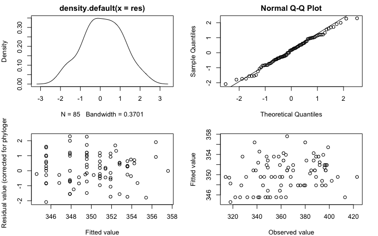<!-- -->

```r
par(mfrow = c(1, 1))

### model outputs ###

#print model output 
summary(pgls_size.t50)
```

```{style="max-height: 350px;"}
## 
## Call:
## pgls(formula = t50 ~ log10(approx_size), data = lenssize.comp, 
##     lambda = "ML", param.CI = 0.95)
## 
## Residuals:
##     Min      1Q  Median      3Q     Max 
## -3.9917 -0.9738  0.3471  1.7731  4.3893 
## 
## Branch length transformations:
## 
## kappa  [Fix]  : 1.000
## lambda [ ML]  : 0.926
##    lower bound : 0.000, p = 2.0995e-07
##    upper bound : 1.000, p = 0.0041166
##    95.0% CI   : (0.683, 0.991)
## delta  [Fix]  : 1.000
## 
## Coefficients:
##                    Estimate Std. Error t value Pr(>|t|)    
## (Intercept)         345.530     15.171 22.7757   <2e-16 ***
## log10(approx_size)   13.355     11.383  1.1732   0.2441    
## ---
## Signif. codes:  0 '***' 0.001 '**' 0.01 '*' 0.05 '.' 0.1 ' ' 1
## 
## Residual standard error: 1.942 on 83 degrees of freedom
## Multiple R-squared: 0.01631,	Adjusted R-squared: 0.004462 
## F-statistic: 1.377 on 1 and 83 DF,  p-value: 0.2441
```

```r
#Likelihood plot for Pagel's lambda from the PGLS model of eye diameter vs. the cuberoot of mass. Solid red line indicates estimate for lambda and broken red lines indcaite the 95% confidence interval
lambda.size.t50 <- pgls.profile(pgls_size.t50, "lambda")
plot(lambda.size.t50)
```

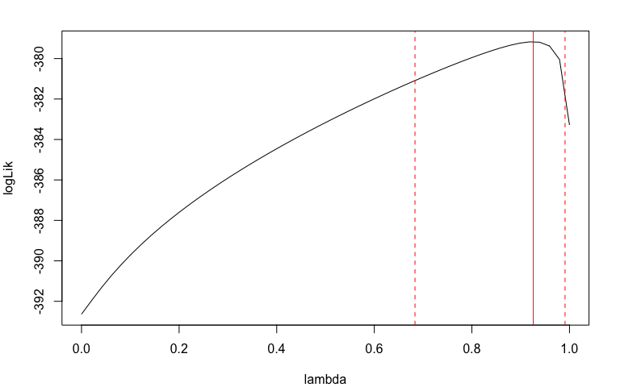<!-- -->

Finally, we can plot our data and the model fit. Note that the linear relationship between t50 and log lens diameter was not significant, indicating that observed variation in transmission among species is not driven solely by differences in path length. 


```r
#plot t50 vs. log lens size with fit
plot_t50size <- ggplot(lens_adults.new, aes(x = approx_size, y = t50, text = genus_species)) + 
  geom_point(size = 2, alpha = 0.8) + 
  scale_x_log10("Lens diameter (mm)") + 
  ylab("t50") + 
  theme_bw() +
  theme(panel.grid.major = element_blank(), panel.grid.minor = element_blank()) +
  geom_abline(slope = coef(pgls_size.t50)[[2]], intercept = coef(pgls_size.t50)[[1]], linetype = "dashed")

#interactive plot
ggplotly(plot_t50size)
```

```{=html}
<div id="htmlwidget-d5b7687061927677c8e0" style="width:576px;height:384px;" class="plotly html-widget"></div>
<script type="application/json" data-for="htmlwidget-d5b7687061927677c8e0">{"x":{"data":[{"x":[0.176091259055681,0,0.176091259055681,0,0.204119982655925,0.397940008672038,0.439332693830263,0,0.397940008672038,0.477121254719662,0.301029995663981,0.439332693830263,0.740362689494244,0.653212513775344,0.176091259055681,0.602059991327962,0.477121254719662,0,0.511883360978874,0,0.602059991327962,-0.0705810742857073,0,0.352182518111362,0.243038048686294,0.301029995663981,0.301029995663981,0.301029995663981,0,0,0.397940008672038,0.176091259055681,0.176091259055681,0.176091259055681,0.0969100130080564,0.397940008672038,0.301029995663981,0.243038048686294,0.301029995663981,0.301029995663981,0,0.301029995663981,0.397940008672038,0.477121254719662,0.301029995663981,0.477121254719662,0.812913356642856,0.628388930050311,0.397940008672038,0.397940008672038,0,0.544068044350276,0.439332693830263,0.176091259055681,0.176091259055681,0.176091259055681,0,0.397940008672038,0.628388930050311,0.477121254719662,0.602059991327962,0.301029995663981,0.653212513775344,0.602059991327962,0.176091259055681,0.602059991327962,0,0.397940008672038,0,0.518513939877887,0.477121254719662,0.903089986991944,0.812913356642856,0.544068044350276,0.0969100130080564,0.290034611362518,0.676693609624867,0.176091259055681,0.397940008672038,0.544068044350276,0.477121254719662,0.544068044350276,0.602059991327962,0.301029995663981,0.301029995663981],"y":[394,337,380,351,318,385,349,360,365,398,389,396,399,387,379,389,396,356,341,341,358,318,326,384,402,346,331,355,413,349,337,327,345,397,359,370,423,394,407,314,322,368,339,348,359,370,380,364,365,397,342,381,366,389,368,374,347,388,395,397,328,343,362,348,360,391,364,388,332,392,392,365,338,362,349,317,342,376,397,387,359,349,354,361,352],"text":["approx_size: 1.50<br />t50: 394<br />Acris_blanchardi","approx_size: 1.00<br />t50: 337<br />Adenomera_andreae","approx_size: 1.50<br />t50: 380<br />Alytes_cisternasii","approx_size: 1.00<br />t50: 351<br />Alytes_muletensis","approx_size: 1.60<br />t50: 318<br />Ambystoma_mexicanum","approx_size: 2.50<br />t50: 385<br />Aplastodiscus_leucopygius","approx_size: 2.75<br />t50: 349<br />Ascaphus_truei","approx_size: 1.00<br />t50: 360<br />Batrachoseps_attenuatus","approx_size: 2.50<br />t50: 365<br />Boana_polytaenia","approx_size: 3.00<br />t50: 398<br />Boana_calcarata","approx_size: 2.00<br />t50: 389<br />Boana_cinerascens","approx_size: 2.75<br />t50: 396<br />Boana_diabolica","approx_size: 5.50<br />t50: 399<br />Boana_faber","approx_size: 4.50<br />t50: 387<br />Boana_pardalis","approx_size: 1.50<br />t50: 379<br />Boana_punctata","approx_size: 4.00<br />t50: 389<br />Bokermannohyla_circumdata","approx_size: 3.00<br />t50: 396<br />Boophis_erythrodactylus","approx_size: 1.00<br />t50: 356<br />Brachycephalus_ephippium","approx_size: 3.25<br />t50: 341<br />Bufo_bufo","approx_size: 1.00<br />t50: 341<br />Chiasmocleis_shudikarensis","approx_size: 4.00<br />t50: 358<br />Cornufer_guentheri","approx_size: 0.85<br />t50: 318<br />Cynops_pyrrhogaster","approx_size: 1.00<br />t50: 326<br />Dendrobates_leucomelas","approx_size: 2.25<br />t50: 384<br />Dendropsophus_leucophyllatus","approx_size: 1.75<br />t50: 402<br />Dendropsophus_minusculus","approx_size: 2.00<br />t50: 346<br />Discoglossus_galganoi","approx_size: 2.00<br />t50: 331<br />Dyscophus_guineti","approx_size: 2.00<br />t50: 355<br />Eleutherodactylus_marnockii","approx_size: 1.00<br />t50: 413<br />Epipedobates_tricolor","approx_size: 1.00<br />t50: 349<br />Gastrophryne_olivacea","approx_size: 2.50<br />t50: 337<br />Glyphoglossus_guttulatus","approx_size: 1.50<br />t50: 327<br />Haddadus_binotatus","approx_size: 1.50<br />t50: 345<br />Hemisus_marmoratus","approx_size: 1.50<br />t50: 397<br />Heterixalus_alboguttatus","approx_size: 1.25<br />t50: 359<br />Hyalinobatrachium_cappellei","approx_size: 2.50<br />t50: 370<br />Dryophytes_cinereus","approx_size: 2.00<br />t50: 423<br />Hylodes_phyllodes","approx_size: 1.75<br />t50: 394<br />Hyperolius_fusciventris","approx_size: 2.00<br />t50: 407<br />Hyperolius_riggenbachi","approx_size: 2.00<br />t50: 314<br />Ischnocnema_henselii","approx_size: 1.00<br />t50: 322<br />Ischnocnema_parva","approx_size: 2.00<br />t50: 368<br />Itapotihyla_langsdorffii","approx_size: 2.50<br />t50: 339<br />Kaloula_pulchra","approx_size: 3.00<br />t50: 348<br />Kassina_senegalensis","approx_size: 2.00<br />t50: 359<br />Lepidobatrachus_laevis","approx_size: 3.00<br />t50: 370<br />Leptodactylus_fuscus","approx_size: 6.50<br />t50: 380<br />Leptodactylus_knudseni","approx_size: 4.25<br />t50: 364<br />Leptodactylus_pentadactylus","approx_size: 2.50<br />t50: 365<br />Leptodactylus_podicipinus","approx_size: 2.50<br />t50: 397<br />Leptodactylus_rhodomystax","approx_size: 1.00<br />t50: 342<br />Lissotriton_vulgaris","approx_size: 3.50<br />t50: 381<br />Lithobates_sphenocephalus","approx_size: 2.75<br />t50: 366<br />Lithodytes_lineatus","approx_size: 1.50<br />t50: 389<br />Mantella_betsileo","approx_size: 1.50<br />t50: 368<br />Mantella_viridis","approx_size: 1.50<br />t50: 374<br />Megophrys_nasuta","approx_size: 1.00<br />t50: 347<br />Notophthalmus_viridescens","approx_size: 2.50<br />t50: 388<br />Scinax_rizibilis","approx_size: 4.25<br />t50: 395<br />Osteocephalus_taurinus","approx_size: 3.00<br />t50: 397<br />Osteopilus_septentrionalis","approx_size: 4.00<br />t50: 328<br />Pelobates_cultripes","approx_size: 2.00<br />t50: 343<br />Phrynomantis_microps","approx_size: 4.50<br />t50: 362<br />Phyllomedusa_distincta","approx_size: 4.00<br />t50: 348<br />Phyllomedusa_vaillantii","approx_size: 1.50<br />t50: 360<br />Physalaemus_cuvieri","approx_size: 4.00<br />t50: 391<br />Polypedates_leucomystax","approx_size: 1.00<br />t50: 364<br />Pristimantis_chiastonotus","approx_size: 2.50<br />t50: 388<br />Pristimantis_zeuctotylus","approx_size: 1.00<br />t50: 332<br />Proceratophrys_boiei","approx_size: 3.30<br />t50: 392<br />Lithobates_pipiens","approx_size: 3.00<br />t50: 392<br />Rana_temporaria","approx_size: 8.00<br />t50: 365<br />Rhaebo_guttatus","approx_size: 6.50<br />t50: 338<br />Rhinella_icterica","approx_size: 3.50<br />t50: 362<br />Rhinella_marina","approx_size: 1.25<br />t50: 349<br />Rhinophrynus_dorsalis","approx_size: 1.95<br />t50: 317<br />Salamandra_salamandra","approx_size: 4.75<br />t50: 342<br />Scaphiopus_couchii","approx_size: 1.50<br />t50: 376<br />Scinax_boesemani","approx_size: 2.50<br />t50: 397<br />Scinax_cruentomma","approx_size: 3.50<br />t50: 387<br />Scinax_hayii","approx_size: 3.00<br />t50: 359<br />Sclerophrys_maculata","approx_size: 3.50<br />t50: 349<br />Spea_bombifrons","approx_size: 4.00<br />t50: 354<br />Spea_multiplicata","approx_size: 2.00<br />t50: 361<br />Vitreorana_uranoscopa","approx_size: 2.00<br />t50: 352<br />Xenopus_laevis"],"type":"scatter","mode":"markers","marker":{"autocolorscale":false,"color":"rgba(0,0,0,1)","opacity":0.8,"size":7.55905511811024,"symbol":"circle","line":{"width":1.88976377952756,"color":"rgba(0,0,0,1)"}},"hoveron":"points","showlegend":false,"xaxis":"x","yaxis":"y","hoverinfo":"text","frame":null},{"x":[-0.11926462734959,0.951773540055826],"y":[343.936920929664,358.240750268221],"text":"intercept: 345.5297<br />slope: 13.35511","type":"scatter","mode":"lines","line":{"width":1.88976377952756,"color":"rgba(0,0,0,1)","dash":"dash"},"hoveron":"points","showlegend":false,"xaxis":"x","yaxis":"y","hoverinfo":"text","frame":null}],"layout":{"margin":{"t":26.958904109589,"r":7.30593607305936,"b":40.9132420091324,"l":43.1050228310502},"plot_bgcolor":"rgba(255,255,255,1)","paper_bgcolor":"rgba(255,255,255,1)","font":{"color":"rgba(0,0,0,1)","family":"","size":14.6118721461187},"xaxis":{"domain":[0,1],"automargin":true,"type":"linear","autorange":false,"range":[-0.11926462734959,0.951773540055826],"tickmode":"array","ticktext":["1","3","5"],"tickvals":[0,0.477121254719662,0.698970004336019],"categoryorder":"array","categoryarray":["1","3","5"],"nticks":null,"ticks":"outside","tickcolor":"rgba(51,51,51,1)","ticklen":3.65296803652968,"tickwidth":0.66417600664176,"showticklabels":true,"tickfont":{"color":"rgba(77,77,77,1)","family":"","size":11.689497716895},"tickangle":-0,"showline":false,"linecolor":null,"linewidth":0,"showgrid":false,"gridcolor":null,"gridwidth":0,"zeroline":false,"anchor":"y","title":{"text":"Lens diameter (mm)","font":{"color":"rgba(0,0,0,1)","family":"","size":14.6118721461187}},"hoverformat":".2f"},"yaxis":{"domain":[0,1],"automargin":true,"type":"linear","autorange":false,"range":[308.55,428.45],"tickmode":"array","ticktext":["325","350","375","400","425"],"tickvals":[325,350,375,400,425],"categoryorder":"array","categoryarray":["325","350","375","400","425"],"nticks":null,"ticks":"outside","tickcolor":"rgba(51,51,51,1)","ticklen":3.65296803652968,"tickwidth":0.66417600664176,"showticklabels":true,"tickfont":{"color":"rgba(77,77,77,1)","family":"","size":11.689497716895},"tickangle":-0,"showline":false,"linecolor":null,"linewidth":0,"showgrid":false,"gridcolor":null,"gridwidth":0,"zeroline":false,"anchor":"x","title":{"text":"t50","font":{"color":"rgba(0,0,0,1)","family":"","size":14.6118721461187}},"hoverformat":".2f"},"shapes":[{"type":"rect","fillcolor":"transparent","line":{"color":"rgba(51,51,51,1)","width":0.66417600664176,"linetype":"solid"},"yref":"paper","xref":"paper","x0":0,"x1":1,"y0":0,"y1":1}],"showlegend":false,"legend":{"bgcolor":"rgba(255,255,255,1)","bordercolor":"transparent","borderwidth":1.88976377952756,"font":{"color":"rgba(0,0,0,1)","family":"","size":11.689497716895}},"hovermode":"closest","barmode":"relative"},"config":{"doubleClick":"reset","modeBarButtonsToAdd":["hoverclosest","hovercompare"],"showSendToCloud":false},"source":"A","attrs":{"10966e91903e":{"x":{},"y":{},"text":{},"type":"scatter"},"109616950f28":{"intercept":{},"slope":{}}},"cur_data":"10966e91903e","visdat":{"10966e91903e":["function (y) ","x"],"109616950f28":["function (y) ","x"]},"highlight":{"on":"plotly_click","persistent":false,"dynamic":false,"selectize":false,"opacityDim":0.2,"selected":{"opacity":1},"debounce":0},"shinyEvents":["plotly_hover","plotly_click","plotly_selected","plotly_relayout","plotly_brushed","plotly_brushing","plotly_clickannotation","plotly_doubleclick","plotly_deselect","plotly_afterplot","plotly_sunburstclick"],"base_url":"https://plot.ly"},"evals":[],"jsHooks":[]}</script>
```

## %UVA vs. path length


```r
#### PGLS model for %UVA vs. lens size ####

#model
pgls_size.puva <- pgls(pUVA ~ log10(approx_size), 
                  data = lenssize.comp, 
                  lambda = "ML", #uses Maximum Liklihood estimate of lambda
                  param.CI = 0.95)
```

After fitting the model, we can examine the diagnostic plots to check model assumptions, then look at the parameter estimates and the likelihood profile of lambda.


```r
###check model assumptions ###

#diagnostic plots
par(mar = c(4,4,2,2))
par(mfrow = c(2, 2))
plot(pgls_size.puva, main = "PGLS model for pUVA vs. log lens size")
```

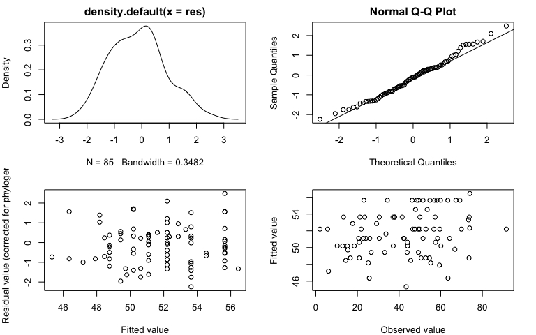<!-- -->

```r
par(mfrow = c(1, 1))

### model outputs ###

#print model output 
summary(pgls_size.puva)
```

```{style="max-height: 350px;"}
## 
## Call:
## pgls(formula = pUVA ~ log10(approx_size), data = lenssize.comp, 
##     lambda = "ML", param.CI = 0.95)
## 
## Residuals:
##     Min      1Q  Median      3Q     Max 
## -3.1903 -1.2283 -0.1703  0.5680  3.5408 
## 
## Branch length transformations:
## 
## kappa  [Fix]  : 1.000
## lambda [ ML]  : 0.839
##    lower bound : 0.000, p = 2.2887e-05
##    upper bound : 1.000, p = 0.00045649
##    95.0% CI   : (0.506, 0.973)
## delta  [Fix]  : 1.000
## 
## Coefficients:
##                    Estimate Std. Error t value  Pr(>|t|)    
## (Intercept)         55.6462    10.9241  5.0939 2.162e-06 ***
## log10(approx_size) -11.4285     9.1549 -1.2484    0.2154    
## ---
## Signif. codes:  0 '***' 0.001 '**' 0.01 '*' 0.05 '.' 0.1 ' ' 1
## 
## Residual standard error: 1.446 on 83 degrees of freedom
## Multiple R-squared: 0.01843,	Adjusted R-squared: 0.006604 
## F-statistic: 1.558 on 1 and 83 DF,  p-value: 0.2154
```

```r
#Likelihood plot for Pagel's lambda from the PGLS model of eye diameter vs. the cuberoot of mass. Solid red line indicates estimate for lambda and broken red lines indcaite the 95% confidence interval
lambda.size.uva <- pgls.profile(pgls_size.puva, "lambda")
plot(lambda.size.uva)
```

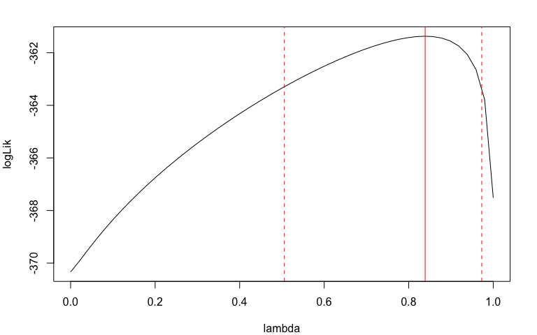<!-- -->

Finally, we can plot our data and the model fit. Note that the linear relationship between %UVA and log lens diameter was not significant, indicating that observed variation in transmission among species is not driven solely by differences in path length.


```r
#plot %UVA vs. log lens size with fit
plot_uvasize <- ggplot(lens_adults.new, aes(x = approx_size, y = pUVA, text = genus_species)) + 
  geom_point(size = 2, alpha = 0.8) + 
  scale_x_log10("Lens diameter (mm)") + 
  ylab("%UVA") + 
  theme_bw() +
  theme(panel.grid.major = element_blank(), panel.grid.minor = element_blank()) +
  geom_abline(slope = coef(pgls_size.puva)[[2]], intercept = coef(pgls_size.puva)[[1]], linetype = "dashed")

#interactive plot
ggplotly(plot_uvasize)
```

```{=html}
<div id="htmlwidget-70dedc87930c35a4dd55" style="width:576px;height:384px;" class="plotly html-widget"></div>
<script type="application/json" data-for="htmlwidget-70dedc87930c35a4dd55">{"x":{"data":[{"x":[0.176091259055681,0,0.176091259055681,0,0.204119982655925,0.397940008672038,0.439332693830263,0,0.397940008672038,0.477121254719662,0.301029995663981,0.439332693830263,0.740362689494244,0.653212513775344,0.176091259055681,0.602059991327962,0.477121254719662,0,0.511883360978874,0,0.602059991327962,-0.0705810742857073,0,0.352182518111362,0.243038048686294,0.301029995663981,0.301029995663981,0.301029995663981,0,0,0.397940008672038,0.176091259055681,0.176091259055681,0.176091259055681,0.0969100130080564,0.397940008672038,0.301029995663981,0.243038048686294,0.301029995663981,0.301029995663981,0,0.301029995663981,0.397940008672038,0.477121254719662,0.301029995663981,0.477121254719662,0.812913356642856,0.628388930050311,0.397940008672038,0.397940008672038,0,0.544068044350276,0.439332693830263,0.176091259055681,0.176091259055681,0.176091259055681,0,0.397940008672038,0.628388930050311,0.477121254719662,0.602059991327962,0.301029995663981,0.653212513775344,0.602059991327962,0.176091259055681,0.602059991327962,0,0.397940008672038,0,0.518513939877887,0.477121254719662,0.903089986991944,0.812913356642856,0.544068044350276,0.0969100130080564,0.290034611362518,0.676693609624867,0.176091259055681,0.397940008672038,0.544068044350276,0.477121254719662,0.544068044350276,0.602059991327962,0.301029995663981,0.301029995663981],"y":[13.3,63.4,37.1,51.5,73.4,30.5,57.5,34.4,51.5,18.5,21.8,20.9,6.1,25.2,37.8,20.9,12.9,48.6,66.8,58.2,52.8,74,54.8,33.7,17.7,59.6,69.9,49.3,23.1,49.4,64.3,73.7,57.3,23.5,47.9,42.5,2,29.2,5.7,91.5,67.3,49.9,58.5,60.1,47.6,37.2,25.7,45.6,42.2,24.1,59.9,33.1,44,21.2,37.9,30.5,57.1,22.8,14.4,10.3,73.6,56.7,55.2,54.6,50,16.6,46.3,25.9,69.2,15.4,15.2,43.4,63.5,43.9,53.5,73.9,59.4,41.5,20.6,26.6,44.1,49.3,50.6,46.6,52.9],"text":["approx_size: 1.50<br />pUVA: 13.3<br />Acris_blanchardi","approx_size: 1.00<br />pUVA: 63.4<br />Adenomera_andreae","approx_size: 1.50<br />pUVA: 37.1<br />Alytes_cisternasii","approx_size: 1.00<br />pUVA: 51.5<br />Alytes_muletensis","approx_size: 1.60<br />pUVA: 73.4<br />Ambystoma_mexicanum","approx_size: 2.50<br />pUVA: 30.5<br />Aplastodiscus_leucopygius","approx_size: 2.75<br />pUVA: 57.5<br />Ascaphus_truei","approx_size: 1.00<br />pUVA: 34.4<br />Batrachoseps_attenuatus","approx_size: 2.50<br />pUVA: 51.5<br />Boana_polytaenia","approx_size: 3.00<br />pUVA: 18.5<br />Boana_calcarata","approx_size: 2.00<br />pUVA: 21.8<br />Boana_cinerascens","approx_size: 2.75<br />pUVA: 20.9<br />Boana_diabolica","approx_size: 5.50<br />pUVA:  6.1<br />Boana_faber","approx_size: 4.50<br />pUVA: 25.2<br />Boana_pardalis","approx_size: 1.50<br />pUVA: 37.8<br />Boana_punctata","approx_size: 4.00<br />pUVA: 20.9<br />Bokermannohyla_circumdata","approx_size: 3.00<br />pUVA: 12.9<br />Boophis_erythrodactylus","approx_size: 1.00<br />pUVA: 48.6<br />Brachycephalus_ephippium","approx_size: 3.25<br />pUVA: 66.8<br />Bufo_bufo","approx_size: 1.00<br />pUVA: 58.2<br />Chiasmocleis_shudikarensis","approx_size: 4.00<br />pUVA: 52.8<br />Cornufer_guentheri","approx_size: 0.85<br />pUVA: 74.0<br />Cynops_pyrrhogaster","approx_size: 1.00<br />pUVA: 54.8<br />Dendrobates_leucomelas","approx_size: 2.25<br />pUVA: 33.7<br />Dendropsophus_leucophyllatus","approx_size: 1.75<br />pUVA: 17.7<br />Dendropsophus_minusculus","approx_size: 2.00<br />pUVA: 59.6<br />Discoglossus_galganoi","approx_size: 2.00<br />pUVA: 69.9<br />Dyscophus_guineti","approx_size: 2.00<br />pUVA: 49.3<br />Eleutherodactylus_marnockii","approx_size: 1.00<br />pUVA: 23.1<br />Epipedobates_tricolor","approx_size: 1.00<br />pUVA: 49.4<br />Gastrophryne_olivacea","approx_size: 2.50<br />pUVA: 64.3<br />Glyphoglossus_guttulatus","approx_size: 1.50<br />pUVA: 73.7<br />Haddadus_binotatus","approx_size: 1.50<br />pUVA: 57.3<br />Hemisus_marmoratus","approx_size: 1.50<br />pUVA: 23.5<br />Heterixalus_alboguttatus","approx_size: 1.25<br />pUVA: 47.9<br />Hyalinobatrachium_cappellei","approx_size: 2.50<br />pUVA: 42.5<br />Dryophytes_cinereus","approx_size: 2.00<br />pUVA:  2.0<br />Hylodes_phyllodes","approx_size: 1.75<br />pUVA: 29.2<br />Hyperolius_fusciventris","approx_size: 2.00<br />pUVA:  5.7<br />Hyperolius_riggenbachi","approx_size: 2.00<br />pUVA: 91.5<br />Ischnocnema_henselii","approx_size: 1.00<br />pUVA: 67.3<br />Ischnocnema_parva","approx_size: 2.00<br />pUVA: 49.9<br />Itapotihyla_langsdorffii","approx_size: 2.50<br />pUVA: 58.5<br />Kaloula_pulchra","approx_size: 3.00<br />pUVA: 60.1<br />Kassina_senegalensis","approx_size: 2.00<br />pUVA: 47.6<br />Lepidobatrachus_laevis","approx_size: 3.00<br />pUVA: 37.2<br />Leptodactylus_fuscus","approx_size: 6.50<br />pUVA: 25.7<br />Leptodactylus_knudseni","approx_size: 4.25<br />pUVA: 45.6<br />Leptodactylus_pentadactylus","approx_size: 2.50<br />pUVA: 42.2<br />Leptodactylus_podicipinus","approx_size: 2.50<br />pUVA: 24.1<br />Leptodactylus_rhodomystax","approx_size: 1.00<br />pUVA: 59.9<br />Lissotriton_vulgaris","approx_size: 3.50<br />pUVA: 33.1<br />Lithobates_sphenocephalus","approx_size: 2.75<br />pUVA: 44.0<br />Lithodytes_lineatus","approx_size: 1.50<br />pUVA: 21.2<br />Mantella_betsileo","approx_size: 1.50<br />pUVA: 37.9<br />Mantella_viridis","approx_size: 1.50<br />pUVA: 30.5<br />Megophrys_nasuta","approx_size: 1.00<br />pUVA: 57.1<br />Notophthalmus_viridescens","approx_size: 2.50<br />pUVA: 22.8<br />Scinax_rizibilis","approx_size: 4.25<br />pUVA: 14.4<br />Osteocephalus_taurinus","approx_size: 3.00<br />pUVA: 10.3<br />Osteopilus_septentrionalis","approx_size: 4.00<br />pUVA: 73.6<br />Pelobates_cultripes","approx_size: 2.00<br />pUVA: 56.7<br />Phrynomantis_microps","approx_size: 4.50<br />pUVA: 55.2<br />Phyllomedusa_distincta","approx_size: 4.00<br />pUVA: 54.6<br />Phyllomedusa_vaillantii","approx_size: 1.50<br />pUVA: 50.0<br />Physalaemus_cuvieri","approx_size: 4.00<br />pUVA: 16.6<br />Polypedates_leucomystax","approx_size: 1.00<br />pUVA: 46.3<br />Pristimantis_chiastonotus","approx_size: 2.50<br />pUVA: 25.9<br />Pristimantis_zeuctotylus","approx_size: 1.00<br />pUVA: 69.2<br />Proceratophrys_boiei","approx_size: 3.30<br />pUVA: 15.4<br />Lithobates_pipiens","approx_size: 3.00<br />pUVA: 15.2<br />Rana_temporaria","approx_size: 8.00<br />pUVA: 43.4<br />Rhaebo_guttatus","approx_size: 6.50<br />pUVA: 63.5<br />Rhinella_icterica","approx_size: 3.50<br />pUVA: 43.9<br />Rhinella_marina","approx_size: 1.25<br />pUVA: 53.5<br />Rhinophrynus_dorsalis","approx_size: 1.95<br />pUVA: 73.9<br />Salamandra_salamandra","approx_size: 4.75<br />pUVA: 59.4<br />Scaphiopus_couchii","approx_size: 1.50<br />pUVA: 41.5<br />Scinax_boesemani","approx_size: 2.50<br />pUVA: 20.6<br />Scinax_cruentomma","approx_size: 3.50<br />pUVA: 26.6<br />Scinax_hayii","approx_size: 3.00<br />pUVA: 44.1<br />Sclerophrys_maculata","approx_size: 3.50<br />pUVA: 49.3<br />Spea_bombifrons","approx_size: 4.00<br />pUVA: 50.6<br />Spea_multiplicata","approx_size: 2.00<br />pUVA: 46.6<br />Vitreorana_uranoscopa","approx_size: 2.00<br />pUVA: 52.9<br />Xenopus_laevis"],"type":"scatter","mode":"markers","marker":{"autocolorscale":false,"color":"rgba(0,0,0,1)","opacity":0.8,"size":7.55905511811024,"symbol":"circle","line":{"width":1.88976377952756,"color":"rgba(0,0,0,1)"}},"hoveron":"points","showlegend":false,"xaxis":"x","yaxis":"y","hoverinfo":"text","frame":null},{"x":[-0.11926462734959,0.951773540055826],"y":[57.0091979006697,44.7687930367734],"text":"intercept: 55.64618<br />slope: -11.42854","type":"scatter","mode":"lines","line":{"width":1.88976377952756,"color":"rgba(0,0,0,1)","dash":"dash"},"hoveron":"points","showlegend":false,"xaxis":"x","yaxis":"y","hoverinfo":"text","frame":null}],"layout":{"margin":{"t":26.958904109589,"r":7.30593607305936,"b":40.9132420091324,"l":37.2602739726027},"plot_bgcolor":"rgba(255,255,255,1)","paper_bgcolor":"rgba(255,255,255,1)","font":{"color":"rgba(0,0,0,1)","family":"","size":14.6118721461187},"xaxis":{"domain":[0,1],"automargin":true,"type":"linear","autorange":false,"range":[-0.11926462734959,0.951773540055826],"tickmode":"array","ticktext":["1","3","5"],"tickvals":[0,0.477121254719662,0.698970004336019],"categoryorder":"array","categoryarray":["1","3","5"],"nticks":null,"ticks":"outside","tickcolor":"rgba(51,51,51,1)","ticklen":3.65296803652968,"tickwidth":0.66417600664176,"showticklabels":true,"tickfont":{"color":"rgba(77,77,77,1)","family":"","size":11.689497716895},"tickangle":-0,"showline":false,"linecolor":null,"linewidth":0,"showgrid":false,"gridcolor":null,"gridwidth":0,"zeroline":false,"anchor":"y","title":{"text":"Lens diameter (mm)","font":{"color":"rgba(0,0,0,1)","family":"","size":14.6118721461187}},"hoverformat":".2f"},"yaxis":{"domain":[0,1],"automargin":true,"type":"linear","autorange":false,"range":[-2.475,95.975],"tickmode":"array","ticktext":["0","25","50","75"],"tickvals":[0,25,50,75],"categoryorder":"array","categoryarray":["0","25","50","75"],"nticks":null,"ticks":"outside","tickcolor":"rgba(51,51,51,1)","ticklen":3.65296803652968,"tickwidth":0.66417600664176,"showticklabels":true,"tickfont":{"color":"rgba(77,77,77,1)","family":"","size":11.689497716895},"tickangle":-0,"showline":false,"linecolor":null,"linewidth":0,"showgrid":false,"gridcolor":null,"gridwidth":0,"zeroline":false,"anchor":"x","title":{"text":"%UVA","font":{"color":"rgba(0,0,0,1)","family":"","size":14.6118721461187}},"hoverformat":".2f"},"shapes":[{"type":"rect","fillcolor":"transparent","line":{"color":"rgba(51,51,51,1)","width":0.66417600664176,"linetype":"solid"},"yref":"paper","xref":"paper","x0":0,"x1":1,"y0":0,"y1":1}],"showlegend":false,"legend":{"bgcolor":"rgba(255,255,255,1)","bordercolor":"transparent","borderwidth":1.88976377952756,"font":{"color":"rgba(0,0,0,1)","family":"","size":11.689497716895}},"hovermode":"closest","barmode":"relative"},"config":{"doubleClick":"reset","modeBarButtonsToAdd":["hoverclosest","hovercompare"],"showSendToCloud":false},"source":"A","attrs":{"10967904f17b":{"x":{},"y":{},"text":{},"type":"scatter"},"1096338a004f":{"intercept":{},"slope":{}}},"cur_data":"10967904f17b","visdat":{"10967904f17b":["function (y) ","x"],"1096338a004f":["function (y) ","x"]},"highlight":{"on":"plotly_click","persistent":false,"dynamic":false,"selectize":false,"opacityDim":0.2,"selected":{"opacity":1},"debounce":0},"shinyEvents":["plotly_hover","plotly_click","plotly_selected","plotly_relayout","plotly_brushed","plotly_brushing","plotly_clickannotation","plotly_doubleclick","plotly_deselect","plotly_afterplot","plotly_sunburstclick"],"base_url":"https://plot.ly"},"evals":[],"jsHooks":[]}</script>
```

## Dataset: adult species means with unpigmented lenses 

We only expect path length to show a strong relationship with UV transmission in unpigmented lenses, so we may want to look separately at just unpigmented ones. In our results, we considered a t50 ≤ 350nm to be an unpigmented lens (n = 27).

Our lenses ranged in t50 from 317 to 423.  We can look at that plotted onto a histogram of all our t50 values to see where that falls in our data. 


```r
#Histogram of T50 values in our dataset
  plot_t50hist <-ggplot(lens_adults.new, aes(x = t50)) + 
  geom_histogram(color = "black", fill = "gray", binwidth = 5) +
  theme_bw() +
  theme(panel.grid.major = element_blank(), panel.grid.minor = element_blank()) +
  xlab("t50") +
  geom_vline(aes(xintercept=350), col = "red", linetype = "dashed")
  

plot_t50hist
```

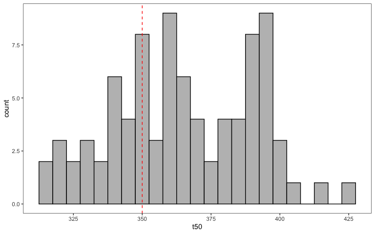<!-- -->

### t50 vs. path length (unpigmented)


```r
#add pigmentation category to dataframe
lens_adults.new <- lens_adults.new %>%
  mutate(pigment = ifelse(t50 <= 350, "unpigmented", "pigmented"))

#subset unpigmented species
lens_unpig <- lens_adults.new %>%
  filter(pigment=="unpigmented")

#PGLS models for t50 or %UVA vs. lens diameter among species

#### prep data ####

#Make list of taxa to drop (in tree but not in dataset)
drops <- setdiff(lens.tree$tip.label, as.character(lens_unpig$ASW_names))

#Drop unwanted tips from phylogeny
unpig.tree <- drop.tip(phy = lens.tree, tip = drops) 

#Make row names of the species the phylogeny tip labels
rownames(lens_unpig) <- lens_unpig$ASW_names

#check that names match in dataframe and tree
name.check(phy = unpig.tree, data = lens_unpig, data.names = lens_unpig$ASW_names)

#use caper function to combine phylogeny and data into one object (this function also matches species names in tree and dataset)
unpig.comp <- comparative.data(phy = unpig.tree, data = lens_unpig, 
                              names.col = ASW_names, vcv = TRUE, 
                              na.omit = FALSE, warn.dropped = TRUE)

#check for dropped tips or dropped species
unpig.comp$dropped$tips #phylogeny
unpig.comp$dropped$unmatched.rows #dataset

#### PGLS model for t50 vs. lens size ####

#model
pgls_unpig.t50 <- pgls(t50 ~ log10(approx_size), 
                  data = unpig.comp, 
                  lambda = "ML", #uses Maximum Liklihood estimate of lambda
                  param.CI = 0.95)
```

After fitting the model, we can examine the diagnostic plots to check model assumptions, then look at the parameter estimates and the likelihood profile of lambda. 


```r
###check model assumptions ###

#diagnostic plots
par(mar = c(4,4,2,2))
par(mfrow = c(2, 2))
plot(pgls_unpig.t50, main = "PGLS model for t50 vs. log lens size in unpigmented lenses")
```

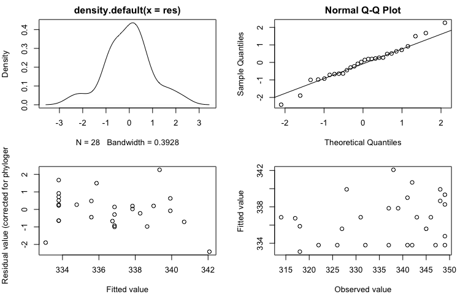<!-- -->

```r
par(mfrow = c(1, 1))

### model outputs ###

#print model output 
summary(pgls_unpig.t50)
```

```{style="max-height: 350px;"}
## 
## Call:
## pgls(formula = t50 ~ log10(approx_size), data = unpig.comp, lambda = "ML", 
##     param.CI = 0.95)
## 
## Residuals:
##      Min       1Q   Median       3Q      Max 
## -1.56134 -0.42041  0.05374  0.31628  1.46275 
## 
## Branch length transformations:
## 
## kappa  [Fix]  : 1.000
## lambda [ ML]  : 0.000
##    lower bound : 0.000, p = 1    
##    upper bound : 1.000, p = 0.028999
##    95.0% CI   : (NA, 0.962)
## delta  [Fix]  : 1.000
## 
## Coefficients:
##                    Estimate Std. Error  t value Pr(>|t|)    
## (Intercept)        333.7931     3.1406 106.2849   <2e-16 ***
## log10(approx_size)  10.1862     8.6350   1.1796   0.2488    
## ---
## Signif. codes:  0 '***' 0.001 '**' 0.01 '*' 0.05 '.' 0.1 ' ' 1
## 
## Residual standard error: 0.6596 on 26 degrees of freedom
## Multiple R-squared: 0.0508,	Adjusted R-squared: 0.01429 
## F-statistic: 1.392 on 1 and 26 DF,  p-value: 0.2488
```

```r
#Likelihood plot for Pagel's lambda from the PGLS model of eye diameter vs. the cuberoot of mass. Solid red line indicates estimate for lambda and broken red lines indcaite the 95% confidence interval
lambda.unpig.t50 <- pgls.profile(pgls_unpig.t50, "lambda")
plot(lambda.unpig.t50)
```

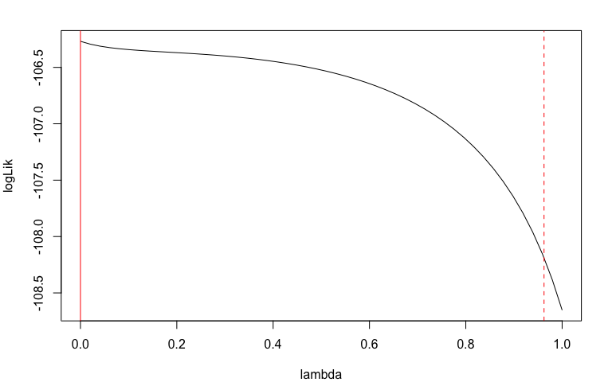<!-- -->

Finally, we can plot our data and the model fit. Note that the linear relationship between t50 and log lens diameter was not significant, indicating that lens transmission among species with unpigmented lenses is not correlated with path length.


```r
#plot t50 vs. log lens size with fit
plot_t50unpig <- ggplot(lens_unpig, aes(x = approx_size, y = t50, text = genus_species)) + 
  geom_point(size = 2, alpha = 0.8) + 
  scale_x_log10("Lens diameter (mm)") + 
  ylab("t50") + 
  theme_bw() +
  theme(panel.grid.major = element_blank(), panel.grid.minor = element_blank()) +
  geom_abline(slope = coef(pgls_unpig.t50)[[2]], intercept = coef(pgls_unpig.t50)[[1]], linetype = "dashed")

#interactive plot
ggplotly(plot_t50unpig)
```

```{=html}
<div id="htmlwidget-751551d2d021805b6e12" style="width:576px;height:384px;" class="plotly html-widget"></div>
<script type="application/json" data-for="htmlwidget-751551d2d021805b6e12">{"x":{"data":[{"x":[0,0.204119982655925,0.439332693830263,0.511883360978874,0,-0.0705810742857073,0,0.301029995663981,0.301029995663981,0,0.397940008672038,0.176091259055681,0.176091259055681,0.301029995663981,0,0.397940008672038,0.477121254719662,0,0,0.602059991327962,0.301029995663981,0.602059991327962,0,0.812913356642856,0.0969100130080564,0.290034611362518,0.676693609624867,0.544068044350276],"y":[337,318,349,341,341,318,326,346,331,349,337,327,345,314,322,339,348,342,347,328,343,348,332,338,349,317,342,349],"text":["approx_size: 1.00<br />t50: 337<br />Adenomera_andreae","approx_size: 1.60<br />t50: 318<br />Ambystoma_mexicanum","approx_size: 2.75<br />t50: 349<br />Ascaphus_truei","approx_size: 3.25<br />t50: 341<br />Bufo_bufo","approx_size: 1.00<br />t50: 341<br />Chiasmocleis_shudikarensis","approx_size: 0.85<br />t50: 318<br />Cynops_pyrrhogaster","approx_size: 1.00<br />t50: 326<br />Dendrobates_leucomelas","approx_size: 2.00<br />t50: 346<br />Discoglossus_galganoi","approx_size: 2.00<br />t50: 331<br />Dyscophus_guineti","approx_size: 1.00<br />t50: 349<br />Gastrophryne_olivacea","approx_size: 2.50<br />t50: 337<br />Glyphoglossus_guttulatus","approx_size: 1.50<br />t50: 327<br />Haddadus_binotatus","approx_size: 1.50<br />t50: 345<br />Hemisus_marmoratus","approx_size: 2.00<br />t50: 314<br />Ischnocnema_henselii","approx_size: 1.00<br />t50: 322<br />Ischnocnema_parva","approx_size: 2.50<br />t50: 339<br />Kaloula_pulchra","approx_size: 3.00<br />t50: 348<br />Kassina_senegalensis","approx_size: 1.00<br />t50: 342<br />Lissotriton_vulgaris","approx_size: 1.00<br />t50: 347<br />Notophthalmus_viridescens","approx_size: 4.00<br />t50: 328<br />Pelobates_cultripes","approx_size: 2.00<br />t50: 343<br />Phrynomantis_microps","approx_size: 4.00<br />t50: 348<br />Phyllomedusa_vaillantii","approx_size: 1.00<br />t50: 332<br />Proceratophrys_boiei","approx_size: 6.50<br />t50: 338<br />Rhinella_icterica","approx_size: 1.25<br />t50: 349<br />Rhinophrynus_dorsalis","approx_size: 1.95<br />t50: 317<br />Salamandra_salamandra","approx_size: 4.75<br />t50: 342<br />Scaphiopus_couchii","approx_size: 3.50<br />t50: 349<br />Spea_bombifrons"],"type":"scatter","mode":"markers","marker":{"autocolorscale":false,"color":"rgba(0,0,0,1)","opacity":0.8,"size":7.55905511811024,"symbol":"circle","line":{"width":1.88976377952756,"color":"rgba(0,0,0,1)"}},"hoveron":"points","showlegend":false,"xaxis":"x","yaxis":"y","hoverinfo":"text","frame":null},{"x":[-0.114755795832135,0.857088078189284],"y":[332.624215038942,342.523636938225],"text":"intercept: 333.7931<br />slope: 10.18623","type":"scatter","mode":"lines","line":{"width":1.88976377952756,"color":"rgba(0,0,0,1)","dash":"dash"},"hoveron":"points","showlegend":false,"xaxis":"x","yaxis":"y","hoverinfo":"text","frame":null}],"layout":{"margin":{"t":26.958904109589,"r":7.30593607305936,"b":40.9132420091324,"l":43.1050228310502},"plot_bgcolor":"rgba(255,255,255,1)","paper_bgcolor":"rgba(255,255,255,1)","font":{"color":"rgba(0,0,0,1)","family":"","size":14.6118721461187},"xaxis":{"domain":[0,1],"automargin":true,"type":"linear","autorange":false,"range":[-0.114755795832135,0.857088078189284],"tickmode":"array","ticktext":["1","3","5"],"tickvals":[0,0.477121254719662,0.698970004336019],"categoryorder":"array","categoryarray":["1","3","5"],"nticks":null,"ticks":"outside","tickcolor":"rgba(51,51,51,1)","ticklen":3.65296803652968,"tickwidth":0.66417600664176,"showticklabels":true,"tickfont":{"color":"rgba(77,77,77,1)","family":"","size":11.689497716895},"tickangle":-0,"showline":false,"linecolor":null,"linewidth":0,"showgrid":false,"gridcolor":null,"gridwidth":0,"zeroline":false,"anchor":"y","title":{"text":"Lens diameter (mm)","font":{"color":"rgba(0,0,0,1)","family":"","size":14.6118721461187}},"hoverformat":".2f"},"yaxis":{"domain":[0,1],"automargin":true,"type":"linear","autorange":false,"range":[312.25,350.75],"tickmode":"array","ticktext":["320","330","340","350"],"tickvals":[320,330,340,350],"categoryorder":"array","categoryarray":["320","330","340","350"],"nticks":null,"ticks":"outside","tickcolor":"rgba(51,51,51,1)","ticklen":3.65296803652968,"tickwidth":0.66417600664176,"showticklabels":true,"tickfont":{"color":"rgba(77,77,77,1)","family":"","size":11.689497716895},"tickangle":-0,"showline":false,"linecolor":null,"linewidth":0,"showgrid":false,"gridcolor":null,"gridwidth":0,"zeroline":false,"anchor":"x","title":{"text":"t50","font":{"color":"rgba(0,0,0,1)","family":"","size":14.6118721461187}},"hoverformat":".2f"},"shapes":[{"type":"rect","fillcolor":"transparent","line":{"color":"rgba(51,51,51,1)","width":0.66417600664176,"linetype":"solid"},"yref":"paper","xref":"paper","x0":0,"x1":1,"y0":0,"y1":1}],"showlegend":false,"legend":{"bgcolor":"rgba(255,255,255,1)","bordercolor":"transparent","borderwidth":1.88976377952756,"font":{"color":"rgba(0,0,0,1)","family":"","size":11.689497716895}},"hovermode":"closest","barmode":"relative"},"config":{"doubleClick":"reset","modeBarButtonsToAdd":["hoverclosest","hovercompare"],"showSendToCloud":false},"source":"A","attrs":{"109670970681":{"x":{},"y":{},"text":{},"type":"scatter"},"10964b2c38e6":{"intercept":{},"slope":{}}},"cur_data":"109670970681","visdat":{"109670970681":["function (y) ","x"],"10964b2c38e6":["function (y) ","x"]},"highlight":{"on":"plotly_click","persistent":false,"dynamic":false,"selectize":false,"opacityDim":0.2,"selected":{"opacity":1},"debounce":0},"shinyEvents":["plotly_hover","plotly_click","plotly_selected","plotly_relayout","plotly_brushed","plotly_brushing","plotly_clickannotation","plotly_doubleclick","plotly_deselect","plotly_afterplot","plotly_sunburstclick"],"base_url":"https://plot.ly"},"evals":[],"jsHooks":[]}</script>
```

### %UVA vs. path length (unpigmented)


```r
#### PGLS model for %UVA vs. lens size ####

#model
pgls_unpig.puva <- pgls(pUVA ~ log10(approx_size), 
                  data = unpig.comp, 
                  lambda = "ML", #uses Maximum Liklihood estimate of lambda
                  param.CI = 0.95)
```

After fitting the model, we can examine the diagnostic plots to check model assumptions, then look at the parameter estimates and the likelihood profile of lambda. 


```r
###check model assumptions ###

#diagnostic plots
par(mar = c(4,4,2,2))
par(mfrow = c(2, 2))
plot(pgls_unpig.puva, main = "PGLS model for pUVA vs. log lens size in unpigmented lenses")
```

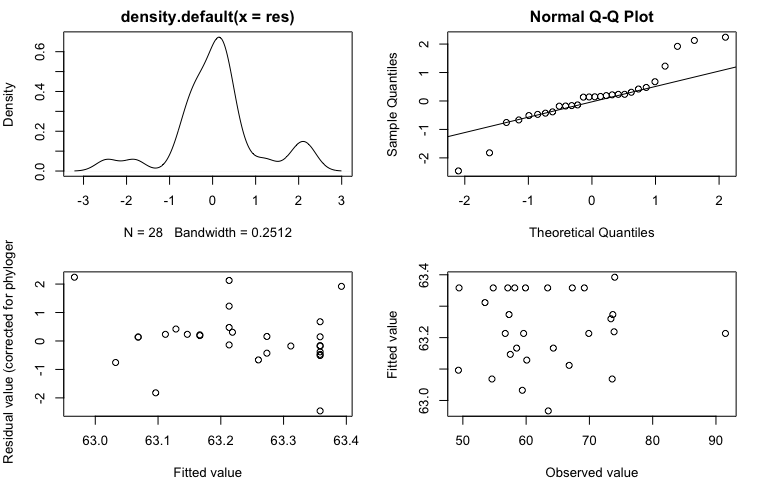<!-- -->

```r
par(mfrow = c(1, 1))

### model outputs ###

#print model output 
summary(pgls_unpig.puva)
```

```{style="max-height: 350px;"}
## 
## Call:
## pgls(formula = pUVA ~ log10(approx_size), data = unpig.comp, 
##     lambda = "ML", param.CI = 0.95)
## 
## Residuals:
##     Min      1Q  Median      3Q     Max 
## -1.3417 -0.2151  0.0785  0.1825  1.2231 
## 
## Branch length transformations:
## 
## kappa  [Fix]  : 1.000
## lambda [ ML]  : 0.000
##    lower bound : 0.000, p = 1    
##    upper bound : 1.000, p = 0.011065
##    95.0% CI   : (NA, 0.863)
## delta  [Fix]  : 1.000
## 
## Coefficients:
##                    Estimate Std. Error t value Pr(>|t|)    
## (Intercept)        63.35822    2.66112 23.8088   <2e-16 ***
## log10(approx_size) -0.48154    7.31682 -0.0658    0.948    
## ---
## Signif. codes:  0 '***' 0.001 '**' 0.01 '*' 0.05 '.' 0.1 ' ' 1
## 
## Residual standard error: 0.5589 on 26 degrees of freedom
## Multiple R-squared: 0.0001666,	Adjusted R-squared: -0.03829 
## F-statistic: 0.004331 on 1 and 26 DF,  p-value: 0.948
```

```r
#Likelihood plot for Pagel's lambda from the PGLS model of eye diameter vs. the cuberoot of mass. Solid red line indicates estimate for lambda and broken red lines indcaite the 95% confidence interval
lambda.unpig.uva <- pgls.profile(pgls_unpig.puva, "lambda")
plot(lambda.unpig.uva)
```

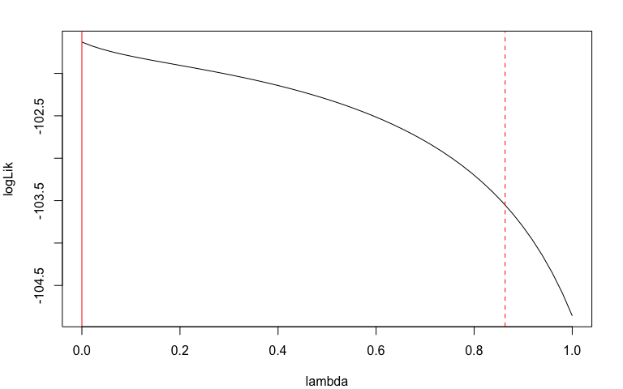<!-- -->
Finally, we can plot our data and the model fit. Note that the linear relationship between t50 and log lens diameter was not significant, indicating that lens transmission among species with unpigmented lenses is not correlated with path length.


```r
#plot %UVA vs. log lens size with fit
plot_uva.unpig <- ggplot(lens_unpig, aes(x = approx_size, y = pUVA, text = genus_species)) + 
  geom_point(size = 2, alpha = 0.8) + 
  scale_x_log10("Lens diameter (mm)") + 
  ylab("%UVA") + 
  theme_bw() +
  theme(panel.grid.major = element_blank(), panel.grid.minor = element_blank()) +
  geom_abline(slope = coef(pgls_unpig.puva)[[2]], intercept = coef(pgls_unpig.puva)[[1]], linetype = "dashed")

#interactive plot
ggplotly(plot_uva.unpig)
```

```{=html}
<div id="htmlwidget-e069cbf4b4317f4f2fe6" style="width:576px;height:384px;" class="plotly html-widget"></div>
<script type="application/json" data-for="htmlwidget-e069cbf4b4317f4f2fe6">{"x":{"data":[{"x":[0,0.204119982655925,0.439332693830263,0.511883360978874,0,-0.0705810742857073,0,0.301029995663981,0.301029995663981,0,0.397940008672038,0.176091259055681,0.176091259055681,0.301029995663981,0,0.397940008672038,0.477121254719662,0,0,0.602059991327962,0.301029995663981,0.602059991327962,0,0.812913356642856,0.0969100130080564,0.290034611362518,0.676693609624867,0.544068044350276],"y":[63.4,73.4,57.5,66.8,58.2,74,54.8,59.6,69.9,49.4,64.3,73.7,57.3,91.5,67.3,58.5,60.1,59.9,57.1,73.6,56.7,54.6,69.2,63.5,53.5,73.9,59.4,49.3],"text":["approx_size: 1.00<br />pUVA: 63.4<br />Adenomera_andreae","approx_size: 1.60<br />pUVA: 73.4<br />Ambystoma_mexicanum","approx_size: 2.75<br />pUVA: 57.5<br />Ascaphus_truei","approx_size: 3.25<br />pUVA: 66.8<br />Bufo_bufo","approx_size: 1.00<br />pUVA: 58.2<br />Chiasmocleis_shudikarensis","approx_size: 0.85<br />pUVA: 74.0<br />Cynops_pyrrhogaster","approx_size: 1.00<br />pUVA: 54.8<br />Dendrobates_leucomelas","approx_size: 2.00<br />pUVA: 59.6<br />Discoglossus_galganoi","approx_size: 2.00<br />pUVA: 69.9<br />Dyscophus_guineti","approx_size: 1.00<br />pUVA: 49.4<br />Gastrophryne_olivacea","approx_size: 2.50<br />pUVA: 64.3<br />Glyphoglossus_guttulatus","approx_size: 1.50<br />pUVA: 73.7<br />Haddadus_binotatus","approx_size: 1.50<br />pUVA: 57.3<br />Hemisus_marmoratus","approx_size: 2.00<br />pUVA: 91.5<br />Ischnocnema_henselii","approx_size: 1.00<br />pUVA: 67.3<br />Ischnocnema_parva","approx_size: 2.50<br />pUVA: 58.5<br />Kaloula_pulchra","approx_size: 3.00<br />pUVA: 60.1<br />Kassina_senegalensis","approx_size: 1.00<br />pUVA: 59.9<br />Lissotriton_vulgaris","approx_size: 1.00<br />pUVA: 57.1<br />Notophthalmus_viridescens","approx_size: 4.00<br />pUVA: 73.6<br />Pelobates_cultripes","approx_size: 2.00<br />pUVA: 56.7<br />Phrynomantis_microps","approx_size: 4.00<br />pUVA: 54.6<br />Phyllomedusa_vaillantii","approx_size: 1.00<br />pUVA: 69.2<br />Proceratophrys_boiei","approx_size: 6.50<br />pUVA: 63.5<br />Rhinella_icterica","approx_size: 1.25<br />pUVA: 53.5<br />Rhinophrynus_dorsalis","approx_size: 1.95<br />pUVA: 73.9<br />Salamandra_salamandra","approx_size: 4.75<br />pUVA: 59.4<br />Scaphiopus_couchii","approx_size: 3.50<br />pUVA: 49.3<br />Spea_bombifrons"],"type":"scatter","mode":"markers","marker":{"autocolorscale":false,"color":"rgba(0,0,0,1)","opacity":0.8,"size":7.55905511811024,"symbol":"circle","line":{"width":1.88976377952756,"color":"rgba(0,0,0,1)"}},"hoveron":"points","showlegend":false,"xaxis":"x","yaxis":"y","hoverinfo":"text","frame":null},{"x":[-0.114755795832135,0.857088078189284],"y":[63.4134839642796,62.9455014942386],"text":"intercept: 63.35822<br />slope: -0.4815408","type":"scatter","mode":"lines","line":{"width":1.88976377952756,"color":"rgba(0,0,0,1)","dash":"dash"},"hoveron":"points","showlegend":false,"xaxis":"x","yaxis":"y","hoverinfo":"text","frame":null}],"layout":{"margin":{"t":26.958904109589,"r":7.30593607305936,"b":40.9132420091324,"l":37.2602739726027},"plot_bgcolor":"rgba(255,255,255,1)","paper_bgcolor":"rgba(255,255,255,1)","font":{"color":"rgba(0,0,0,1)","family":"","size":14.6118721461187},"xaxis":{"domain":[0,1],"automargin":true,"type":"linear","autorange":false,"range":[-0.114755795832135,0.857088078189284],"tickmode":"array","ticktext":["1","3","5"],"tickvals":[0,0.477121254719662,0.698970004336019],"categoryorder":"array","categoryarray":["1","3","5"],"nticks":null,"ticks":"outside","tickcolor":"rgba(51,51,51,1)","ticklen":3.65296803652968,"tickwidth":0.66417600664176,"showticklabels":true,"tickfont":{"color":"rgba(77,77,77,1)","family":"","size":11.689497716895},"tickangle":-0,"showline":false,"linecolor":null,"linewidth":0,"showgrid":false,"gridcolor":null,"gridwidth":0,"zeroline":false,"anchor":"y","title":{"text":"Lens diameter (mm)","font":{"color":"rgba(0,0,0,1)","family":"","size":14.6118721461187}},"hoverformat":".2f"},"yaxis":{"domain":[0,1],"automargin":true,"type":"linear","autorange":false,"range":[47.19,93.61],"tickmode":"array","ticktext":["50","60","70","80","90"],"tickvals":[50,60,70,80,90],"categoryorder":"array","categoryarray":["50","60","70","80","90"],"nticks":null,"ticks":"outside","tickcolor":"rgba(51,51,51,1)","ticklen":3.65296803652968,"tickwidth":0.66417600664176,"showticklabels":true,"tickfont":{"color":"rgba(77,77,77,1)","family":"","size":11.689497716895},"tickangle":-0,"showline":false,"linecolor":null,"linewidth":0,"showgrid":false,"gridcolor":null,"gridwidth":0,"zeroline":false,"anchor":"x","title":{"text":"%UVA","font":{"color":"rgba(0,0,0,1)","family":"","size":14.6118721461187}},"hoverformat":".2f"},"shapes":[{"type":"rect","fillcolor":"transparent","line":{"color":"rgba(51,51,51,1)","width":0.66417600664176,"linetype":"solid"},"yref":"paper","xref":"paper","x0":0,"x1":1,"y0":0,"y1":1}],"showlegend":false,"legend":{"bgcolor":"rgba(255,255,255,1)","bordercolor":"transparent","borderwidth":1.88976377952756,"font":{"color":"rgba(0,0,0,1)","family":"","size":11.689497716895}},"hovermode":"closest","barmode":"relative"},"config":{"doubleClick":"reset","modeBarButtonsToAdd":["hoverclosest","hovercompare"],"showSendToCloud":false},"source":"A","attrs":{"109678e6ec58":{"x":{},"y":{},"text":{},"type":"scatter"},"1096a6c36b":{"intercept":{},"slope":{}}},"cur_data":"109678e6ec58","visdat":{"109678e6ec58":["function (y) ","x"],"1096a6c36b":["function (y) ","x"]},"highlight":{"on":"plotly_click","persistent":false,"dynamic":false,"selectize":false,"opacityDim":0.2,"selected":{"opacity":1},"debounce":0},"shinyEvents":["plotly_hover","plotly_click","plotly_selected","plotly_relayout","plotly_brushed","plotly_brushing","plotly_clickannotation","plotly_doubleclick","plotly_deselect","plotly_afterplot","plotly_sunburstclick"],"base_url":"https://plot.ly"},"evals":[],"jsHooks":[]}</script>
```

The lack of relationship between transmission and lens size across species is good evidence that differences we observe across species are due to differences in the spectral properties of the lens, even among species with highly transparent lenses. It also justifies why we do not account for lens diameter in our models of lens transmission vs. ecology (which is impossible, as the published data we include did not have measurements for lens diameter).


# Ecology vs. lens size

Here we look at whether lens size varies across ecological traits in our dataset. 


```r
# create vectors of colors for habitat
col_hab <- c("scansorial" = "#009E73",
              "other"  = "#636363")

#create vector of colors for activity period
col_act <- c("nondiurnal" = "#636363",
             "diurnal" = "#FFA010")

#boxplot of lens size across scansorial/not
plot_scans <- ggplot(lens_adults.new, 
                aes(x = hab, y = approx_size, fill = hab)) +
  geom_violin(trim=FALSE, alpha = 0.6)+
  scale_fill_manual(values = col_hab, name = " ") +
  scale_x_discrete(breaks = c("scansorial","other"),
                   limits = c("scansorial","other"),
                   labels = c("scansorial","non-scansorial")) +
  labs(title=NULL,x=" ", y = "Lens diameter (mm)")+
  geom_boxplot(width=0.15, fill="white", outlier.alpha = 0)+
  geom_jitter(shape = 19, size = 1, alpha = 0.7, position = position_jitter(0.1)) + 
  theme_classic() +
  theme(legend.position = "none")

#boxplot of lens size across diurnal/not
plot_diur <- ggplot(lens_adults.new, 
                aes(x = act, y = approx_size, fill = act)) +
  geom_violin(trim=FALSE, alpha = 0.6)+
  scale_fill_manual(values = col_act, name = " ") +
  scale_x_discrete(breaks = c("diurnal","nondiurnal"),
                   limits = c("diurnal","nondiurnal"),
                   labels = c("diurnal","non-diurnal")) +
  labs(title=NULL,x=" ", y = "Lens diameter (mm)")+
  geom_boxplot(width=0.15, fill="white", outlier.alpha = 0)+
  geom_jitter(shape = 19, size = 1, alpha = 0.7, position = position_jitter(0.1)) + 
  theme_classic() +
  theme(legend.position = "none")

#make figure
plot_grid(plot_scans, plot_diur + ylab(""),
          align = 'vh', 
          labels = c("A", "B"),
          hjust = -0.5, 
          vjust = 1.8, 
          nrow = 1)
```

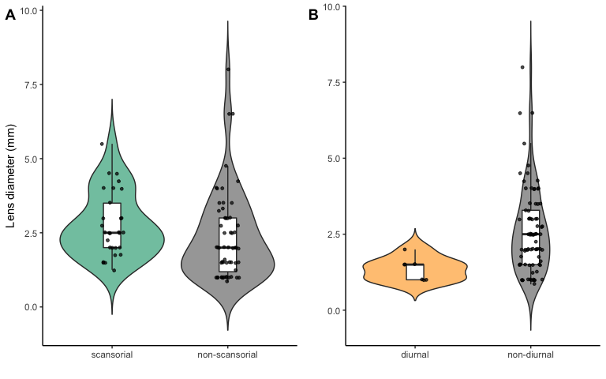<!-- -->

```r
#export fig
pdf("../Figures/FigS7.pdf", width = 6, height = 4)
plot_grid(plot_scans, plot_diur + ylab(""),
          align = 'vh', 
          labels = c("A", "B"),
          hjust = -0.5, 
          vjust = 1.8, 
          nrow = 1)
dev.off()
```

```{style="max-height: 350px;"}
## quartz_off_screen 
##                 2
```
We can also test whether species with different ecological traits differ in lens size.


```r
#PGLS model for lens size vs. scansoriality -----

#model
pgls_hab <- pgls(approx_size ~ hab, 
                  data = lenssize.comp, 
                  lambda = "ML", #uses Maximum Liklihood estimate of lambda
                  param.CI = 0.95)

#diagnostic plots
par(mar = c(4,4,2,2))
par(mfrow = c(2, 2))
plot(pgls_hab, main = "PGLS model for size vs scansoriality")
```

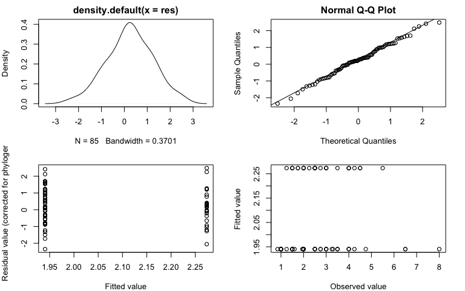<!-- -->

```r
par(mfrow = c(1, 1))

#print model output 
summary(pgls_hab)
```

```{style="max-height: 350px;"}
## 
## Call:
## pgls(formula = approx_size ~ hab, data = lenssize.comp, lambda = "ML", 
##     param.CI = 0.95)
## 
## Residuals:
##      Min       1Q   Median       3Q      Max 
## -0.23999 -0.03812  0.02549  0.10064  0.25369 
## 
## Branch length transformations:
## 
## kappa  [Fix]  : 1.000
## lambda [ ML]  : 0.769
##    lower bound : 0.000, p = 0.0076294
##    upper bound : 1.000, p = 0.0075615
##    95.0% CI   : (0.220, 0.974)
## delta  [Fix]  : 1.000
## 
## Coefficients:
##               Estimate Std. Error t value Pr(>|t|)  
## (Intercept)    1.94056    0.75853  2.5583  0.01233 *
## habscansorial  0.33297    0.41720  0.7981  0.42709  
## ---
## Signif. codes:  0 '***' 0.001 '**' 0.01 '*' 0.05 '.' 0.1 ' ' 1
## 
## Residual standard error: 0.1058 on 83 degrees of freedom
## Multiple R-squared: 0.007616,	Adjusted R-squared: -0.004341 
## F-statistic: 0.637 on 1 and 83 DF,  p-value: 0.4271
```

```r
#PGLS model for lens size vs. diurnality -----

#model
pgls_act <- pgls(approx_size ~ act, 
                  data = lenssize.comp, 
                  lambda = "ML", #uses Maximum Liklihood estimate of lambda
                  param.CI = 0.95)

#diagnostic plots
par(mar = c(4,4,2,2))
par(mfrow = c(2, 2))
plot(pgls_act, main = "PGLS model for size vs diurnality")
```

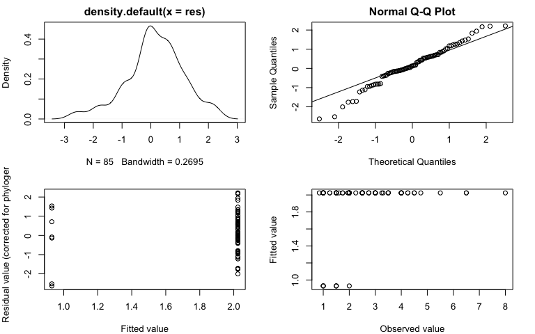<!-- -->

```r
par(mfrow = c(1, 1))

#print model output 
summary(pgls_act)
```

```{style="max-height: 350px;"}
## 
## Call:
## pgls(formula = approx_size ~ act, data = lenssize.comp, lambda = "ML", 
##     param.CI = 0.95)
## 
## Residuals:
##      Min       1Q   Median       3Q      Max 
## -0.24674 -0.02451  0.01147  0.06700  0.20775 
## 
## Branch length transformations:
## 
## kappa  [Fix]  : 1.000
## lambda [ ML]  : 0.641
##    lower bound : 0.000, p = 0.0077929
##    upper bound : 1.000, p = 0.0010038
##    95.0% CI   : (0.120, 0.939)
## delta  [Fix]  : 1.000
## 
## Coefficients:
##               Estimate Std. Error t value Pr(>|t|)  
## (Intercept)    0.93010    0.79779  1.1658  0.24702  
## actnondiurnal  1.09399    0.49781  2.1976  0.03076 *
## ---
## Signif. codes:  0 '***' 0.001 '**' 0.01 '*' 0.05 '.' 0.1 ' ' 1
## 
## Residual standard error: 0.09542 on 83 degrees of freedom
## Multiple R-squared: 0.05499,	Adjusted R-squared: 0.0436 
## F-statistic:  4.83 on 1 and 83 DF,  p-value: 0.03076
```
These models indicate that lens size does not differ significantly among scansorial vs. nonscansorial species, but that nondiurnal species have significantly larger lenses than diurnal species in this dataset. 

# Supplemental Figure


```r
#make panels to figures
fig.a <- plot_t50size +
  xlab("") +
  ylab("t50 (nm)") + 
  theme_classic()

fig.b <- plot_uvasize +
  xlab("")+ 
  theme_classic()

fig.c <- plot_t50unpig +
  ylab("t50 (nm)")+ 
  theme_classic()

fig.d <- plot_uva.unpig+ 
  theme_classic()

fig.e <- plot_scans

fig.f <- plot_diur

# arrange panels in figure
plots <- plot_grid(fig.a, fig.b, fig.c, fig.d, fig.e, fig.f,
           align = 'vh', 
           labels = c("A", "B", "C", "D", "E", "F"), #panel labels for figure
           hjust = -.5,
           vjust = 1,
           nrow = 3) #number of rows in grids

#view figure
plot_grid(plots)
```

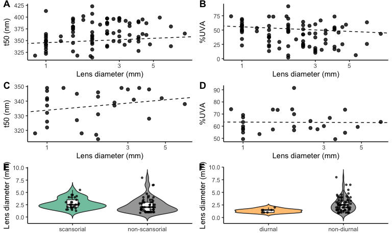<!-- -->

```r
#export figure
pdf("../Figures/Fig-S6.pdf", width = 6, height = 7.5)
plot_grid(plots)
dev.off()
```

```{style="max-height: 350px;"}
## quartz_off_screen 
##                 2
```
