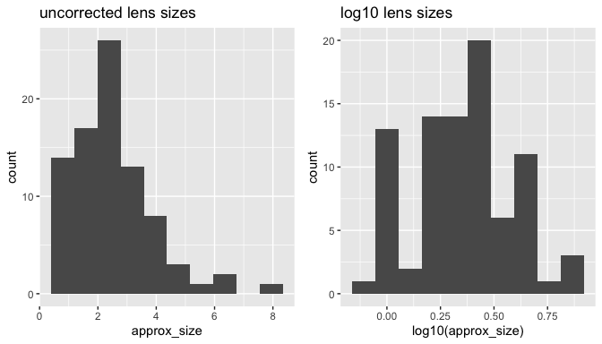
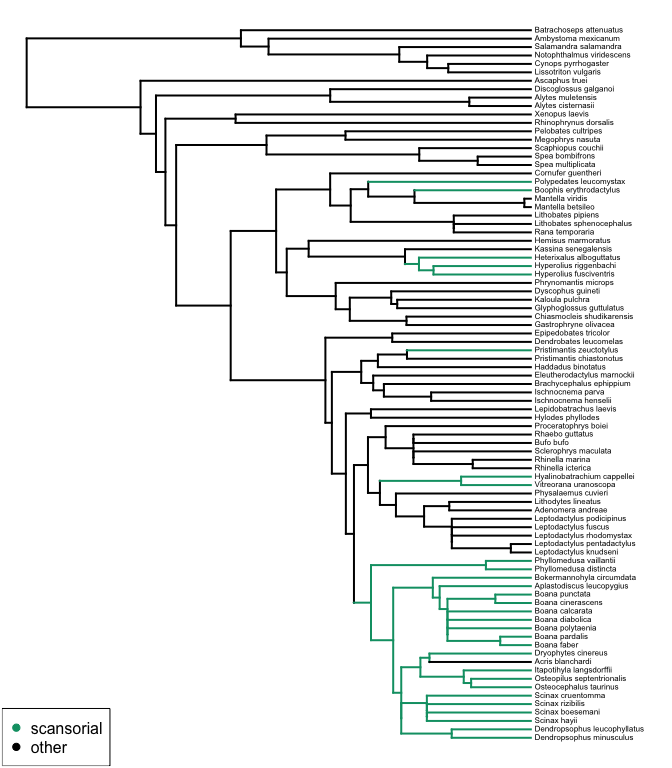
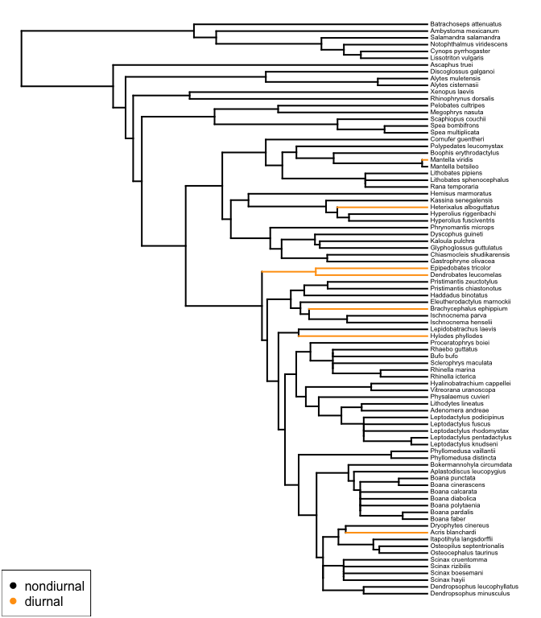

### Prep


```r
# load required libraries
library(ggtree)
library(gridExtra)
library(knitr)
library(kableExtra)
library(tidyverse)
library(ape)
library(geiger)
library(mvMORPH)

# load custom functions
source("./find_transitions.R")

# set colour scheme
my_cols<-c("diurnal"="#FFA010",
         "nondiurnal"="black",
         "scansorial"="#009E73",
         "other"="black")
```

### Load data


```r
# data (excluding tadpoles/juveniles)
dat <- read_csv("../Data/tidy data/lenses_compiled.csv", na = c("NA",NA, "unknown")) %>%
  select(ASW_names, everything()) %>% # put ASW_names first (important for later) 
  filter(stage == "adult" | is.na(stage))
```

```
## New names:
## * `` -> ...1
```

```
## Rows: 125 Columns: 15
```

```
## ── Column specification ────────────────────────────────────────────────────────
## Delimiter: ","
## chr (10): order, family, genus_species, stage, dataset, source, diam_mm, hab...
## dbl  (5): ...1, approx_size, t450nm, t50, pUVA
```

```
## 
## ℹ Use `spec()` to retrieve the full column specification for this data.
## ℹ Specify the column types or set `show_col_types = FALSE` to quiet this message.
```

```r
# tree
tree<-read.tree("../Data/tidy data/pruned_tree.txt")
tree
```

```
## 
## Phylogenetic tree with 115 tips and 114 internal nodes.
## 
## Tip labels:
##   Dendropsophus_ebraccatus, Dendropsophus_minusculus, Dendropsophus_leucophyllatus, Dendropsophus_minutus, Dendropsophus_microcephalus, Xenohyla_truncata, ...
## 
## Rooted; includes branch lengths.
```

### Check data and tree match and are in good shape


```r
## is tree structure ok?
is.ultrametric(tree)
```

```
## [1] TRUE
```

```r
is.binary(tree)
```

```
## [1] TRUE
```

```r
## are species duplicated?
any(duplicated(tree$tip.label)) # should be FALSE
```

```
## [1] FALSE
```

```r
dat$ASW_names[duplicated(dat$ASW_names)]
```

```
## [1] "Bufo_bufo"                "Lithobates_pipiens"      
## [3] "Rana_temporaria"          "Brachycephalus_ephippium"
## [5] "Ischnocnema_parva"        "Rhinella_icterica"       
## [7] "Hylodes_phyllodes"        "Physalaemus_cuvieri"
```
It looks like there are 8 species that appear more than once. We can pull out just those like so: 


```r
dat %>%
  filter(ASW_names %in% dat$ASW_names[duplicated(dat$ASW_names)]) %>%
  select(genus_species, stage, dataset, ASW_names) %>%
  arrange(ASW_names) %>%
  kable() %>%
  kable_styling(full_width = F)
```

<table class="table" style="width: auto !important; margin-left: auto; margin-right: auto;">
 <thead>
  <tr>
   <th style="text-align:left;"> genus_species </th>
   <th style="text-align:left;"> stage </th>
   <th style="text-align:left;"> dataset </th>
   <th style="text-align:left;"> ASW_names </th>
  </tr>
 </thead>
<tbody>
  <tr>
   <td style="text-align:left;"> Brachycephalus_ephippium </td>
   <td style="text-align:left;"> adult </td>
   <td style="text-align:left;"> this_study </td>
   <td style="text-align:left;"> Brachycephalus_ephippium </td>
  </tr>
  <tr>
   <td style="text-align:left;"> Brachycephalus_ephippium </td>
   <td style="text-align:left;"> NA </td>
   <td style="text-align:left;"> Yovanovich et al. (2020) </td>
   <td style="text-align:left;"> Brachycephalus_ephippium </td>
  </tr>
  <tr>
   <td style="text-align:left;"> Bufo_bufo </td>
   <td style="text-align:left;"> adult </td>
   <td style="text-align:left;"> this_study </td>
   <td style="text-align:left;"> Bufo_bufo </td>
  </tr>
  <tr>
   <td style="text-align:left;"> Bufo_bufo </td>
   <td style="text-align:left;"> NA </td>
   <td style="text-align:left;"> Yovanovich et al. (2019) </td>
   <td style="text-align:left;"> Bufo_bufo </td>
  </tr>
  <tr>
   <td style="text-align:left;"> Hylodes_phyllodes </td>
   <td style="text-align:left;"> adult </td>
   <td style="text-align:left;"> this_study </td>
   <td style="text-align:left;"> Hylodes_phyllodes </td>
  </tr>
  <tr>
   <td style="text-align:left;"> Hylodes_phyllodes </td>
   <td style="text-align:left;"> NA </td>
   <td style="text-align:left;"> Yovanovich et al. (2020) </td>
   <td style="text-align:left;"> Hylodes_phyllodes </td>
  </tr>
  <tr>
   <td style="text-align:left;"> Ischnocnema_parva </td>
   <td style="text-align:left;"> adult </td>
   <td style="text-align:left;"> this_study </td>
   <td style="text-align:left;"> Ischnocnema_parva </td>
  </tr>
  <tr>
   <td style="text-align:left;"> Ischnocnema_parva </td>
   <td style="text-align:left;"> NA </td>
   <td style="text-align:left;"> Yovanovich et al. (2020) </td>
   <td style="text-align:left;"> Ischnocnema_parva </td>
  </tr>
  <tr>
   <td style="text-align:left;"> Lithobates_pipiens </td>
   <td style="text-align:left;"> adult </td>
   <td style="text-align:left;"> this_study </td>
   <td style="text-align:left;"> Lithobates_pipiens </td>
  </tr>
  <tr>
   <td style="text-align:left;"> Lithobates_pipiens </td>
   <td style="text-align:left;"> NA </td>
   <td style="text-align:left;"> Yovanovich et al. (2019) </td>
   <td style="text-align:left;"> Lithobates_pipiens </td>
  </tr>
  <tr>
   <td style="text-align:left;"> Physalaemus_cuvieri </td>
   <td style="text-align:left;"> adult </td>
   <td style="text-align:left;"> this_study </td>
   <td style="text-align:left;"> Physalaemus_cuvieri </td>
  </tr>
  <tr>
   <td style="text-align:left;"> Physalaemus_cuvieri </td>
   <td style="text-align:left;"> NA </td>
   <td style="text-align:left;"> Yovanovich et al. (2020) </td>
   <td style="text-align:left;"> Physalaemus_cuvieri </td>
  </tr>
  <tr>
   <td style="text-align:left;"> Rana_temporaria </td>
   <td style="text-align:left;"> adult </td>
   <td style="text-align:left;"> this_study </td>
   <td style="text-align:left;"> Rana_temporaria </td>
  </tr>
  <tr>
   <td style="text-align:left;"> Rana_temporaria </td>
   <td style="text-align:left;"> NA </td>
   <td style="text-align:left;"> Yovanovich et al. (2019) </td>
   <td style="text-align:left;"> Rana_temporaria </td>
  </tr>
  <tr>
   <td style="text-align:left;"> Rhinella_icterica </td>
   <td style="text-align:left;"> adult </td>
   <td style="text-align:left;"> this_study </td>
   <td style="text-align:left;"> Rhinella_icterica </td>
  </tr>
  <tr>
   <td style="text-align:left;"> Rhinella_icterica </td>
   <td style="text-align:left;"> NA </td>
   <td style="text-align:left;"> Yovanovich et al. (2020) </td>
   <td style="text-align:left;"> Rhinella_icterica </td>
  </tr>
</tbody>
</table>
  
As already highlighted in the manuscript, the duplicates stem from this_study vs. Yovanovich. I will keep only this_study here. 
  

```r
## prepare a final, clean dataset:
dat_clean<- dat %>%
  filter(!(ASW_names %in% ASW_names[duplicated(ASW_names)] & is.na(stage)))

any(duplicated(dat_clean$ASW_names)) # no more duplicates (should be FALSE)
```

```
## [1] FALSE
```
 
Lens sizes are not normally distributed. 


```r
gg_lens<-ggplot(dat_clean, aes(x=approx_size)) +
  geom_histogram(bins = 10) +
  ggtitle("uncorrected lens sizes")

# log 10 transformed
gg_log_lens<-ggplot(dat_clean, aes(x=log10(approx_size))) +
  geom_histogram(bins=10) +
  ggtitle("log10 lens sizes")

grid.arrange(gg_lens, gg_log_lens, nrow=1)
```

```
## Warning: Removed 29 rows containing non-finite values (stat_bin).

## Warning: Removed 29 rows containing non-finite values (stat_bin).
```

<!-- -->

It would seem wise transforming lens sizes going forward:


```r
dat_clean <- dat_clean %>%
  mutate(approx_size=log10(approx_size))
```

I will perform an extra filter step here, because I only want to work with species that have a complete set of data: 


```r
## keep only the data columns I will use, and drop all species with NA's
dat_clean <- dat_clean %>%
  select(ASW_names, hab, act, approx_size, t50, pUVA) %>%
  drop_na()

# prune tree to include only the same species
tree<-keep.tip(tree, dat_clean$ASW_names)

# reorder the data to match the order of the tree
dat_clean <-dat_clean %>%
  arrange(match(ASW_names, tree$tip.label))

all(dat_clean$ASW_names == tree$tip.label) # should be TRUE
```

```
## [1] TRUE
```

## Evolution of lens transmission and habitat

### Ancestral state reconstruction:

Stochastic character mapping.


```r
# perform stochasitc character mapping
hab_tree<-make.simmap(tree=tree,
                          x=pull(dat_clean, hab, name=ASW_names),
                          model="ER", nsim=10) ## nsims here set to 10, but should ideally be higher. I doubt it will change the out come for this fairly simple data set though.
```

```
## make.simmap is sampling character histories conditioned on
## the transition matrix
## 
## Q =
##                   other   scansorial
## other      -0.001151353  0.001151353
## scansorial  0.001151353 -0.001151353
## (estimated using likelihood);
## and (mean) root node prior probabilities
## pi =
##      other scansorial 
##        0.5        0.5
```

```
## Done.
```

```r
hab_ace <- describe.simmap(hab_tree, plot=F)

# pull out most likely ancestral state per node
hab_node_states <- colnames(hab_ace$ace)[apply(MAR=1, FUN=which.max, X = hab_ace$ace)]

# create a simmap object with the branches painted according to the ancestral state reconstruction
hab_tree_painted<-find_transitions(phy=tree,
                                       tip_states = dat_clean$hab,
                                       node_states = hab_node_states,
                                       simmap = T,
                                       stem_prop = 1)

plot(hab_tree_painted, colors=my_cols[unique(dat_clean$hab)], fsize=0.5)
legend("bottomleft",
       col=my_cols[unique(dat_clean$hab)],
       legend=names(my_cols[unique(dat_clean$hab)]),
       pch=19)
```

<!-- -->


```r
#export supplementary figure
pdf("../Figures/supp-scans.pdf", width = 6, height = 8)
plot(hab_tree_painted, colors=my_cols[unique(dat_clean$hab)], fsize=0.5, ftype="bi")
legend("bottomleft",
       col=c("#009E73","black"),
       legend=c("scansorial", "non-scansorial"),
       pch=19,
       bty = "n",
       cex = .8)
dev.off()
```

```
## quartz_off_screen 
##                 2
```
  
  
### mvMORPH model fitting for t50

We will fit four models. A Brownian motion model or an OU model with a single set of parameters for the whole tree, or a BM or OU model with different parameters for each 'regime'.


```r
# empty list to fill
hab_mvmodels_t50<-list()

# fill the list with the different model results
hab_mvmodels_t50$ou1<-mvOU(hab_tree_painted,
                           dat_clean[,c("approx_size","t50")],
                           model="OU1",
                           diagnostic=T, echo=F)
```

```
## successful convergence of the optimizer 
## a reliable solution has been reached
```

```r
hab_mvmodels_t50$oum<-mvOU(hab_tree_painted,
                           dat_clean[,c("approx_size","t50")],
                           model="OUM",
                           diagnostic=T, echo=F,
                           optimization=c("Nelder-Mead")) ### NOTE THE DIFFERENT OPTOMIZATION METHOD
```

```
## successful convergence of the optimizer 
## a reliable solution has been reached
```

```r
hab_mvmodels_t50$bm1<-mvBM(hab_tree_painted,
                           dat_clean[,c("approx_size","t50")],
                           model="BM1",
                           diagnostic=T, echo=F)
```

```
## successful convergence of the optimizer 
## a reliable solution has been reached
```

```r
hab_mvmodels_t50$bmm<-mvBM(hab_tree_painted,
                           dat_clean[,c("approx_size","t50")],
                           model="BMM",
                           diagnostic=T, echo=F)
```

```
## successful convergence of the optimizer 
## a reliable solution has been reached
```
  
Withing the two model types, we could compare their fit with a log likelihood ratio test:

```r
LRT(hab_mvmodels_t50$oum,hab_mvmodels_t50$ou1)
```

```
## -- Log-likelihood Ratio Test -- 
## Model OUM  symmetric positive  versus  OU1  symmetric positive 
## Number of degrees of freedom : 2 
## LRT statistic: 16.52745  p-value: 0.0002576979 *** 
## --- 
## Signif. codes:  0 '***' 0.001 '**' 0.01 '*' 0.05 '.' 0.1 ' ' 1
```

```r
LRT(hab_mvmodels_t50$bmm,hab_mvmodels_t50$bm1)
```

```
## -- Log-likelihood Ratio Test -- 
## Model BMM  versus  BM1 
## Number of degrees of freedom : 3 
## LRT statistic: 6.314603  p-value: 0.09726796 . 
## --- 
## Signif. codes:  0 '***' 0.001 '**' 0.01 '*' 0.05 '.' 0.1 ' ' 1
```
  
The BM models are not significantly different from each other. We can now compare the AIC scores of all 4 models:

```r
sort(sapply(hab_mvmodels_t50, `[[`, "AIC"))
```

```
##      oum      ou1      bmm      bm1 
## 731.7581 744.2855 744.5249 744.8395
```
    
It seems like an OU model with multiple optima is best.  
  
__NOTE:__ I used a different optimization method for the oum model because the default resulted in an optomization warning. 
  
Parameter of this best model:


```r
hab_mvmodels_t50$oum
```

```
## 
## -- Summary results -- 
## LogLikelihood: 	 -355.879 
## AIC: 	 731.7581 
## AICc: 	 733.1417 
## 10 parameters 
## 
## Estimated theta values 
## ______________________ 
##            approx_size      t50
## other        0.2527585 351.5491
## scansorial   0.5527679 395.7148
## 
## ML alpha values 
## ______________________ 
##               approx_size           t50
## approx_size  5.837819e-03 -5.576364e-06
## t50         -5.576364e-06  1.028523e-02
## 
## ML sigma values 
## ______________________ 
##             approx_size         t50
## approx_size 0.000657119 0.006207196
## t50         0.006207196 9.850000241
```
  
  
### mvMORPH model fitting for pUVA
  
we can repeat this for pUVA.  


```r
hab_mvmodels_pUVA<-list()
hab_mvmodels_pUVA$ou1<-mvOU(hab_tree_painted,
                                dat_clean[,c("approx_size","pUVA")],
                                model="OU1",
                                diagnostic=T, echo=F)
```

```
## successful convergence of the optimizer 
## a reliable solution has been reached
```

```r
hab_mvmodels_pUVA$oum<-mvOU(hab_tree_painted,
                                dat_clean[,c("approx_size","pUVA")],
                                model="OUM",
                                diagnostic=T, echo=F)
```

```
## successful convergence of the optimizer 
## a reliable solution has been reached
```

```r
hab_mvmodels_pUVA$bm1<-mvBM(hab_tree_painted,
                                dat_clean[,c("approx_size","pUVA")],
                                model="BM1",
                                diagnostic=T, echo=F)
```

```
## successful convergence of the optimizer 
## a reliable solution has been reached
```

```r
hab_mvmodels_pUVA$bmm<-mvBM(hab_tree_painted,
                                dat_clean[,c("approx_size","pUVA")],
                                model="BMM",
                                diagnostic=T, echo=F)
```

```
## successful convergence of the optimizer 
## a reliable solution has been reached
```

```r
# LRT
LRT(hab_mvmodels_pUVA$oum,hab_mvmodels_pUVA$ou1)
```

```
## -- Log-likelihood Ratio Test -- 
## Model OUM  symmetric positive  versus  OU1  symmetric positive 
## Number of degrees of freedom : 2 
## LRT statistic: 13.4727  p-value: 0.001186974 ** 
## --- 
## Signif. codes:  0 '***' 0.001 '**' 0.01 '*' 0.05 '.' 0.1 ' ' 1
```

```r
LRT(hab_mvmodels_pUVA$bmm,hab_mvmodels_pUVA$bm1) # not significant
```

```
## -- Log-likelihood Ratio Test -- 
## Model BMM  versus  BM1 
## Number of degrees of freedom : 3 
## LRT statistic: 4.9283  p-value: 0.1771233  
## --- 
## Signif. codes:  0 '***' 0.001 '**' 0.01 '*' 0.05 '.' 0.1 ' ' 1
```

```r
# AIC scores
sort(sapply(hab_mvmodels_pUVA, `[[`, "AIC"))
```

```
##      oum      ou1      bm1      bmm 
## 695.8234 705.2961 713.3008 714.3725
```

```r
# again, OUM wins
hab_mvmodels_pUVA$oum
```

```
## 
## -- Summary results -- 
## LogLikelihood: 	 -337.9117 
## AIC: 	 695.8234 
## AICc: 	 697.207 
## 10 parameters 
## 
## Estimated theta values 
## ______________________ 
##            approx_size     pUVA
## other        0.2514555 51.18618
## scansorial   0.4432046 22.27036
## 
## ML alpha values 
## ______________________ 
##               approx_size          pUVA
## approx_size  4.946754e-03 -4.088957e-05
## pUVA        -4.088957e-05  1.287724e-02
## 
## ML sigma values 
## ______________________ 
##               approx_size        pUVA
## approx_size  0.0006388606 -0.01667685
## pUVA        -0.0166768503  7.39844169
```
  
As expected, we find the inverse pattern to t50, but again, it is reassuring to find that a multiple-optima OU model is better than a single BM model. 
  
### Summary  
  
In summary, these analyses suggest that t50 and pUVA are under selection (OU preferred over BM) and that the trait optima are different for the different regimes.
  
## Evolution of lens transmission and activity period

### Ancestral state reconstruction:

Stochastic character mapping.


```r
# perform stochasitc character mapping
act_tree<-make.simmap(tree=tree,
                          x=pull(dat_clean, act, name=ASW_names),
                          model="ER", nsim=10) ## nsims here set to 10, but should ideally be higher. I doubt it will change the out come for this fairly simple data set though.
```

```
## make.simmap is sampling character histories conditioned on
## the transition matrix
## 
## Q =
##                 diurnal   nondiurnal
## diurnal    -0.000916661  0.000916661
## nondiurnal  0.000916661 -0.000916661
## (estimated using likelihood);
## and (mean) root node prior probabilities
## pi =
##    diurnal nondiurnal 
##        0.5        0.5
```

```
## Done.
```

```r
act_ace <- describe.simmap(act_tree, plot=F)

# pull out most likely ancestral state per node
act_node_states <- colnames(act_ace$ace)[apply(MAR=1, FUN=which.max, X = act_ace$ace)]

# create a simmap object with the branches painted according to the ancestral state reconstruction
act_tree_painted<-find_transitions(phy=tree,
                                       tip_states = dat_clean$act,
                                       node_states = act_node_states,
                                       simmap = T,
                                       stem_prop = 1)

plot(act_tree_painted, colors=my_cols[unique(dat_clean$act)], fsize=0.5)
legend("bottomleft",
       col=my_cols[unique(dat_clean$act)],
       legend=names(my_cols[unique(dat_clean$act)]),
       pch=19)
```

<!-- -->

```r
#export supplementary figure
pdf("../Figures/supp-diurnal.pdf", width = 6, height = 8)
plot(act_tree_painted, colors=my_cols[unique(dat_clean$act)], fsize=0.5, ftype = "bi")
legend("bottomleft",
       col=c("#FFA010","black"),
       legend=c("diurnal", "non-diurnal"),
       pch=19,
       bty = "n",
       cex = .8)
dev.off()
```

```
## quartz_off_screen 
##                 2
```
  
### mvMORPH model fitting for t50

We will fit four models. A Brownian motion model or an OU model with a single set of parameters for the whole tree, or a BM or OU model with different parameters for each 'regime'.


```r
# empty list to fill
act_mvmodels_t50<-list()

# fill the list with the different model results
act_mvmodels_t50$ou1<-mvOU(act_tree_painted,
                           dat_clean[,c("approx_size","t50")],
                           model="OU1",
                           diagnostic=T, echo=F)
```

```
## successful convergence of the optimizer 
## a reliable solution has been reached
```

```r
act_mvmodels_t50$oum<-mvOU(act_tree_painted,
                           dat_clean[,c("approx_size","t50")],
                           model="OUM",
                           diagnostic=T, echo=F,
                           optimization=c("Nelder-Mead")) ### NOTE THE DIFFERENT OPTOMIZATION METHOD
```

```
## successful convergence of the optimizer 
## a reliable solution has been reached
```

```r
act_mvmodels_t50$bm1<-mvBM(act_tree_painted,
                           dat_clean[,c("approx_size","t50")],
                           model="BM1",
                           diagnostic=T, echo=F)
```

```
## successful convergence of the optimizer 
## a reliable solution has been reached
```

```r
act_mvmodels_t50$bmm<-mvBM(act_tree_painted,
                           dat_clean[,c("approx_size","t50")],
                           model="BMM",
                           diagnostic=T, echo=F)
```

```
## successful convergence of the optimizer 
## a reliable solution has been reached
```
  
Withing the two model types, we could compare their fit with a log likelihood ratio test:

```r
LRT(act_mvmodels_t50$oum,act_mvmodels_t50$ou1)
```

```
## -- Log-likelihood Ratio Test -- 
## Model OUM  symmetric positive  versus  OU1  symmetric positive 
## Number of degrees of freedom : 2 
## LRT statistic: 16.90571  p-value: 0.0002132908 *** 
## --- 
## Signif. codes:  0 '***' 0.001 '**' 0.01 '*' 0.05 '.' 0.1 ' ' 1
```

```r
LRT(act_mvmodels_t50$bmm,act_mvmodels_t50$bm1)
```

```
## -- Log-likelihood Ratio Test -- 
## Model BMM  versus  BM1 
## Number of degrees of freedom : 3 
## LRT statistic: 18.05769  p-value: 0.0004279615 *** 
## --- 
## Signif. codes:  0 '***' 0.001 '**' 0.01 '*' 0.05 '.' 0.1 ' ' 1
```
  
We can now compare the AIC scores of all 4 models:

```r
sort(sapply(act_mvmodels_t50, `[[`, "AIC"))
```

```
##      oum      bmm      ou1      bm1 
## 731.3798 732.7818 744.2855 744.8395
```
    
It seems like both the OU and BM model with multiple optima perform equally well. 
  
__NOTE:__ I used a different optimization method for the oum model because the default resulted in an optomization warning.
  
Parameter of the best models:


```r
act_mvmodels_t50$oum
```

```
## 
## -- Summary results -- 
## LogLikelihood: 	 -355.6899 
## AIC: 	 731.3798 
## AICc: 	 732.7634 
## 10 parameters 
## 
## Estimated theta values 
## ______________________ 
##            approx_size      t50
## nondiurnal  0.26772256 350.6086
## diurnal    -0.05090078 400.7194
## 
## ML alpha values 
## ______________________ 
##               approx_size           t50
## approx_size  7.547326e-03 -3.148267e-05
## t50         -3.148267e-05  5.953292e-03
## 
## ML sigma values 
## ______________________ 
##              approx_size        t50
## approx_size 0.0006869238 0.00641832
## t50         0.0064183199 7.82486646
```

```r
act_mvmodels_t50$bmm
```

```
## 
## -- Summary results for multiple rate BMM model -- 
## LogLikelihood: 	 -358.3909 
## AIC: 	 732.7818 
## AICc: 	 733.6762 
## 8 parameters 
## 
## Estimated rate matrix 
## ______________________ 
## , , nondiurnal
## 
##             approx_size         t50
## approx_size 0.000424037 0.008945709
## t50         0.008945709 3.662451820
## 
## , , diurnal
## 
##               approx_size          t50
## approx_size  0.0003690941 -0.003743936
## t50         -0.0037439358 29.340806314
## 
## 
## Estimated root state 
## ______________________ 
##        approx_size      t50
## theta:   0.2360632 347.7901
```
  
  
### mvMORPH model fitting for pUVA
  
we can repeat this for pUVA.  


```r
act_mvmodels_pUVA<-list()
act_mvmodels_pUVA$ou1<-mvOU(act_tree_painted,
                                dat_clean[,c("approx_size","pUVA")],
                                model="OU1",
                                diagnostic=T, echo=F)
```

```
## successful convergence of the optimizer 
## a reliable solution has been reached
```

```r
act_mvmodels_pUVA$oum<-mvOU(act_tree_painted,
                                dat_clean[,c("approx_size","pUVA")],
                                model="OUM",
                                diagnostic=T, echo=F)
```

```
## successful convergence of the optimizer 
## a reliable solution has been reached
```

```r
act_mvmodels_pUVA$bm1<-mvBM(act_tree_painted,
                                dat_clean[,c("approx_size","pUVA")],
                                model="BM1",
                                diagnostic=T, echo=F)
```

```
## successful convergence of the optimizer 
## a reliable solution has been reached
```

```r
act_mvmodels_pUVA$bmm<-mvBM(act_tree_painted,
                                dat_clean[,c("approx_size","pUVA")],
                                model="BMM",
                                diagnostic=T, echo=F)
```

```
## successful convergence of the optimizer 
## a reliable solution has been reached
```

```r
# LRT
LRT(act_mvmodels_pUVA$oum,act_mvmodels_pUVA$ou1)
```

```
## -- Log-likelihood Ratio Test -- 
## Model OUM  symmetric positive  versus  OU1  symmetric positive 
## Number of degrees of freedom : 2 
## LRT statistic: 13.36795  p-value: 0.001250798 ** 
## --- 
## Signif. codes:  0 '***' 0.001 '**' 0.01 '*' 0.05 '.' 0.1 ' ' 1
```

```r
LRT(act_mvmodels_pUVA$bmm,act_mvmodels_pUVA$bm1)
```

```
## -- Log-likelihood Ratio Test -- 
## Model BMM  versus  BM1 
## Number of degrees of freedom : 3 
## LRT statistic: 8.241793  p-value: 0.04127016 * 
## --- 
## Signif. codes:  0 '***' 0.001 '**' 0.01 '*' 0.05 '.' 0.1 ' ' 1
```

```r
# AIC scores
sort(sapply(act_mvmodels_pUVA, `[[`, "AIC"))
```

```
##      oum      ou1      bmm      bm1 
## 695.9281 705.2961 711.0590 713.3008
```

```r
# OUM wins
act_mvmodels_pUVA$oum
```

```
## 
## -- Summary results -- 
## LogLikelihood: 	 -337.9641 
## AIC: 	 695.9281 
## AICc: 	 697.3118 
## 10 parameters 
## 
## Estimated theta values 
## ______________________ 
##            approx_size     pUVA
## nondiurnal   0.2816491 50.47370
## diurnal     -0.1816010 22.09263
## 
## ML alpha values 
## ______________________ 
##              approx_size         pUVA
## approx_size 7.265054e-03 8.369799e-06
## pUVA        8.369799e-06 9.701678e-03
## 
## ML sigma values 
## ______________________ 
##               approx_size        pUVA
## approx_size  0.0007007665 -0.01747186
## pUVA        -0.0174718593  7.39643735
```
  
  
### Summary  
  
In summary, these analyses suggest that pUVA are under selection (OU preferred over BM) and that the trait optima are different for the different regimes. for t50, a multi optima scenario is again best, but here BMM and OUM perform similarly.
